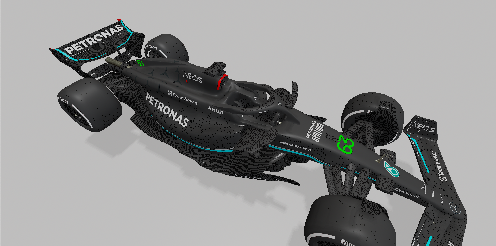
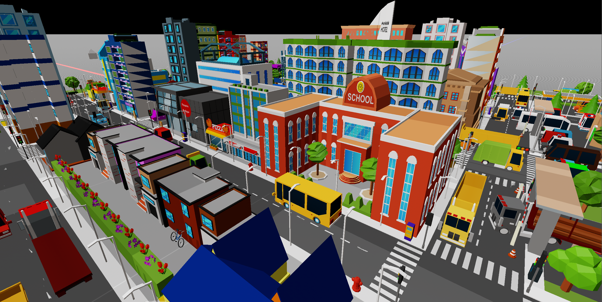

<h1 align="center">
  <a href="https://github.com/untoldengine/UntoldEngine">
    <!-- Please provide path to your logo here -->
    
  </a>
</h1>

<div align="center">
  <br />
  <a href="https://github.com/untoldengine/UntoldEngine/issues/new?assignees=&labels=bug&template=01_BUG_REPORT.md&title=bug%3A+">Report a Bug</a>
  ·
  <a href="https://github.com/untoldengine/UntoldEngine/issues/new?assignees=&labels=enhancement&template=02_FEATURE_REQUEST.md&title=feat%3A+">Request a Feature</a>
  .
  <a href="https://github.com/untoldengine/UntoldEngine/issues/new?assignees=&labels=question&template=04_SUPPORT_QUESTION.md&title=support%3A+">Ask a Question</a>
</div>

<div align="center">
<br />


[](LICENSE)

[](https://github.com/untoldengine/UntoldEngine/issues?q=is%3Aissue+is%3Aopen+label%3A%22help+wanted%22)
[](https://github.com/untoldengine)

</div>

<details open="open">
<summary>Table of Contents</summary>

- [About](#about)
- [Getting Started](#getting-started)
- [High-Level API Overview](#High-Level-API-Overview)
- [Core Systems of the Untold Engine](#Core-Systems-of-the-Untold-Engine)
- [Visuals](#visuals)
- [Roadmap](#roadmap)
- [Support](#support)
- [Project assistance](#project-assistance)
- [Contributing](#contributing)
- [License](#license)
- [Common Issues](#common-issues)


</details>

---

## About

> "A Swift-based 3D game engine designed for simplicity and creativity on macOS and iOS."

The Untold Engine is an open-source 3D game engine under active development, designed for macOS and iOS platforms. Written in Swift and powered by Metal, its goal is to simplify game creation with a clean, intuitive API. While the engine already supports many core systems like rendering, physics, and animation, there’s still much to build and improve.

### Current Features:

- Simple API: Focused on ease of use, even for those new to game development.
- Core Systems: Includes foundational systems for entity registration, rendering, physics, and more.
- Metal Integration: Leverages Apple’s graphics API for efficient rendering.

### The Journey Ahead:

The Untold Engine is a work in progress, with ambitious goals to:

- Expand physics capabilities with collision detection.
- Enhance PBR rendering for more realistic visuals.
- Add new features to make game development a breeze.

### Why Try the Untold Engine?

- For Learners: A great way to explore game development with an engine that prioritizes simplicity.
- For Game Developers: An opportunity to contribute to an open-source project and shape its future.
- For Apple Developers: A Swift and Metal-based engine that feels at home on macOS and iOS.

The engine is far from complete, but with every iteration, it gets closer to being an amazing tool for developers. By trying it out, contributing, or sharing your feedback, you can help make the Untold Engine better for everyone.

Author: [Harold Serrano](http://www.haroldserrano.com)

---

## Getting Started

### Prerequisites

To begin using the Untold Engine, you’ll need:

- An Apple computer.
- The latest version of Xcode, which you can download from the App Store.

### Running the Untold Engine - (Quick Run)

Ready to explore the Untold Engine? Follow the step-by-step instructions in [Running the Untold Engine](docs/Installation.md).

### Choose your starting path

I’ve designed three different ways for you to [Get Started](docs/Onboarding.md) with the Untold Engine. Whether you just want to explore or are ready to make your own game.

### Video Tutorials

I have uploaded video tutorials to help you get started with the Untold Engine. Enjoy

1. [How to Install the Untold Engine: Quick Start Guide](https://youtu.be/tAAOzIMQD_Q)
2. [Getting Started with the Untold Engine: A Simple Beginner's Guide](https://youtu.be/jzl56O06ulc)
3. [Untold Engine Onboarding: The Best Learning Path for Beginners](https://youtu.be/h6OgCbM3V1Y)
4. [Rendering with the Untold Engine - A Beginner’s Guide](https://youtu.be/kj6i6btb9c0)
5. [Animating in  the Untold Engine - A Beginner’s Guide](https://youtu.be/Du23BsQmwO8)
6. [Moving Characters in the Untold Engine: A Beginner's Guide](https://youtu.be/biScvPvccI4)

---

## High-Level API Overview

The Untold Engine offers an intuitive API for game development. Here's a quick look:

```swift
let stadium = createEntity()
setEntityMesh(entityId: stadium, filename: "stadium", withExtension: "usdc")
translateBy(entityId: stadium, position: simd_float3(0.0, 0.0, 0.0))
```

For a complete breakdown of the API, see [API Overview](docs/APIOverview.md).

---

## Core Systems of the Untold Engine

The Untold Engine is powered by modular systems that simplify game development:

- **Rendering System**: Render 3D models with support for PBR and custom shaders.
- **Physics System**: Simulate gravity, forces, and movement.
- **Animation System**: Add life to your models with skeletal animations.
- **Input System**: Capture keyboard and mouse interactions.
- **Steering System**: Implement intelligent behaviors like path-following.
- **Transform System**: Manage entity positions, rotations, and scales.
- **Shaders**: Add or modify shaders to fit your game's stye.

Learn more about these systems in the [Core Systems Guide](docs/CoreSystems.md).

---

## Visuals

Here are some examples of what the Untold Engine can do, showing its progress and current features in action.





---

## Roadmap

See the [open issues](https://github.com/untoldengine/UntoldEngine/issues) for a list of proposed features (and known issues).

- [Top Feature Requests](https://github.com/untoldengine/UntoldEngine/issues?q=label%3Aenhancement+is%3Aopen+sort%3Areactions-%2B1-desc) (Add your votes using the 👍 reaction)
- [Top Bugs](https://github.com/untoldengine/UntoldEngine/issues?q=is%3Aissue+is%3Aopen+label%3Abug+sort%3Areactions-%2B1-desc) (Add your votes using the 👍 reaction)
- [Newest Bugs](https://github.com/untoldengine/UntoldEngine/issues?q=is%3Aopen+is%3Aissue+label%3Abug)

---

## Support

Reach out to the maintainer at one of the following places:

- [GitHub issues](https://github.com/untoldengine/UntoldEngine/issues/new?assignees=&labels=question&template=04_SUPPORT_QUESTION.md&title=support%3A+)

---

## Project assistance

If you want to say **thank you** or/and support active development of Untold Engine:

- Add a [GitHub Star](https://github.com/untoldengine/UntoldEngine) to the project.
- Tweet about the Untold Engine.
- Write interesting articles about the project on [Dev.to](https://dev.to/), [Medium](https://medium.com/) or your personal blog.

Together, we can make Untold Engine **better**!

---

## Contributing

We welcome contributions to the Untold Engine! Here’s how you can help:

1. **Fix Bugs**: Review open issues labeled [help wanted](https://github.com/untoldengine/UntoldEngine/issues?q=label%3Ahelp+wanted).
2. **Improve Features**: Enhance existing systems, such as adding collision detection to the physics system.
3. **Create Tutorials**: Write how-to guides or share examples to help other developers.
4. **Expand the Engine**: Suggest and implement new features like AI systems or advanced shaders.

See the [Contribution Guidelines](docs/ContributionGuidelines.md) for details.

---

## License

This project is licensed under the **LGPL v2.1**.

### What Does This Mean for You?
- **Developing a Game**: You can use the Untold Engine to build your game without needing to open source your game’s code.
- **Modifying the Engine**: If you make changes to the engine itself, those changes must be open-sourced under the LGPL v2.1.

For more details, see the full license text [here](https://www.gnu.org/licenses/lgpl-2.1.html).

---
 
