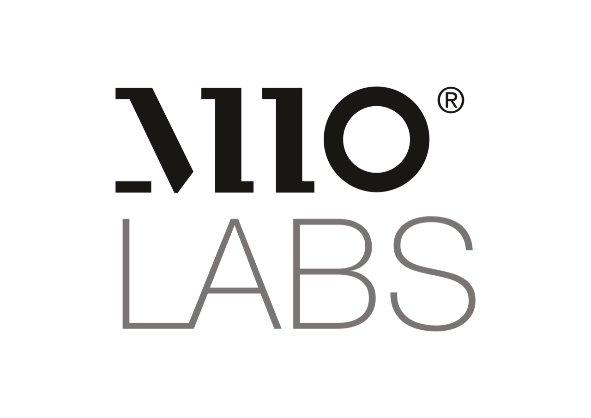

<h1 align="center">
  <a href="https://github.com/untoldengine/UntoldEngine">
    <!-- Please provide path to your logo here -->
    
  </a>
</h1>

   
  <a href="https://github.com/untoldengine/UntoldEngine/issues/new?assignees=&labels=bug&template=01_BUG_REPORT.md&title=bug%3A+">Report a Bug</a>
  ·
  <a href="https://github.com/untoldengine/UntoldEngine/issues/new?assignees=&labels=enhancement&template=02_FEATURE_REQUEST.md&title=feat%3A+">Request a Feature</a>
  .
  <a href="https://github.com/untoldengine/UntoldEngine/issues/new?assignees=&labels=question&template=04_SUPPORT_QUESTION.md&title=support%3A+">Ask a Question</a>

 

Table of Contents

- [About](#about)
- [Documentation](#documentation)
- [Roadmap](#roadmap)
- [Support](#support)
- [Project assistance](#project-assistance)
- [Contributing](#contributing)
- [Top Contributors](#top-contributors)
- [License](#license)

---

## About

> "A Swift-based 3D game engine designed for simplicity and creativity on macOS and iOS."

The Untold Engine is an open-source 3D game engine under active development, designed for macOS and iOS platforms. Written in Swift and powered by Metal, its goal is to simplify game creation with a clean, intuitive API. While the engine already supports many core systems like rendering, physics, and animation, there’s still much to build and improve.

Click on image to play video:

## Vision

The Untold Engine strives to be a **stable, performant, and developer-friendly** 3D engine that empowers creativity, removes friction, and makes game development feel effortless for Apple developers

## Guiding Principles

To achieve this vision, we follow these principles:

- The engine strives to remain stable and crash-free.
- The codebase is backed by unit tests.
- We profile continuously to prevent regressions (visual and performance).
- The API must remain clear and user-friendly.
- We always think about the developer first—removing friction so they can focus on their games.

### Current Features:

- Simple API: Focused on ease of use, even for those new to game development.
- Core Systems: Includes foundational systems for entity registration, rendering, physics, and more.
- Metal Integration: Leverages Apple’s graphics API for efficient rendering.

### The Journey Ahead:

The Untold Engine is a work in progress, with ambitious goals to:

- Expand physics capabilities with collision detection.
- Enhance PBR rendering for more realistic visuals.
- Add new features to make game development a breeze.

### Why Try the Untold Engine?

- For Learners: A great way to explore game development with an engine that prioritizes simplicity.
- For Game Developers: An opportunity to contribute to an open-source project and shape its future.
- For Apple Developers: A Swift and Metal-based engine that feels at home on macOS and iOS.

The engine is far from complete, but with every iteration, it gets closer to being an amazing tool for developers. By trying it out, contributing, or sharing your feedback, you can help make the Untold Engine better for everyone.

Author: [Harold Serrano](http://www.haroldserrano.com)

---

## Documentation & Quick Start

If you just want to **try the engine right away**, check out the demo games in our companion repo:  
👉 [UntoldArcade](https://github.com/untoldengine/UntoldArcade)  

Clone it, open the Xcode workspace, and you’ll be able to run a demo game (like **SoccerArcade**) immediately.

---

If you’re interested in learning more about the engine itself — how it works, how to build with it, and the full API — head over to our official documentation site:  
👉 [Untold Engine Docs](https://untoldengine.github.io/UntoldEngine)

There you’ll find:
- Installation & setup
- Editor overview
- How-to guides (import assets, add models, use systems)
- API references & examples

⚡ New to the engine? Start with the **Getting Started** guide in the docs.

---

## Roadmap

See the [open issues](https://github.com/untoldengine/UntoldEngine/issues) for a list of proposed features (and known issues).

- [Top Feature Requests](https://github.com/untoldengine/UntoldEngine/issues?q=label%3Aenhancement+is%3Aopen+sort%3Areactions-%2B1-desc) (Add your votes using the 👍 reaction)
- [Top Bugs](https://github.com/untoldengine/UntoldEngine/issues?q=is%3Aissue+is%3Aopen+label%3Abug+sort%3Areactions-%2B1-desc) (Add your votes using the 👍 reaction)
- [Newest Bugs](https://github.com/untoldengine/UntoldEngine/issues?q=is%3Aopen+is%3Aissue+label%3Abug)

---

## Support

Reach out to the maintainer at one of the following places:

- [GitHub issues](https://github.com/untoldengine/UntoldEngine/issues/new?assignees=&labels=question&template=04_SUPPORT_QUESTION.md&title=support%3A+)

---

## Project assistance

If you want to say **thank you** or/and support active development of Untold Engine:

- Add a [GitHub Star](https://github.com/untoldengine/UntoldEngine) to the project.
- Tweet about the Untold Engine.
- Write interesting articles about the project on [Dev.to](https://dev.to/), [Medium](https://medium.com/) or your personal blog.

Together, we can make Untold Engine **better**!

---

## Contributing

We welcome contributions to the Untold Engine! Here’s how you can help:

1. **Fix Bugs**: Review open issues labeled [help wanted](https://github.com/untoldengine/UntoldEngine/issues?q=label%3Ahelp+wanted).
2. **Improve Features**: Enhance existing systems, such as adding collision detection to the physics system.
3. **Create Tutorials**: Write how-to guides or share examples to help other developers.
4. **Expand the Engine**: Suggest and implement new features like AI systems or advanced shaders.

See the [Contribution Guidelines](https://untoldengine.github.io/UntoldEngine) for details.

---

## Top Contributors

A huge thanks to the people helping shape the Untold Engine. Your support and contributions make the project better every day.

  

## License  

This project is licensed under the **LGPL v3.0**.  

### What Does This Mean for You?  
- **Developing a Game**: You can use the Untold Engine to build your game without needing to open source your game’s code.  
- **Modifying the Engine**: If you make changes to the engine itself, those changes must be open-sourced under the LGPL v3.0.  
- **Stronger Protections**: LGPL v3.0 adds explicit patent protection and compatibility with modern licenses like Apache-2.0 (used by OpenUSD).  

### License in Plain Terms  

| You want to…                                 | Allowed? | Obligations                                      |
|----------------------------------------------|----------|--------------------------------------------------|
| Build a game with Untold Engine              | ✅ Yes   | No need to open source your game’s code          |
| Modify Untold Engine internals               | ✅ Yes   | Must share modifications under LGPL v3.0         |
| Distribute the Untold Engine                 | ✅ Yes   | Keep the LGPL license intact                     |
| Use for commercial projects                  | ✅ Yes   | No royalties or fees                             |
| Combine with Apache-2.0 libs (e.g. OpenUSD)  | ✅ Yes   | Fully compatible under LGPL v3.0                 |

For more details, see the full license text [here](https://www.gnu.org/licenses/lgpl-3.0.html).  

> 💡 Our philosophy: You’re free to build with Untold Engine however you like — but if you improve the engine itself, those improvements should be shared back so the whole community benefits.  

---

## Questions & Discussions

To keep communication clear and accessible for everyone:

- 💡 Use **[GitHub Discussions](https://github.com/untoldengine/UntoldEngine/discussions)** for feature proposals, ideas, or general questions.  
- 🐞 Use **[GitHub Issues](https://github.com/untoldengine/UntoldEngine/issues)** for bugs or concrete tasks that need tracking.  

This way, conversations stay organized, visible to the community, and future contributors can benefit from past discussions. 
 
