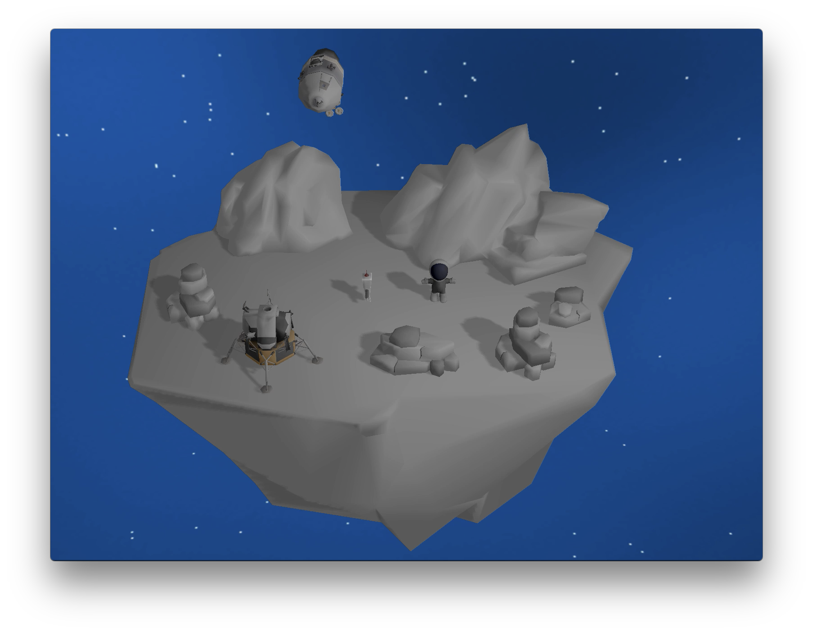

# Untold Engine

## Introduction

**The Untold Engine: Demystifying how a game engine works**

Hi, my name is [Harold Serrano](http://www.haroldserrano.com), and I developed the [Untold Engine](http://www.untoldengine.com), an open source 3D game engine written in C++ and Metal Graphics (API).

It took me over five years to develop the *Untold Engine* from scratch. I spent thousands and thousands of hours developing the Untold Engine, and now I'm releasing it as an open source. 

*Why?*

Because I want to share with you everything I know about Game Engine Development. I have written hundreds of articles on Game Engine Development on my blog, and now I want to share with you the source code. 

The purpose of the Untold Engine is to help you understand how game engines work. That is its sole purpose. 

To help you understand how game engines work, the [Untold Engine](http://www.untoldengine.com) provides, aside from its source code, documentation which explains its architecture and components through illustrations and projects.

Feel free to learn, to experiment, to develop, and most importantly: 

**TAKE WHAT YOU SEE HERE, AND MAKE IT BETTER AND BETTER**.

## Running the Untold Engine

Before running the engine, please visit [www.untoldengine.com](http://www.untoldengine.com) and click on **Docs**. The documentation provides instructions on how to setup the engine.

## What you need?

To run the the Untold Engine, you need the following tools:

* Xcode IDE
* A free [Apple Developer Account](https://developer.apple.com)
* An actual iOS device and a Mac with Metal (API) support. 
	* See [supported iOS](https://developer.apple.com/library/archive/documentation/DeviceInformation/Reference/iOSDeviceCompatibility/HardwareGPUInformation/HardwareGPUInformation.html)
	* See [supported Macs](https://support.apple.com/en-us/HT205073)

## Current Version

Beta version v0.0.10

## License

The Untold Engine is licensed under the LGPL v2.1. This means that if you develop a game using the Untold Engine, you do not need to open source your game. However, if you create a derivative of the Untold Engine, then you must apply the rules stated in the LGPL v2.1. That is, you must open source the derivative work.

It took me five years to develop the Untold Engine. So, do not remove my name from the files :).

## Team Members

- [Harold Serrano](http://www.haroldserrano.com) is the developer of the **Untold Engine**.
- Erick Perez is in charge of business operations.