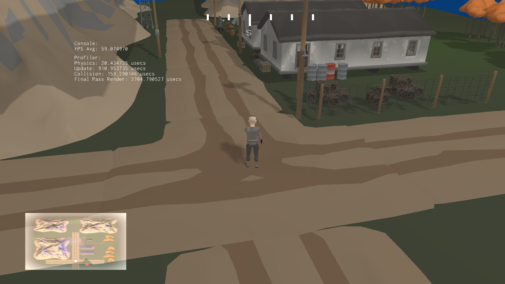
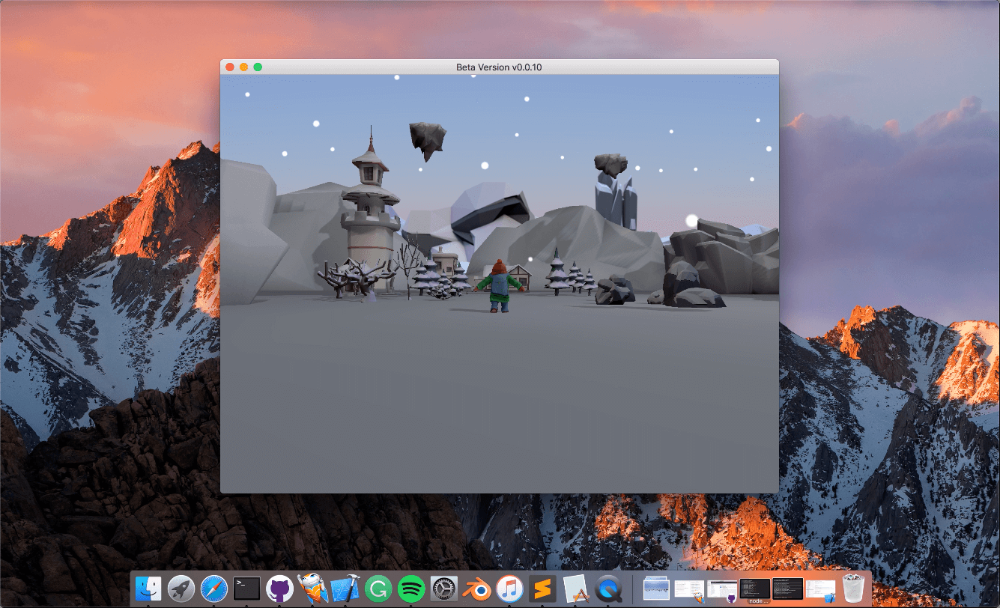
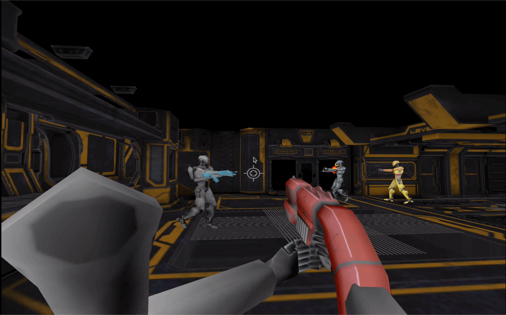
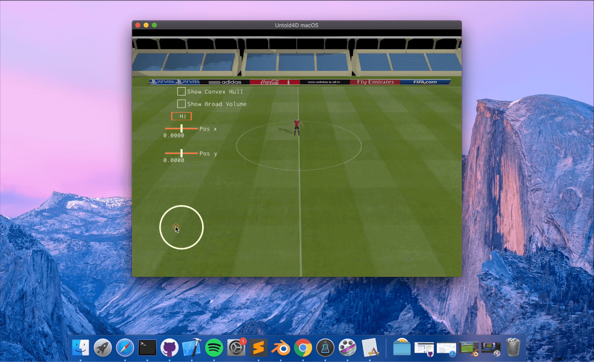
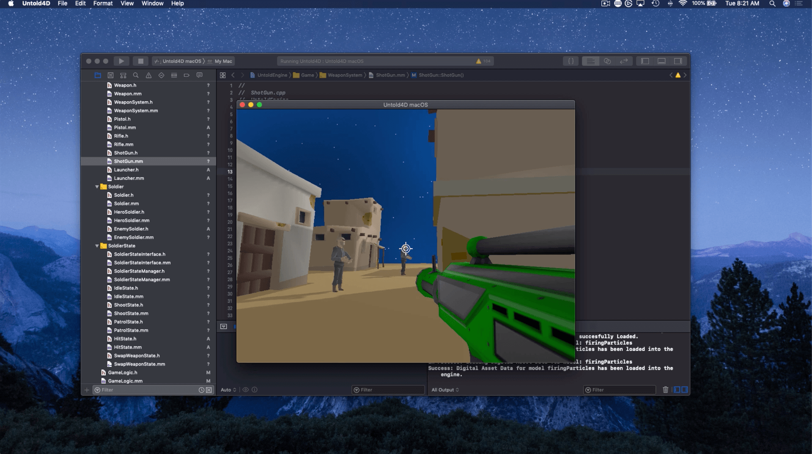
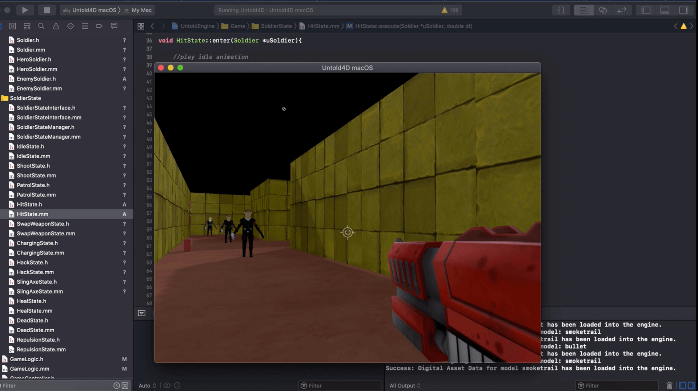

# Untold Engine

## Introduction

**The Untold Engine: An easy to use, open source, 3D game engine for iOS/macOS game development**

Hi, my name is [Harold Serrano](http://www.haroldserrano.com), and I developed the [Untold Engine](http://www.untoldengine.com), an open source 3D game engine written in C++ and Metal Graphics (API).

It took me over five years to develop the *Untold Engine* from scratch. I spent thousands and thousands of hours developing the Untold Engine, and now I'm releasing it as an open source. 

## Running the Untold Engine

Before running the engine, please visit the [Docs](https://www.untoldengine.com).

## What you need?

To run the the Untold Engine, you need the following tools:

* Xcode IDE 
* A free [Apple Developer Account](https://developer.apple.com)
* An actual iOS device and a Mac with Metal (API) support. 
	* See [supported iOS](https://developer.apple.com/library/archive/documentation/DeviceInformation/Reference/iOSDeviceCompatibility/HardwareGPUInformation/HardwareGPUInformation.html)
	* See [supported Macs](https://support.apple.com/en-us/HT205073)

## Current Version

Beta version v0.0.15. See current [Release Notes](https://www.untoldengine.com) for improvement and fixes.

## License

The Untold Engine is licensed under the LGPL v2.1. This means that if you develop a game using the Untold Engine, you do not need to open source your game. However, if you create a derivative of the Untold Engine, then you must apply the rules stated in the LGPL v2.1. That is, you must open source the derivative work.

## Contributing to Untold Engine

Since this project has barely been released as an open-source, I am not taking Pull-Request yet. I want to complete the documentation and write more tutorials before allowing Pull-Request.

If you want to help out, I would appreciate if you could report back any bugs you encounter. Make sure to report them at our [Github issues](https://github.com/untoldengine/UntoldEngine/issues), so we all have access to them.

Thank you.

Once I feel that the documentation is ready, I will allow Pull-Request.

