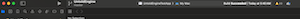

# Untold Engine

## Introduction

Welcome to Untold Engine! 

The Untold Engine is a custom 3D game engine built with Swift and Metal, designed for ease of use. Originally, the engine was written in C++ following Object-Oriented Programming (OOP) principles. However, it was rewritten in Swift to adopt Data-Oriented Design (DOD) principles.

The engine now leverages the Entity Component System (ECS) architecture, which decouples data from behavior. This approach enables developers to build complex scenes and systems more effectively, while also making better use of modern CPU and GPU architectures.

Currently, this new version of the engine does not have a Physics or Animation system, but both features are actively being developed and will be included in future updates.

Author: [Harold Serrano](http://www.haroldserrano.com)

## Running the Untold Engine

To run the the Untold Engine, do the following:

1. Clone the Repository

```bash
git clone https://github.com/untoldengine/UntoldEngine

cd UntoldEngine
```

2. Open the Swift Package

```bash
open Package.swift
```
3. Xcode should open up. In the scheme settings, make sure to select "UntoldEngineTestApp" and "myMac" as your target.



4. Click on Run

You should see models being rendered.


To enter/exit "game mode" press 'L'. To move the car use the normal 'WASD' keys

If you want to get a feel for the API, head to main.swift file inside Sources->UntoldEngineTestApp

## Using the Untold Engine in your game - For those that want to see something right away

### Create a macOS game in Xcode

- Open up Xcode -> File -> New -> Project

- Choose a 'Command Line Tool' for macOS.

- Click Next. Give your game a name and make sure to Select Swift as the language.


### Add the Untold Engine as a Package Dependency

- In your Xcode project go to File-> Add Packages...

- In the search field, enter the URL of the Untold Engine repository:

https://github.com/untoldengine/UntoldEngine.git 

- Xcode will fetch the package. Select the appropriate version or branc( i.e. Master)

- Choose the target where you want to add the engine, then click Add Package 


### Add boiler plate code to the AppDelegate

Once the package is added, you can import the Untold Engine in your Swift files. 

Go to main.swift and import the following modules:

```swift
import Cocoa
import MetalKit
import UntoldEngine
```


To ensure the engine initializes correctly, we need to execute a set of initialization functions. These functions are called only once. I've prepared a boilerplate code that you can simply copy and paste.

```swift
// AppDelegate: Boiler plate code -- Handles everything – Renderer, Metal setup, and GameScene initialization
class AppDelegate: NSObject, NSApplicationDelegate {
    var window: NSWindow!
    var metalView: MTKView!
    var renderer: UntoldRenderer!
    var gameScene: GameScene!

    func applicationDidFinishLaunching(_ notification: Notification) {
        
        print("Launching Untold Engine v0.2")

        // Create and configure the window
        window = NSWindow(
            contentRect: NSRect(x: 0, y: 0, width: 1280, height: 720),
            styleMask: [.titled, .closable, .resizable],
            backing: .buffered,
            defer: false
        )
        
        metalView = MTKView(frame: window.contentView!.bounds)
        metalView.device = MTLCreateSystemDefaultDevice()
        metalView.depthStencilPixelFormat = .depth32Float
        metalView.colorPixelFormat = .rgba16Float
        metalView.preferredFramesPerSecond = 60
        metalView.framebufferOnly = false

        // Initialize the renderer and set it as the MTKView delegate
        renderer = UntoldRenderer(metalView)
        renderer?.mtkView(metalView, drawableSizeWillChange: metalView.drawableSize)
        metalView.delegate = renderer

        // Create the game scene
        gameScene = GameScene()

        // Connect renderer callbacks to the game scene
        renderer.gameUpdateCallback = { [weak self] deltaTime in
            self?.gameScene.update(deltaTime)
        }
        renderer.handleInputCallback = { [weak self] in
            self?.gameScene.handleInput()
        }

        // Set up window and display it
        window.contentView = metalView
        window.makeKeyAndOrderFront(nil)
        window.center()
        window.title = "Untold Engine v0.2"

        NSApp.setActivationPolicy(.regular)
        NSApp.activate(ignoringOtherApps: true)
    }

    func applicationShouldTerminateAfterLastWindowClosed(_ sender: NSApplication) -> Bool {
        return true
    }
}

// Entry point

let app = NSApplication.shared
let delegate = AppDelegate()
app.delegate = delegate

app.run()
```


Finally, add a GameScene class to main.swift

```swift
class GameScene {

    init() {
        
    }
    
    func update(_ deltaTime: Float) {

    }

    func handleInput() {

    }

}
```


If everything was done correctly, you should see a window with a grid once you hit "Run".


### Adding game entities

Next, let's load a usd file, create an entity, link the usd model to the entity and translate the entity

```swift

class GameScene{

    init(){

        // Loading usdc files
        loadScene(filename: "blueshirtplayer", withExtension: "usdc")
        loadScene(filename: "redshirtplayer", withExtension: "usdc")
        
        loadBulkScene(filename: "house-example", withExtension: "usdc")
        
        // Create an entity for player 1
        let player1: EntityID = createEntity()
        
        // Attach the mesh to the entity
        addMeshToEntity(entityId: player1, name: "soccerplayer1")  // 'name' refers to the model name in the scene
        
        // Translate the entity
        translateTo(entityId:player1,position:simd_float3(-2.0,0.0,2.0))
        
        // Create an entity for player 2
        let player2: EntityID = createEntity()
        
        // Attach the mesh to the entity
        addMeshToEntity(entityId: player2, name: "soccerplayer2")  // 'name' refers to the model name in the scene
        
        // Translate the entity
        translateTo(entityId:player2,position:simd_float3(2.0,0.0,2.0))

    }

}

```

And finally, let's add a Sun light.

```swift
class GameScene{

    init(){

        // ... other initializations ...
        
        // Create an entity for the directional light
        let sunEntity: EntityID = createEntity()

        // Create the directional light instance
        let sun: DirectionalLight = DirectionalLight()

        // Add the entity and the light to the lighting system
        lightingSystem.addDirectionalLight(entityID: sunEntity, light: sun)

    }

}
```

Click on Run and you should see the following:


## Current Version

Beta version v0.1.0. 

## License

The Untold Engine is licensed under the LGPL v2.1. This means that if you develop a game using the Untold Engine, you do not need to open source your game. However, if you create a derivative of the Untold Engine, then you must apply the rules stated in the LGPL v2.1. That is, you must open source the derivative work.


## Contributing to Untold Engine

Since this project has barely been released as an open-source, I am not taking Pull-Request yet. I want to complete the documentation and write more tutorials before allowing Pull-Request.

If you want to help out, I would appreciate if you could report back any bugs you encounter. Make sure to report them at our [Github issues](https://github.com/untoldengine/UntoldEngine/issues), so we all have access to them.

Thank you.

Once I feel that the documentation is ready, I will allow Pull-Request.


