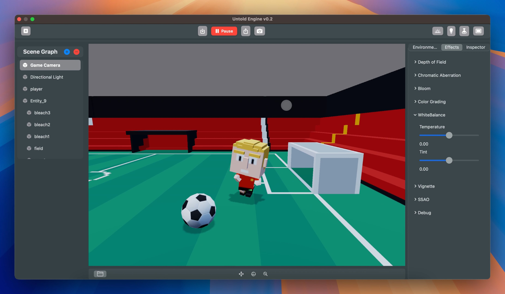

<h1 align="center">
  <a href="https://github.com/untoldengine/UntoldEngine">
    <!-- Please provide path to your logo here -->
    
  </a>
</h1>

<div align="center">
  <br />
  <a href="https://github.com/untoldengine/UntoldEngine/issues/new?assignees=&labels=bug&template=01_BUG_REPORT.md&title=bug%3A+">Report a Bug</a>
  ·
  <a href="https://github.com/untoldengine/UntoldEngine/issues/new?assignees=&labels=enhancement&template=02_FEATURE_REQUEST.md&title=feat%3A+">Request a Feature</a>
  .
  <a href="https://github.com/untoldengine/UntoldEngine/issues/new?assignees=&labels=question&template=04_SUPPORT_QUESTION.md&title=support%3A+">Ask a Question</a>
</div>

<div align="center">
<br />


[](LICENSE)

[](https://github.com/untoldengine/UntoldEngine/issues?q=is%3Aissue+is%3Aopen+label%3A%22help+wanted%22)
[](https://github.com/untoldengine)

</div>

<details open="open">
<summary>Table of Contents</summary>

- [About](#about)
- [Getting Started](#getting-started)
- [High-Level API Overview](#High-Level-API-Overview)
- [Using the Untold Engine](#Using-the-Untold-Engine)
- [Visuals](#visuals)
- [Roadmap](#roadmap)
- [Support](#support)
- [Project assistance](#project-assistance)
- [Contributing](#contributing)
- [License](#license)
- [Common Issues](#common-issues)


</details>

---

## About

> "A Swift-based 3D game engine designed for simplicity and creativity on macOS and iOS."

The Untold Engine is an open-source 3D game engine under active development, designed for macOS and iOS platforms. Written in Swift and powered by Metal, its goal is to simplify game creation with a clean, intuitive API. While the engine already supports many core systems like rendering, physics, and animation, there’s still much to build and improve.

Click on image to play video:

[](https://vimeo.com/1116239409?share=copy#t=0)

## Vision

The Untold Engine strives to be a **stable, performant, and developer-friendly** 3D engine that empowers creativity, removes friction, and makes game development feel effortless for Apple developers

## Guiding Principles

To achieve this vision, we follow these principles:

- The engine strives to remain stable and crash-free.
- The codebase is backed by unit tests.
- We profile continuously to prevent regressions (visual and performance).
- The API must remain clear and user-friendly.
- We always think about the developer first—removing friction so they can focus on their games.


### Current Features:

- Simple API: Focused on ease of use, even for those new to game development.
- Core Systems: Includes foundational systems for entity registration, rendering, physics, and more.
- Metal Integration: Leverages Apple’s graphics API for efficient rendering.

### The Journey Ahead:

The Untold Engine is a work in progress, with ambitious goals to:

- Expand physics capabilities with collision detection.
- Enhance PBR rendering for more realistic visuals.
- Add new features to make game development a breeze.

### Why Try the Untold Engine?

- For Learners: A great way to explore game development with an engine that prioritizes simplicity.
- For Game Developers: An opportunity to contribute to an open-source project and shape its future.
- For Apple Developers: A Swift and Metal-based engine that feels at home on macOS and iOS.

The engine is far from complete, but with every iteration, it gets closer to being an amazing tool for developers. By trying it out, contributing, or sharing your feedback, you can help make the Untold Engine better for everyone.

Author: [Harold Serrano](http://www.haroldserrano.com)

---

## Getting Started

The Untold Engine is a game engine designed to be integrated into your game projects. It is distributed as a Swift Package using Swift Package Manager (SPM) for easy integration and maintenance.

There are two primary ways to use the engine:

- **Running the Engine Standalone** – Ideal for contributors and developers who want to explore, modify, or contribute to the engine itself. This mode allows you to test the engine independently using its built-in demo assets and functionalities.
- **Integrating the Engine into Your Game Project** – Perfect for game developers who want to build a game using the engine. This requires adding the engine as a Swift Package Dependency in a game project.

### Prerequisites

To begin using the Untold Engine, you’ll need:

- An Apple computer.
- The latest version of Xcode, which you can download from the App Store.

### Quick Start

Get the Untold Engine running in under a minute:

```bash
git clone https://github.com/untoldengine/UntoldEngine.git
cd UntoldEngine
open Package.swift
```

- In Xcode, select the DemoGame scheme.
- Choose My Mac as the target.
- Press Run ▶ and the Editor will launch.

🎮 You’re ready to explore!

👉 For full installation details (screenshots, controls, and Editor workflow), see the [Installation Guides](docs/Installation.md)

### Assets Download 
To help you get started, download the [Demo Game Assets v1.0](https://github.com/untoldengine/UntoldEngine-Assets/releases/tag/v1). It contains models and animations that you can use as you try out the engine. Unzip the folder and place it on your Desktop.

### Demo Game – Jump right in
The **Demo Game** is a simple soccer dribbling example that runs out of the box.  
It not only lets you test the engine with zero setup, but also serves as a live reference for how the API is used in practice — from entity creation to animations and physics.  

👉 Follow the step-by-step guide to run the [small demo](docs/demogamesteps.md).

### Starter Game – Experiment and Learn
The **Starter Game** is a minimal project designed as your playground.  
It gives you a clean slate to experiment with importing assets, writing your own systems, and building new mechanics. Unlike the Demo Game (which shows the API in action), the Starter Game is where you can start creating your own gameplay ideas.  

👉 Follow the step-by-step guide to run the [starter game](docs/startergamesteps.md).

For an overview of how to reference entities, play animations, and create components and systems, check out the files in the DemoGame folder. More documentation is on the way, but these examples should be enough to help you get started.
If you run into any issues or have questions, please don’t hesitate to open an [issue](https://github.com/untoldengine/UntoldEngine/issues).


---


# Untold Engine Architecture — Summary  

Untold Engine is built on a **data-oriented Entity–Component–System (ECS)** architecture designed for clarity, performance, and extensibility.  

- **Entities**  
  Entities are lightweight IDs. They have no behavior or state on their own.  

- **Components**  
  Components are plain data containers attached to entities. They describe an entity’s properties or capabilities (e.g., `Transform`, `Mesh`, `Light`, `Dribbling`).  
  - Components are the **primary way to add new behavior** in Untold Engine.  
  - All components are serializable and editor-friendly, so they can be saved, loaded, and modified at runtime.  

- **Systems**  
  Systems are stateless functions that run each frame. They query entities with specific components, read and update their data, and drive the simulation.  
  - Example: a **DribblingSystem** looks for entities with a `DribblingComponent`, updates their animations and movement based on input, and interacts with the ball.  

- **Editor Integration**  
  Because components are declarative and Codable, they are automatically exposed to the Editor. Developers and designers can attach/remove components, tweak fields in the Inspector, and see changes take effect instantly when switching to Play Mode.  

This separation of entities, components, and systems keeps the codebase modular, testable, and cache-friendly. New features are added by creating **a new component (data) + a system (logic)**, without modifying the engine core.  

---

## Using the Untold Engine  

The Untold Engine is powered by modular systems that simplify game development. Click on the links to get started.  

### Editor & Workflow  

⚡ **For your convenience**: The Untold Engine provides an Editor that makes it easy to import assets, set up entities, and manage scenes — all without writing code.  

- [Editor Overview](docs/editoroverview.md): Walkthrough of Scene Graph, Inspector, Gizmos, Materials, Lighting, Post-Processing, Asset Browser, and Console.  
- [How to Import Assets](docs/importingassetseditor.md): Learn how to set asset paths and import models, materials, and animations.  

### How-To Guides  
- [Adding a model using the Editor](docs/addModelUsingEditor.md)  
- [Adding an animation using the Editor](docs/addAnimationsUsingEditor.md) (Coming Soon)  

💡 **Note**: The Editor is optional. You can also load models, link animations, attach components, and configure entities directly in code. See the **Systems** section below for details.  

### Systems  
- [Registration-ECS System](docs/UsingRegistrationSystem.md): Handles the creation of entities and components.  
- [Rendering System](docs/UsingRenderingSystem.md): Render 3D models with support for PBR and custom shaders.  
- [Transform System](docs/UsingTransformSystem.md): Manage entity positions, rotations, and scales.  
- [Animation System](docs/UsingAnimationSystem.md): Add life to your models with skeletal animations.  
- [Physics System](docs/UsingPhysicsSystem.md): Simulate gravity, forces, and movement.  
- [Input System](docs/UsingInputSystem.md): Capture keyboard and mouse interactions.  
- [Steering System](docs/UsingSteeringSystem.md): Implement intelligent behaviors like path-following.  
- [Scenegraph](docs/UsingScenegraph.md): Enables parent-child relationships between entities.  
- [Shaders](docs/shaders.md): Add or modify shaders to fit your game’s style.  
- [Importing Assets](docs/ImportingAssetFiles.md): Importing assets into your game project.  

## High-Level API Overview

The Untold Engine offers an intuitive API for game development. Here's a quick look:

```swift
let stadium = createEntity()
setEntityMesh(entityId: stadium, filename: "stadium", withExtension: "usdc")
translateBy(entityId: stadium, position: simd_float3(0.0, 0.0, 0.0))

let player = createEntity()
setEntityMesh(entityId: player, filename: "redplayer", withExtension: "usdc", flip: false)
setEntityAnimations(entityId: player, filename: "running", withExtension: "usdc", name: "running")
changeAnimation(entityId: player, name: "running") // Start animation
setEntityKinetics(entityId: player) // Enable Physics System
```
---

## Visuals

Here are some examples of what the Untold Engine can do, showing its progress and current features in action.


---

## Roadmap

See the [open issues](https://github.com/untoldengine/UntoldEngine/issues) for a list of proposed features (and known issues).

- [Top Feature Requests](https://github.com/untoldengine/UntoldEngine/issues?q=label%3Aenhancement+is%3Aopen+sort%3Areactions-%2B1-desc) (Add your votes using the 👍 reaction)
- [Top Bugs](https://github.com/untoldengine/UntoldEngine/issues?q=is%3Aissue+is%3Aopen+label%3Abug+sort%3Areactions-%2B1-desc) (Add your votes using the 👍 reaction)
- [Newest Bugs](https://github.com/untoldengine/UntoldEngine/issues?q=is%3Aopen+is%3Aissue+label%3Abug)

---

## Support

Reach out to the maintainer at one of the following places:

- [GitHub issues](https://github.com/untoldengine/UntoldEngine/issues/new?assignees=&labels=question&template=04_SUPPORT_QUESTION.md&title=support%3A+)

---

## Project assistance

If you want to say **thank you** or/and support active development of Untold Engine:

- Add a [GitHub Star](https://github.com/untoldengine/UntoldEngine) to the project.
- Tweet about the Untold Engine.
- Write interesting articles about the project on [Dev.to](https://dev.to/), [Medium](https://medium.com/) or your personal blog.

Together, we can make Untold Engine **better**!

---

## Contributing

We welcome contributions to the Untold Engine! Here’s how you can help:

1. **Fix Bugs**: Review open issues labeled [help wanted](https://github.com/untoldengine/UntoldEngine/issues?q=label%3Ahelp+wanted).
2. **Improve Features**: Enhance existing systems, such as adding collision detection to the physics system.
3. **Create Tutorials**: Write how-to guides or share examples to help other developers.
4. **Expand the Engine**: Suggest and implement new features like AI systems or advanced shaders.

See the [Contribution Guidelines](docs/ContributionGuidelines.md) for details.

---

## License  

This project is licensed under the **LGPL v3.0**.  

### What Does This Mean for You?  
- **Developing a Game**: You can use the Untold Engine to build your game without needing to open source your game’s code.  
- **Modifying the Engine**: If you make changes to the engine itself, those changes must be open-sourced under the LGPL v3.0.  
- **Stronger Protections**: LGPL v3.0 adds explicit patent protection and compatibility with modern licenses like Apache-2.0 (used by OpenUSD).  

### License in Plain Terms  

| You want to…                                 | Allowed? | Obligations                                      |
|----------------------------------------------|----------|--------------------------------------------------|
| Build a game with Untold Engine              | ✅ Yes   | No need to open source your game’s code          |
| Modify Untold Engine internals               | ✅ Yes   | Must share modifications under LGPL v3.0         |
| Distribute the Untold Engine                 | ✅ Yes   | Keep the LGPL license intact                     |
| Use for commercial projects                  | ✅ Yes   | No royalties or fees                             |
| Combine with Apache-2.0 libs (e.g. OpenUSD)  | ✅ Yes   | Fully compatible under LGPL v3.0                 |

For more details, see the full license text [here](https://www.gnu.org/licenses/lgpl-3.0.html).  

> 💡 Our philosophy: You’re free to build with Untold Engine however you like — but if you improve the engine itself, those improvements should be shared back so the whole community benefits.  

---

## Questions & Discussions

To keep communication clear and accessible for everyone:

- 💡 Use **[GitHub Discussions](https://github.com/untoldengine/UntoldEngine/discussions)** for feature proposals, ideas, or general questions.  
- 🐞 Use **[GitHub Issues](https://github.com/untoldengine/UntoldEngine/issues)** for bugs or concrete tasks that need tracking.  

This way, conversations stay organized, visible to the community, and future contributors can benefit from past discussions. 
 
