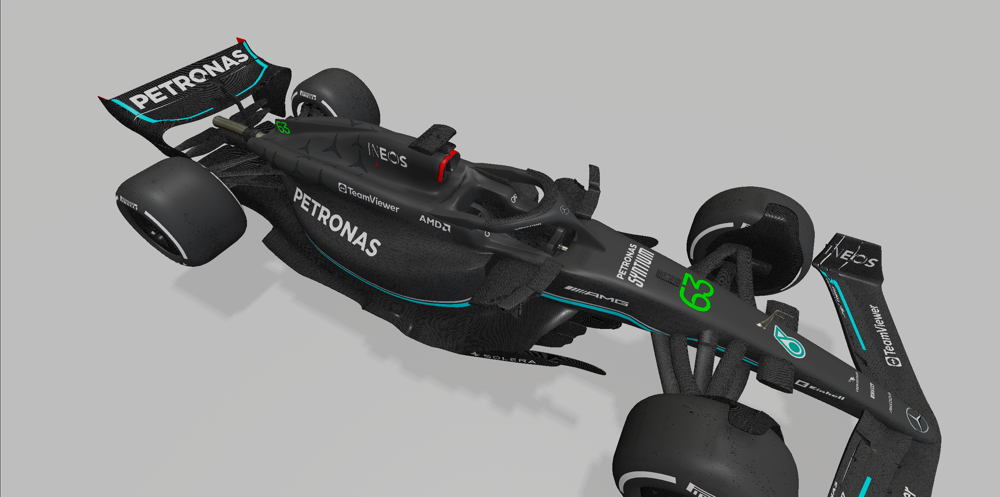

## Untold Engine

> "A Swift-based 3D game engine designed for simplicity and creativity on macOS and iOS."

The Untold Engine is an open-source 3D game engine under active development, designed for macOS and iOS platforms. Written in Swift and powered by Metal, its goal is to simplify game creation with a clean, intuitive API. While the engine already supports many core systems like rendering, physics, and animation, there’s still much to build and improve.

### Current Features:

- Simple API: Focused on ease of use, even for those new to game development.
- Core Systems: Includes foundational systems for entity registration, rendering, physics, and more.
- Metal Integration: Leverages Apple’s graphics API for efficient rendering.

### The Journey Ahead:

The Untold Engine is a work in progress, with ambitious goals to:

- Expand physics capabilities with collision detection.
- Enhance PBR rendering for more realistic visuals.
- Add new features to make game development a breeze.

### Why Try the Untold Engine?

- For Learners: A great way to explore game development with an engine that prioritizes simplicity.
- For Game Developers: An opportunity to contribute to an open-source project and shape its future.
- For Apple Developers: A Swift and Metal-based engine that feels at home on macOS and iOS.

The engine is far from complete, but with every iteration, it gets closer to being an amazing tool for developers. By trying it out, contributing, or sharing your feedback, you can help make the Untold Engine better for everyone.

Author: [Harold Serrano](http://www.haroldserrano.com)

## 📽 Latest Updates
- ✅ Implemented **SSAO** → Improved depth and realism in scenes.
- ✅ Added **Depth of Field** → Cinematic focus control.
- ✅ Finished **Bloom Threshold Fix** → More accurate light glows.

Follow my [YouTube Channel](https://www.youtube.com/@HaroldSerrano) for devlogs and latest updates.

## Visuals

Here are some examples of what the Untold Engine can do, showing its progress and current features in action.

## How to Get the Engine?
The Untold Engine isn’t publicly released yet.
I’m currently deciding on a release model that will support ongoing development while giving early access to interested developers.
Stay tuned — updates will be shared here and on my [YouTube Channel](https://www.youtube.com/@HaroldSerrano).
