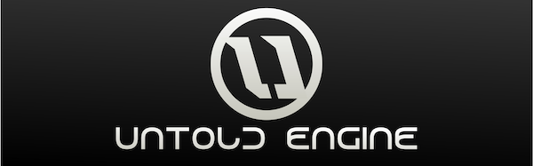
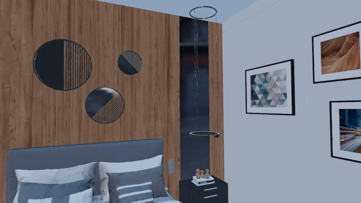
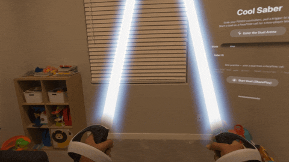

<h1 align="center">
  <a href="https://github.com/untoldengine/UntoldEngine">
    
  </a>
</h1>

<div align="center">
  <br />
  <a href="https://github.com/untoldengine/UntoldEngine/issues/new?assignees=&labels=bug&template=01_BUG_REPORT.md&title=bug%3A+">Report a Bug</a>
  ·
  <a href="https://github.com/untoldengine/UntoldEngine/issues/new?assignees=&labels=enhancement&template=02_FEATURE_REQUEST.md&title=feat%3A+">Request a Feature</a>
  ·
  <a href="https://github.com/untoldengine/UntoldEngine/issues/new?assignees=&labels=question&template=04_SUPPORT_QUESTION.md&title=support%3A+">Ask a Question</a>
  ·
  <a href="https://discord.gg/pSckCPFxj">Join Our Discord</a>
</div>

<div align="center">
<br />


[](LICENSE)
[](https://github.com/untoldengine/UntoldEngine/issues?q=is%3Aissue+is%3Aopen+label%3A%22help+wanted%22)


</div>

---

# Untold Engine

Untold Engine is an **open-source Swift/Metal XR engine for
high-performance Apple-platform spatial visualization apps**, giving
developers full control over rendering, shaders, and the engine pipeline.

Untold Engine is built for developers and teams who:

- Need **full control over Metal rendering, shaders, and engine systems**
- Prefer a native **Swift + Metal** architecture on Apple platforms
- Are building **XR, 3D, or spatial visualization applications**
- Need to handle **large scenes, streaming data, or custom asset pipelines**
- Want an open engine they can inspect, modify, extend, and embed

Creator & Lead Developer:  
https://www.haroldserrano.com



---

## Built For

Untold Engine is designed for developers building custom spatial visualization
software on Apple platforms, including:

- Vision Pro and spatial computing apps
- Architectural walkthroughs and large-scene visualizers
- Custom rendering pipelines and research prototypes

The engine owns the rendering and XR foundation. Your app owns the vertical
workflow, product experience, and customer-specific behavior.

---

## Watch It in Action — Apple Vision Pro Demos

| Demo | Description |
| --- | --- |
| [CoolSaber](https://github.com/untoldengine/UntoldArcade/tree/main/CoolSaber) | PSVR2-driven lightsaber duels, blades clashing over SharePlay |
| [CoolWater](https://github.com/untoldengine/UntoldArcade/tree/main/CoolWater) | Real-time animated water with reflection, refraction, and ripples |
| [CoolCloth](https://github.com/untoldengine/UntoldArcade/tree/main/CoolCloth) | GPU cloth simulation (XPBD) you can punch a ball through |
| [Archviz Viewer](https://untoldengine.github.io/UntoldEngine/LearningPaths/ArchvizToVisionPro/) | Blender-authored architectural scene walked through in mixed reality |
| [Bedroom Digital Twin](https://untoldengine.github.io/UntoldEngine/LearningPaths/BedroomDigitalTwin/) | Tap-to-inspect digital twin bedroom with live mock status data |
| [City Streaming](https://untoldengine.github.io/UntoldEngine/LearningPaths/CityStreamingOnVisionPro/) | City-scale scene streamed in tile by tile with LOD/HLOD |

Full source for every demo above lives in the [UntoldArcade](https://github.com/untoldengine/UntoldArcade) repo.

## Requirements

- macOS 26 or newer
- Swift 6 / Xcode 26 or newer
- Apple Silicon Mac
- Supported platforms: macOS, iOS, and visionOS



## Try the Engine Right Now

The best first step is to run the Starter Demo. It is intentionally small and
shows the basic shape of an Untold Engine app without the extra systems used by
the larger showcase.

> **Recommendation:** Use the latest stable release instead of the `develop`
> branch. The `develop` branch is the bleeding-edge version of Untold Engine and
> is updated frequently, so it may contain unstable changes or regressions.

Clone the repository and launch the Starter Demo:

```bash
git clone https://github.com/untoldengine/UntoldEngine.git
cd UntoldEngine
git checkout v0.16.0
swift run StarterDemo
```

After that, run the focused demos based on what you want to learn:

| Demo | Command | Start here when you want to learn |
| --- | --- | --- |
| Starter Demo | `swift run StarterDemo` | The minimal app structure: renderer setup, camera, light, input, and a simple scene. |
| Interaction / Gameplay Demo | `swift run InteractionGameplayDemo` | Gameplay-style movement, input handling, animation switching, physics pause/resume, and parented entities. |
| Lighting Demo | `swift run LightingDemo` | All four light types — directional, point, spot, and area — with live intensity and cone-angle controls. |
| Rendering Quality Demo | `swift run RenderingQualityDemo` | Post-processing controls such as color grading, SSAO, bloom, vignette, depth of field, anti-aliasing, and debug views. |
| Large Scene Streaming Demo | `swift run LargeSceneStreamingDemo` | Manifest-driven tiled scene streaming, LOD, batching, streaming stats, and large-world traversal. |
| Exporter Pipeline Demo | `swift run ExporterPipelineDemo` | Loading exported `.untold` assets, applying exported animation clips, and checking validation metadata. |
| Showcase Demo | `swift run ShowcaseDemo` | A broader engine showcase that combines many systems in one app. Use this after the focused demos. |

The demos live under `Sources/Demos`. They are runnable when working inside the
engine repository, but are not exposed as products to apps that add Untold
Engine as a package dependency.

---

## Getting Started

To create your own XR, 3D, or spatial visualization app using Untold Engine,
start with the documentation path that matches where you are:

- **Build a complete Vision Pro app:** follow the
  [Archviz To Vision Pro learning path](https://untoldengine.github.io/UntoldEngine/LearningPaths/ArchvizToVisionPro/)
  to take a Blender archviz model into a standalone visionOS project.
- **Learn the engine API through focused demos:** use the
  [Tutorials](https://untoldengine.github.io/UntoldEngine/Tutorials/)
  to understand Starter Demo, lighting, rendering quality, exporter workflows,
  scene channels, light portals, XR input, and performance diagnostics.
- **Create your own project from scratch:** see
  [Getting Started](https://untoldengine.github.io/UntoldEngine/API/GettingStarted/)
  and [Create A New Xcode Project](https://untoldengine.github.io/UntoldEngine/Tutorials/CreateXcodeProjectTutorial/).

If your team is evaluating Untold Engine and needs an engine capability that is
not currently available, see [Commercial Use, Sponsored Features, and Support](COMMERCIAL.md).

## Core Direction

Untold Engine is built around three focused goals:

- **Spatial Engine First** — Designed for spatial computing applications. LOD, geometry streaming, and static batching exist to support large, real-world-scale environments where presence and performance both matter.

- **XR / visionOS Support** — Spatial input, AR workflows, and Vision Pro support are functional today and expanding with each release.

- **Metal-First Architecture** — The rendering layer stays close to Metal to maintain performance, shader control, and pipeline flexibility without abstraction layers getting in the way.

---

## Example Use Cases

Untold Engine is well-suited for:

- Vision Pro and ARKit-based visualization apps
- Large-scale scene visualization: interiors, archviz, cities, datasets
- Custom rendering pipelines and graphics experiments

---

# Current Features

- **Apple Platform Coverage** — Unified Swift + Metal codebase for macOS, iOS, and visionOS
- **Rendering Pipeline Control** — Metal renderer with PBR/IBL workflows, shader-level control, rendering extensions, and post-processing across standard and XR paths
- **AR and XR Runtime Support** — Built-in AR workflows plus visionOS integration and spatial interaction support
- **ECS + Scene Graph Core** — Component-based architecture with hierarchical transforms and scene root transform controls
- **Async Content Loading** — Asynchronous loading pipeline for scenes and assets to improve responsiveness on large worlds
- **LOD and Streaming** — LOD support with geometry streaming, streaming regions, and memory budget management
- **Static Batching and Culling** — Static batching, octree acceleration, and occlusion culling for large-scene performance
- **Advanced Picking** — Scene, ground, and GPU ray picking with octree-backed intersection paths
- **Spatial Input Features** — XR spatial input helpers including anchored pinch drag, distance tracking, and two-hand rotation
- **Scripting System (USC)** — Untold Script Core with multi-script support plus camera, math, and physics APIs (Experimental)
- **Gameplay Systems** — Physics, animation, camera waypoint, and input systems (keyboard, mouse, touch, and gamepad)
- **Gaussian Splat Rendering** — Native Metal support for rendering and compositing 3D Gaussian content
- **Tooling Integration** — Optional Untold Editor workflow and Swift Package Manager integration

---


# Engine API

- [Getting Started](docs/API/GettingStarted.md)
- [Create Project with CLI](docs/API/UsingUntoldEngineCLI.md)
- [Registration System](docs/API/UsingRegistrationSystem.md)
- [Transform System](docs/API/UsingTransformSystem.md)
- [Scenegraph](docs/API/UsingScenegraph.md)
- [Camera System](docs/API/UsingCameraSystem.md)
- [Input System](docs/API/UsingInputSystem.md)
- [Rendering System](docs/API/UsingRenderingSystem.md)
- [Materials](docs/API/UsingMaterials.md)
- [Lighting System](docs/API/UsingLightingSystem.md)
- [Animation System](docs/API/UsingAnimationSystem.md)
- [Physics System](docs/API/UsingPhysicsSystem.md)
- [Steering System](docs/API/UsingSteeringSystem.md)
- [Post FX](docs/API/UsingPostFX.md)
- [LOD System](docs/API/UsingLODSystem.md)
- [Static Batching System](docs/API/UsingStaticBatchingSystem.md)
- [LOD-Batching-Streaming](docs/API/UsingLOD-Batching-Streaming.md)
- [Geometry Streaming System](docs/API/UsingGeometryStreamingSystem.md)
- [Async Loading](docs/API/UsingAsyncLoading.md)
- [Spatial Input](docs/API/UsingSpatialInput.md)
- [XR Immersion Modes](docs/API/UsingXRImmersionMode.md)
- [Light Portals](docs/API/UsingLightPortals.md)
- [Rendering Extensions](docs/API/UsingRenderingExtensions.md)
- [Rendering Extension Examples](Examples/RenderingExtensions/README.md)
- [Create a Rendering Extension Plugin](docs/Extensions/CreatingRenderingExtensionPlugin.md)
- [Gaussian System](docs/API/UsingGaussianSystem.md)
- [Profiler](docs/API/UsingProfiler.md)
- [Spatial Debugger](docs/API/SpatialDebugger.md)
- [Asset Exporter](docs/API/UsingTheExporter.md)
- [Bake Materials](docs/API/UsingBakeMaterials.md)
- [Color Management](docs/API/UsingColorManagement.md)
- [Optimizations](docs/API/Optimizations.md)

---

# Engine Architecture

- [Rendering System](docs/Architecture/renderingSystem.md)
- [Rendering Extensions](docs/Architecture/RenderingExtensions.md)
- [XR Rendering System](docs/Architecture/xrRenderingSystem.md)
- [Out of Core](docs/Architecture/outOfCore.md)
- [Geometry Streaming System](docs/Architecture/geometryStreamingSystem.md)
- [Streaming Cache Lifecycle](docs/Architecture/streamingCacheLifecycle.md)
- [Texture Streaming System](docs/Architecture/textureStreamingSystem.md)
- [Progressive Asset Loader](docs/Architecture/progressiveAssetLoader.md)
- [Asset Remote Streaming](docs/Architecture/asset_remote_streaming.md)
- [Static Batching System](docs/Architecture/batchingSystem.md)
- [LOD System](docs/Architecture/lodSystem.md)

---

# Roadmap

See open issues for planned features and known improvements.

- [Feature Requests](https://github.com/untoldengine/UntoldEngine/issues?q=label%3Aenhancement)
- [Bug Reports](https://github.com/untoldengine/UntoldEngine/issues?q=label%3Abug)

---

# Support

For help or questions, open a [GitHub Issue](https://github.com/untoldengine/UntoldEngine/issues).

---

# Contributing

Contributions are welcome — whether that's fixing bugs, improving systems, writing documentation, or proposing ideas.

Before submitting a pull request, please review the [Contributing Guidelines](docs/Contributor/ContributionGuidelines.md).

All contributions are licensed under **MPL-2.0**.

---

# Contributor License Agreement

By submitting a pull request you agree that your contributions may be distributed under the **Mozilla Public License 2.0**. See [CONTRIBUTOR_LICENSE_AGREEMENT.md](CONTRIBUTOR_LICENSE_AGREEMENT.md) for details.

---

# GitHub Sponsors

A huge thanks to the people helping shape the Untold Engine.

<p align="center">
  <a href="https://github.com/miolabs">
    
  </a>
</p>

---

# License

Untold Engine is licensed under the **Mozilla Public License 2.0 (MPL-2.0)**.

This allows developers to build commercial applications while ensuring improvements to the engine itself remain open.

| Use Case | Allowed | Obligation |
|----------|---------|-----------|
| Build commercial apps | Yes | App code can remain proprietary |
| Build games | Yes | Game code can remain proprietary |
| Use engine unmodified in a commercial product | Yes | No royalties |
| Modify engine files | Yes | Modified engine files remain MPL when distributed |
| Keep engine modifications private | Commercial license required | See [COMMERCIAL.md](COMMERCIAL.md) |
| Create plugins | Yes | Any license allowed |

Full license: https://www.mozilla.org/MPL/2.0/

**Need private engine modifications, sponsored feature work, or priority support?** See [COMMERCIAL.md](COMMERCIAL.md) for details.

---

# Commercial Use, Sponsored Features, and Support

Untold Engine is open source under MPL-2.0 and can be used in commercial apps.
Paid commercial options are available for teams that need private engine
modifications, sponsored engine features, priority support, or custom terms.

- **Sponsored open-source features** — fund roadmap-aligned engine work that is
  released into the public MPL engine.
- **Commercial license** — keep private modifications to engine internals closed
  under commercial terms.
- **Priority support / retainers** — get focused help with engine integration,
  rendering issues, performance, and production use.

If your team needs an engine feature that is not currently available, contact 
[Harold Serrano](https://www.haroldserrano.com/contact) to discuss sponsored feature development, private engine work, commercial licensing, or ongoing support. 

See [COMMERCIAL.md](COMMERCIAL.md) for commercial licensing details.

---

# Trademark

"Untold Engine" and the Untold Engine logo are trademarks of **Untold Engine Studios**. Forks may not use the name in a way that implies official endorsement. See [TRADEMARKS.md](TRADEMARKS.md).

---

# Community

- [GitHub Discussions](https://github.com/untoldengine/UntoldEngine/discussions) — ideas and questions
- [GitHub Issues](https://github.com/untoldengine/UntoldEngine/issues) — bugs and tasks
