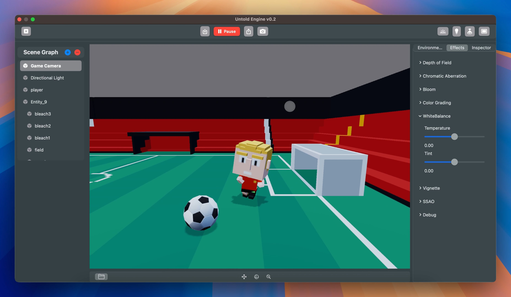
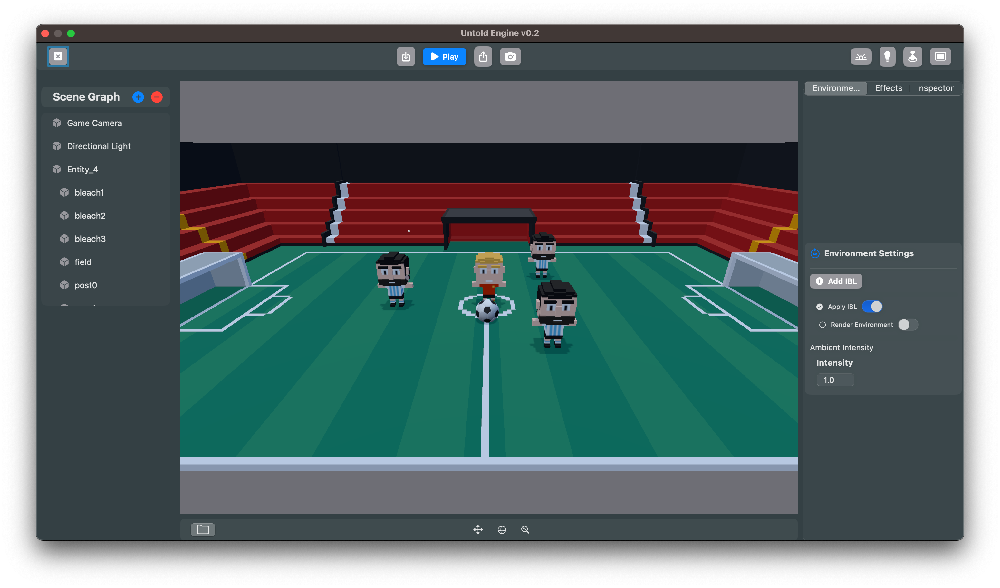

<h1 align="center">
  <a href="https://github.com/untoldengine/UntoldEngine">
    <!-- Please provide path to your logo here -->
    
  </a>
</h1>

<div align="center">
  <br />
  <a href="https://github.com/untoldengine/UntoldEngine/issues/new?assignees=&labels=bug&template=01_BUG_REPORT.md&title=bug%3A+">Report a Bug</a>
  ·
  <a href="https://github.com/untoldengine/UntoldEngine/issues/new?assignees=&labels=enhancement&template=02_FEATURE_REQUEST.md&title=feat%3A+">Request a Feature</a>
  .
  <a href="https://github.com/untoldengine/UntoldEngine/issues/new?assignees=&labels=question&template=04_SUPPORT_QUESTION.md&title=support%3A+">Ask a Question</a>
</div>

<div align="center">
<br />


[](LICENSE)

[](https://github.com/untoldengine/UntoldEngine/issues?q=is%3Aissue+is%3Aopen+label%3A%22help+wanted%22)
[](https://github.com/untoldengine)

</div>

<details open="open">
<summary>Table of Contents</summary>

- [About](#about)
- [Understanding the Ecosystem](#understanding-the-ecosystem)
- [Documentation](#documentation)
- [Getting Started](#getting-started)
  - [For Game Developers](#-for-game-developers)
  - [Command-Line Tool](#%EF%B8%8F-command-line-tool-for-terminal-users)
  - [For Engine Contributors](#%EF%B8%8F-for-engine-contributors)
- [Roadmap](#roadmap)
- [Support](#support)
- [Contributing](#contributing)
- [License](#license)


</details>

---

## About

The Untold Engine strives to be a **stable, performant, and developer-friendly** 3D engine that empowers creativity, removes friction, and makes game development feel effortless for Apple developers

The Untold Engine is an open-source 3D game engine under active development, designed for macOS and iOS platforms. Written in Swift and powered by Metal, its goal is to simplify game creation with a clean, intuitive API. While the engine already supports many core systems like rendering, physics, and animation, there’s still much to build and improve.

Creator & Lead Developer: [Harold Serrano](http://www.haroldserrano.com)

Click on image to play video:

[](https://vimeo.com/1116239409?share=copy#t=0)

## Current Features:
- Cross-Platform Support: Runs on macOS, iOS, and visionOS using a unified Swift + Metal codebase.
- Modern Renderer: Built on Metal with support for PBR materials, IBL, post-processing effects, and efficient GPU resource management.
- Entity–Component–System (ECS): Lightweight ECS architecture for organizing game logic and behaviors cleanly.
- Scene Graph: Hierarchical transformation system for managing parent–child relationships between entities.
- Physics System: Includes Euler integration, motion systems, and component-based extensibility for collisions and constraints.
- Animation System: Supports skeletal animations and reusable animation clips.
- Input System: Unified keyboard, mouse, and touch input handling (with controller support planned).
- Gaussian Splat Rendering: Native support for rendering 3D Gaussian Splats with Metal, enabling photorealistic scene reconstruction and novel view synthesis.
- Untold Editor Integration: Optional visual editor for managing assets, entities, and scenes.
- Swift Package Manager (SPM): Fully modular — integrate it easily into your own Xcode or Swift projects.
- - Open Source & Extensible: Licensed under the Mozilla Public License 2.0 (MPL-2.0), encouraging collaboration while protecting improvements to the engine core.

## The Journey Ahead:

The Untold Engine is a work in progress, with ambitious goals to:

- Extend the physics and collision system.
- Add advanced lighting and reflections.
- Expand XR and input support for visionOS.
- Improve workflow between the engine, editor, and asset pipeline.

---

## Understanding the Ecosystem

The Untold Engine project consists of multiple components designed for different audiences:

### 🎮 **Untold Engine Studio** (For Game Developers)
- **What it is**: Standalone application (DMG download)
- **Includes**: Visual editor + scripting + full engine + all dependencies
- **Target audience**: Game developers who want to create games
- **Get it**: [Download releases](https://github.com/untoldengine/UntoldEditor/releases)
- **No coding/building required** — just install and start creating

### 🛠️ **Untold Engine** (For Engine Contributors)
- **What it is**: Core engine repository (this repo)
- **Contains**: Rendering, physics, ECS, animation, input systems
- **Target audience**: Developers contributing to the engine core
- **Get it**: Clone [UntoldEngine](https://github.com/untoldengine/UntoldEngine)
- **Purpose**: Improve or extend the engine's fundamental systems

### 📝 **Untold Editor** (For Editor Contributors)  
- **What it is**: Editor interface repository
- **Contains**: Visual editing tools, UI, asset management
- **Target audience**: Developers contributing to the editor
- **Get it**: Clone [UntoldEditor](https://github.com/untoldengine/UntoldEditor)
- **Purpose**: Improve the editor interface and workflows

**Quick guide:**
- **Making games?** → Download Untold Engine Studio
- **Contributing to engine core?** → Clone Untold Engine
- **Contributing to editor?** → Clone Untold Editor

---

## Documentation

For comprehensive guides and API documentation, visit:  
👉 [Untold Engine Docs](https://untoldengine.github.io/UntoldEngine)

You'll find:
- **Game developers**: Tutorials on using Untold Engine Studio
- **Contributors**: Architecture guides and API references
- **Installation & setup** for both users and developers
- **How-to guides** for common tasks

⚡ **New to game development with Untold Engine?** Download [Untold Engine Studio](https://github.com/untoldengine/UntoldEditor/releases) and check out the Getting Started guide.

---

## Getting Started

### 🎮 For Game Developers

**Want to make games?** Download **[Untold Engine Studio](https://github.com/untoldengine/UntoldEditor/releases)** — a complete standalone application that includes:

- ✅ Visual editor with scripting support
- ✅ Full Untold Engine integration
- ✅ Asset management and scene editing
- ✅ Everything you need to create games
- ✅ No build tools or GitHub required

👉 **[Download Untold Engine Studio](https://github.com/untoldengine/UntoldEditor/releases)**

Just download the DMG, install, and start creating your game!



### ⌨️ Command-Line Tool (For Terminal Users)

**Prefer the command line?** Use **`untoldengine-create`** — an optional CLI tool for creating game projects without the editor:

```bash
# Clone the repository
git clone https://github.com/untoldengine/UntoldEngine.git
cd UntoldEngine

# Install the CLI globally
./scripts/install-create.sh

# Create a game project from anywhere
cd ~/anywhere
mkdir MyGame && cd MyGame
untoldengine-create create MyGame
```

**Features:**
- ✅ Create projects for macOS, iOS, iOS AR, visionOS, and **multi-platform**
- ✅ Multi-platform: One project for macOS, iOS, and visionOS
- ✅ Automated asset folder structure creation
- ✅ Perfect for CI/CD pipelines and scripting
- ✅ Update existing projects without touching custom code

👉 **[Full CLI Documentation](Tools/UntoldEngineCLI/README.md)**

### 🛠️ For Engine Contributors

**Want to contribute to the engine core?** This repository contains the engine's fundamental systems:

- Rendering (Metal-based)
- Physics and collision detection
- Entity-Component-System (ECS)
- Animation and scene graph
- Input handling

Clone this repository if you want to improve or extend the engine itself.

---

## Roadmap

See the [open issues](https://github.com/untoldengine/UntoldEngine/issues) for a list of proposed features (and known issues).

- [Top Feature Requests](https://github.com/untoldengine/UntoldEngine/issues?q=label%3Aenhancement+is%3Aopen+sort%3Areactions-%2B1-desc) (Add your votes using the 👍 reaction)
- [Top Bugs](https://github.com/untoldengine/UntoldEngine/issues?q=is%3Aissue+is%3Aopen+label%3Abug+sort%3Areactions-%2B1-desc) (Add your votes using the 👍 reaction)
- [Newest Bugs](https://github.com/untoldengine/UntoldEngine/issues?q=is%3Aopen+is%3Aissue+label%3Abug)

---

## Support

Reach out to the maintainer at one of the following places:

- [GitHub issues](https://github.com/untoldengine/UntoldEngine/issues/new?assignees=&labels=question&template=04_SUPPORT_QUESTION.md&title=support%3A+)

---

## Project assistance

If you want to say **thank you** or/and support active development of Untold Engine:

- Add a [GitHub Star](https://github.com/untoldengine/UntoldEngine) to the project.
- Tweet about the Untold Engine.
- Write interesting articles about the project on [Dev.to](https://dev.to/), [Medium](https://medium.com/) or your personal blog.

Together, we can make Untold Engine **better**!

---

## Contributing

We welcome contributions to Untold Engine.

You can contribute in many ways:

- **Fix Bugs** – Help resolve issues reported by the community.
- **Improve Features** – Enhance existing systems such as rendering, physics, ECS, or XR support.
- **Write Documentation** – Tutorials and guides help new developers learn the engine faster.
- **Propose New Ideas** – Share ideas through GitHub Discussions.

Before submitting a pull request, please read:

- CONTRIBUTING.md
- CONTRIBUTOR_LICENSE_AGREEMENT.md

All contributions to Untold Engine are licensed under the **Mozilla Public License 2.0 (MPL-2.0)**.

## Contributor License Agreement

To ensure the long-term sustainability of the project, all contributors must agree to the project's **Contributor License Agreement (CLA)**.

By submitting a pull request, you agree that your contributions may be distributed under the **Mozilla Public License 2.0 (MPL-2.0)**.

See:

CONTRIBUTOR_LICENSE_AGREEMENT.md

---


## Top Github Sponsors

A huge thanks to the people helping shape the Untold Engine. Your support and contributions make the project better every day.

<p align="center">
  <a href="https://github.com/miolabs">
    
  </a>
</p>

---

## License

Untold Engine is licensed under the **Mozilla Public License 2.0 (MPL-2.0)**.

This license allows developers to build commercial applications with Untold Engine while ensuring that improvements made to the engine itself remain open.

### In simple terms

| You want to… | Allowed? | Obligations |
|--------------|----------|-------------|
| Build a game using Untold Engine | ✅ Yes | Your game code can remain proprietary |
| Use Untold Engine in commercial projects | ✅ Yes | No royalties required |
| Modify the Untold Engine source code | ✅ Yes | Modified engine files must remain MPL-2.0 |
| Create plugins or external tools | ✅ Yes | Plugins can use any license |

### Why MPL-2.0?

MPL-2.0 strikes a balance between openness and flexibility:

- Protects improvements to the **engine core**
- Allows proprietary **games, apps, and plugins**
- Encourages a healthy open ecosystem

See the full license text in the `LICENSE` file or visit:

https://www.mozilla.org/MPL/2.0/

---

## Trademark

“Untold Engine” and the Untold Engine logo are trademarks of **Untold Engine Studios**.

You may use the name to reference the project or describe software built with the engine.

However, forks or derivative projects may not use the name in a way that implies official endorsement.

See:

TRADEMARKS.md

---

## Questions & Discussions

To keep communication clear and accessible for everyone:

- 💡 Use **[GitHub Discussions](https://github.com/untoldengine/UntoldEngine/discussions)** for feature proposals, ideas, or general questions.  
- 🐞 Use **[GitHub Issues](https://github.com/untoldengine/UntoldEngine/issues)** for bugs or concrete tasks that need tracking.  

This way, conversations stay organized, visible to the community, and future contributors can benefit from past discussions.
 
