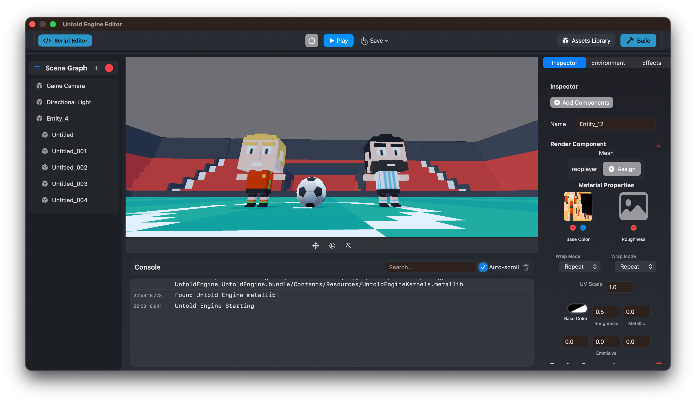

# Installation

This page explains how to install **Untold Engine Studio**, the recommended way to get started with Untold Engine.

Untold Engine Studio is a downloadable app that includes:
- The **Untold Engine** runtime
- The **Untold Editor** for building and editing games



If your goal is to **make games**, this is the only installation you need.

---

## Recommended Installation (Untold Engine Studio)

### 1. Download

Download the latest version of **Untold Engine Studio** from the official website:

[Download Releases](https://github.com/untoldengine/UntoldEditor/releases)

The download is provided as a `.dmg` file for macOS.

---

### 2. Install

1. Open the downloaded `.dmg` file  
2. Drag **Untold Engine Studio** into your `Applications` folder  
3. Launch the app from `Applications`

No additional setup is required.

---

### 3. First Launch

On first launch, Untold Engine Studio will:
- Initialize the engine runtime
- Set up the editor environment
- Prompt you to create or open a project

From here, you can immediately:
- Create scenes visually
- Import 3D models and assets
- Write game logic (Swift in Xcode or USC scripts)
- Build and test your game

---

## System Requirements

- macOS (Apple Silicon recommended)
- Metal-capable GPU
- Keyboard and mouse

---

## What You Get

By installing Untold Engine Studio, you get:

- A complete **game development environment**
- Visual editor for scenes, assets, and scripts
- Full **Untold Engine Swift API** for game logic in Xcode
- **USC scripting system** (experimental component-based scripting)
- Build and run support for macOS, iOS, and visionOS

You do **not** need to install the engine or editor separately.

### Two Ways to Write Game Logic

Untold Engine Studio supports two approaches for writing gameplay code:

**1. Swift in Xcode (Recommended)**
- Write game logic in `GameScene.swift` using the full Untold Engine API
- Complete control over game systems and performance
- Best for complex games and experienced developers
- Works seamlessly with Xcode debugging and profiling

**2. USC Scripts (Experimental)**
- Component-based scripting attached to entities
- Write gameplay behaviors in the integrated script editor
- Good for prototyping and simple game mechanics
- API is experimental and subject to change

You can **use both approaches** in the same project.

---

## Alternative Installation: CLI Workflow

For **advanced users** or those who prefer a **command-line workflow** without the visual editor, you can install the CLI tools.

### When to Use CLI

- You prefer working entirely in Xcode without a visual editor
- You want to script project creation and automation
- You're building tools or integrations on top of UntoldEngine

### CLI Installation

**1. Clone the repository:**

```bash
git clone https://github.com/untoldengine/UntoldEngine.git
cd UntoldEngine
```

**2. Install the CLI globally:**

```bash
./scripts/install-create.sh
```

**3. Verify installation:**

```bash
untoldengine-create --version
untoldengine-create --help
```

### CLI Quick Start

After installing the CLI, create a project from anywhere:

```bash
# 1. Create project directory
cd ~/anywhere
mkdir MyGame && cd MyGame

# 2. Create the project
untoldengine-create create MyGame

# 3. Open in Xcode
open MyGame/MyGame.xcodeproj
```

For complete CLI documentation, see `Tools/UntoldEngineCLI/README.md` in the repository.

---

### What You Get

The CLI creates a complete, ready-to-run project:

- **Xcode project** - Configured and ready to build
- **GameScene.swift** - Your game logic goes here
- **GameViewController.swift** - Renderer and view setup
- **GameData/** directory - All game assets location
- **Platform-specific** files (AppDelegate, Info.plist, etc.)

### Project Structure

```
MyGame/                          # Your working directory
└── MyGame/                      # Generated project
    ├── MyGame.xcodeproj         # Open this in Xcode
    ├── project.yml              # XcodeGen configuration
    └── Sources/
        └── MyGame/
            ├── GameData/        # ← Put your assets here
            │   ├── Models/      # 3D models
            │   ├── Scenes/      # Scene files
            │   ├── Scripts/     # USC scripts
            │   ├── Textures/    # Images
            │   └── ...
            ├── GameScene.swift          # Your game logic
            ├── GameViewController.swift # View controller
            └── AppDelegate.swift        # App entry point
```

### Platform Support

The CLI supports multiple platforms:

```bash
# macOS (default)
untoldengine-create create MyGame --platform macos

# iOS
untoldengine-create create MyGame --platform ios

# iOS with ARKit
untoldengine-create create MyGame --platform iosar

# visionOS (Apple Vision Pro)
untoldengine-create create MyGame --platform visionos
```

### Development Workflow

1. **Write code** in GameScene.swift (game logic)
2. **Add assets** to the GameData/ directory
3. **Build & run** in Xcode (Cmd+R)
4. **Iterate** - make changes and rebuild

For complete CLI documentation, see `Tools/UntoldEngineCLI/README.md` in the repository.

---

## Preloaded Assets

To kickstart development, download prebuilt demo assets:

- **Models**: Soccer stadium, player, ball, and more
- **Animations**: Running, idle, and other character motions
- **Textures**: Sample materials

[Download Demo Assets v1.0](https://haroldserrano.gumroad.com/l/iqjlac)

Extract and copy into your project's `GameData/` directory.

---
