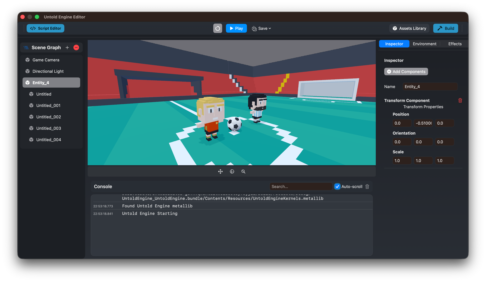

# Overview

This section covers **game development** with the UntoldEngine using **Swift** and **Xcode**.

You'll learn how to create games by writing Swift code that interacts directly with the engine's API.



---

## The Development Workflow

The UntoldEngine uses a **code-first workflow** that integrates seamlessly with Xcode:

1. **Create a project** using the Untold Engine Studio or the CLI tool (`untoldengine-create`)
2. **Write game logic** in Swift (GameScene.swift)
3. **Add assets** to the GameData/ directory
4. **Build & run** in Xcode (Cmd+R)
5. **Iterate** quickly with hot-reload

This workflow keeps you in familiar territory: **Swift, Xcode, and the tools you already know**.

---

## Your Entry Point: GameScene.swift

When you create a project, you get a clean `GameScene.swift` file that looks like this:

```swift
class GameScene {
    
    init() {
        // Configure asset paths
        setupAssetPaths()
        
        // Load game content
        loadBundledScripts()
        loadAndPlayFirstScene()
        
        // Start game systems
        startGameSystems()
    }
    
    func update(deltaTime: Float) {
        // Your game logic goes here
    }
    
    func handleInput() {
        // Handle user input here
    }
}
```

**This is where your game comes to life.** Write Swift code, access the engine API, and build your game.

---


## Project Structure

Your generated project has everything you need:

```
MyGame/
└── MyGame/
    ├── MyGame.xcodeproj         # Open in Xcode
    └── Sources/
        └── MyGame/
            ├── GameData/        # Assets location
            │   ├── Models/
            │   ├── Scenes/
            │   ├── Scripts/
            │   └── Textures/
            ├── GameScene.swift          # Your game logic ⭐
            ├── GameViewController.swift # Renderer setup
            └── AppDelegate.swift        # App entry
```

**Focus on GameScene.swift** - that's where your game lives.

---

