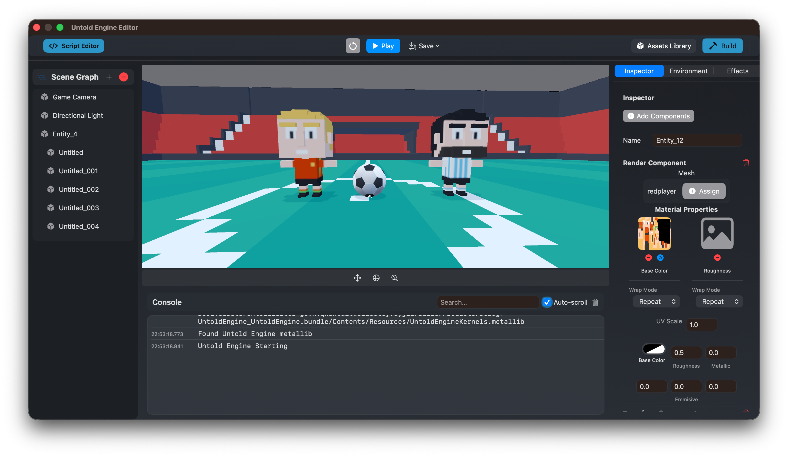

# Overview

This section of the documentation is for **game developers** who want to build games using Untold Engine.

You do not need to understand engine internals or rendering systems to follow this section.

---

## The Game Development Workflow

A typical workflow looks like this:

1. Create or open a project in Untold Engine Studio  
2. Create entities and scenes using the editor  
3. Attach USC scripts to define behavior  
4. Press Play to test your game  
5. Iterate quickly

This workflow is designed to stay simple and predictable.

---

## USC Scripting

Gameplay logic in Untold Engine is written using **USC (Untold Script Core)**.

USC is designed to:
- Be readable and explicit
- Avoid hidden behavior
- Map clearly to engine concepts

You’ll use USC for:
- Movement
- Input handling
- Camera control
- Basic gameplay systems

You can explore USC in detail in:

> **Game Development → USC**

---

## Using the Untold Engine Studio

The Untold Engine Studio is provided to make common tasks easier, such as:
- Editing scenes
- Inspecting entities and components
- Managing assets
- Running and debugging your game

The editor is a tool — not a requirement — and is designed to stay out of your way.

---

## Where to Go Next

- New to Untold Engine? Start with **USC → Introduction**
- Want hands-on examples? See **Tutorials**
- Curious how things work internally? See **Engine Development**

