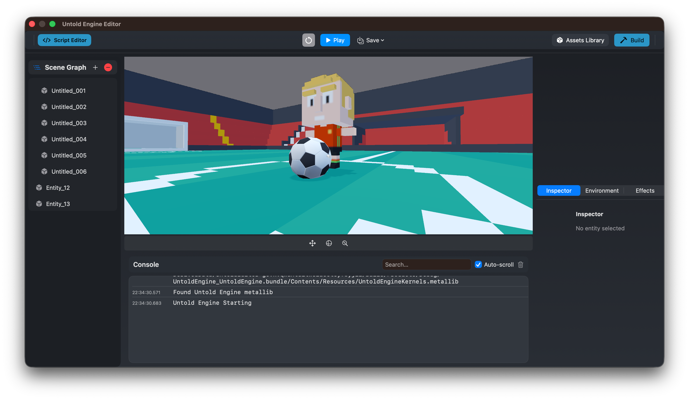
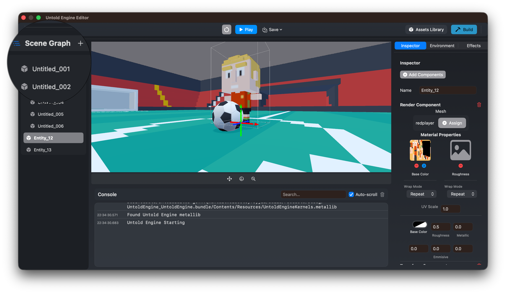
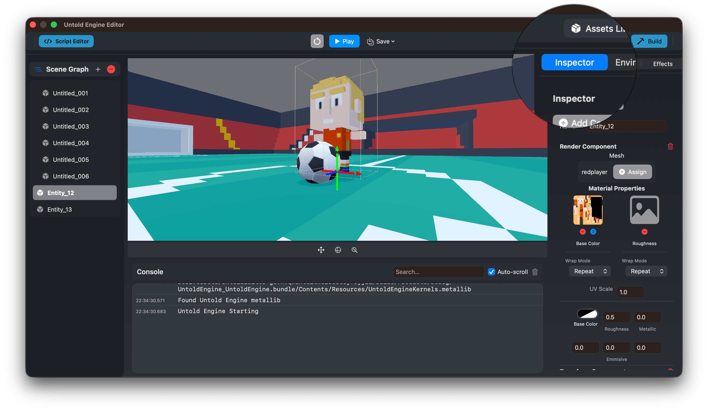
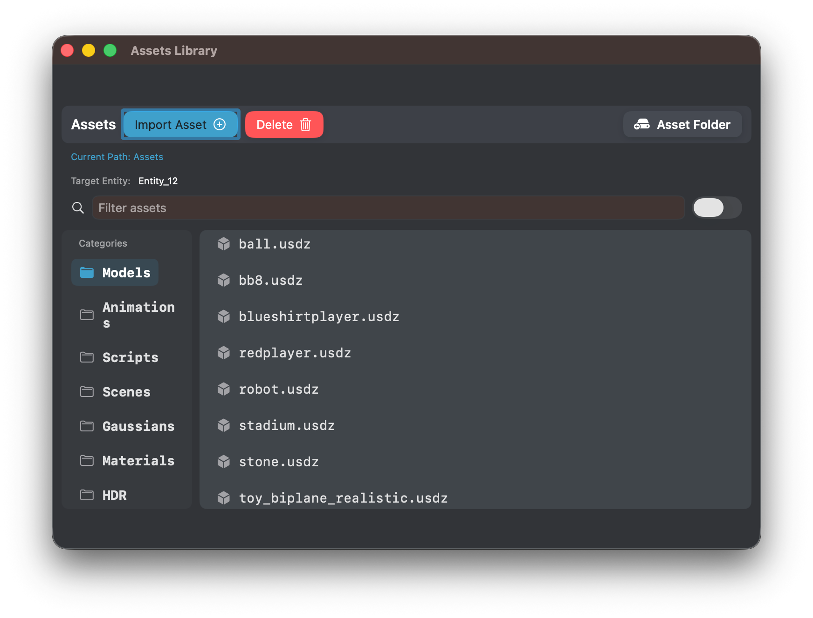

# Editor Overview

The editor is the primary environment for building games with the Untold Engine.

It is designed to be **explicit, predictable, and tightly integrated** with the engine runtime.
What you see in the editor reflects what runs in the game.

This page provides a **user-facing overview** of the editor for game developers.

---

## Purpose of the Editor

The editor allows you to:

- Create and manage scenes
- Inspect and modify entities
- Write and iterate on gameplay scripts
- Manage assets
- Preview runtime behavior in real time

The editor is not a separate simulation layer — it runs directly on top of the engine runtime.

---

## Core Editor Views

The editor is composed of several focused views, each with a clear responsibility.

---

### Scene View

The Scene View is where you visually interact with the world.

You can:
- Navigate the scene camera
- Select entities
- Translate, rotate, and scale entities
- Preview lighting and scene composition

This view reflects the engine’s real transform and rendering state.

---

### Scene Hierarchy View

The Scene Hierarchy shows all entities in the current scene.

It allows you to:
- View parent–child relationships
- Select entities
- Organize scene structure

The hierarchy mirrors the engine’s internal scene graph.

---

### Inspector View

The Inspector displays detailed information about the selected entity.

From the Inspector, you can:
- View and modify components
- Adjust transforms and properties
- Attach scripts and assets

Changes made in the Inspector apply directly to the runtime state.

---

### Asset Browser View

The Asset Browser provides access to project assets such as:

- Models
- Textures
- Scripts
- Scenes

Assets imported through the editor are organized and made available to the engine automatically.

---

## Where to Go Next

- Learn how to use USC scripting: **Game Development → USC**
- Understand scene structure: **Game Development → Scenes**
- Explore editor internals: **Editor Development**
