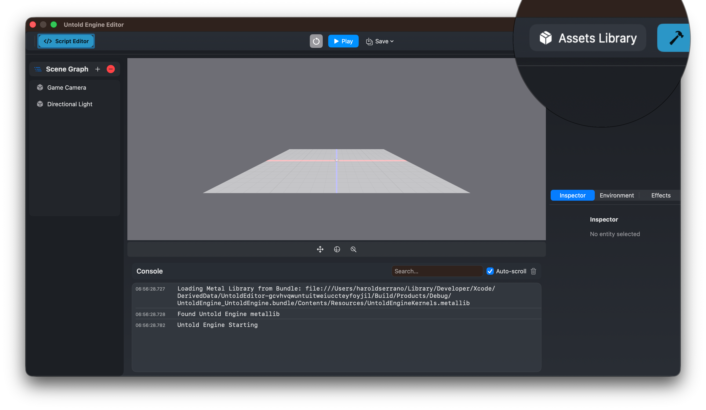
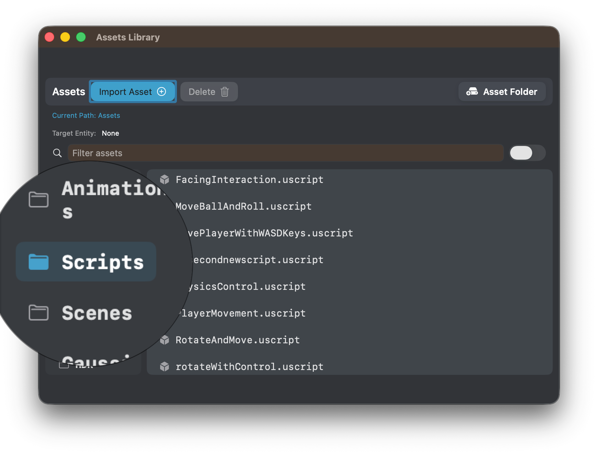
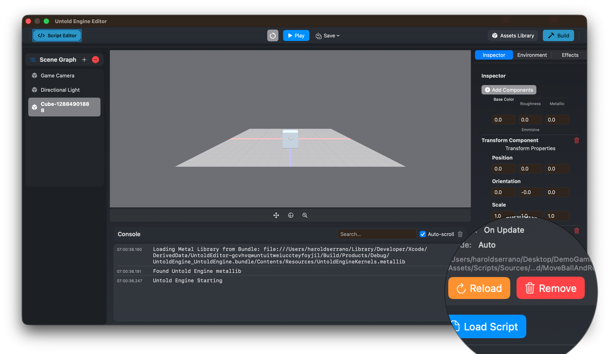

# USC Scripting – Quick Start

This tutorial will walk you through creating your first script in the Untold Engine, from setup to testing in Play mode.

**What you'll build:** A cube that moves upward by changing its position every frame.

**Time:** ~10 minutes

---

## Step 1: Create Your First Script

### 1.1 Configure Asset Path 

1. Open Untold Engine.
2. Go to **Asset Library → Set Asset Folder**
3. Create/Select your projects's asset directory. 

This is where your assets will be saved. Including your Scripts.



### 1.2 Create Your First Script 

1. In the editor toolbar, click **Scripts: Open in Xcode** (blue button).
2. Click the `+` button to create a new script.
3. Enter the script name: `MovingCube`
4. Xcode opens the Scripts package so you can edit the new file.

When the script is created:
- The source file is added to your project
- Xcode shows a template like this:

```swift
import Foundation
import UntoldEngine

extension GenerateScripts {
    static func generateMovingCube(to dir: URL) {
        // Write your script here
    }
}
```

You will edit everything in Xcode.

---

## Step 2: Wire Up the Script

⚠️ IMPORTANT MANUAL STEP

The editor created your script file, but you need to tell the build system to generate it.

1. Click Scripts: Open in Xcode (blue button in toolbar)
2. In Xcode, open GenerateScripts.swift
3. Add your script to the main() function:

```swift
@main
struct GenerateScripts {
    static func main() {
        print("🔨 Generating USC scripts...")
        
        let outputDir = URL(fileURLWithPath: "Generated/")
        try? FileManager.default.createDirectory(at: outputDir, withIntermediateDirectories: true)
        
        // Add this line:
        generateMovingCube(to: outputDir)
        
        print("✅ All scripts generated in Generated/")
    }
}
```

Now run the GenerateScripts target (`Cmd+R`) to generate the `.uscript` files.


MPORTANT NOTES:
The function name (e.g. generateMovingCube) MUST match the tutorial’s script
Only adjust that single line per tutorial
The structure, wording, and warning must remain consistent across all documents

---

## Step 3: Write USC Logic

Replace the function with this complete script:

```swift
extension GenerateScripts {
    static func generateMovingCube(to dir: URL) {
        let script = buildScript(name: "MovingCube") { s in
            // Run every frame
            s.onUpdate()
                .getProperty(.position, as: "pos")
                .setVariable("offset", to: simd_float3(x: 0.0, y: 0.1, z: 0.0))
                .addVec3("pos", "offset", as: "newPos")
                .setProperty(.position, toVariable: "newPos")
        }
        
        let outputPath = dir.appendingPathComponent("MovingCube.uscript")
        try? saveUSCScript(script, to: outputPath)
        print("  ✅ MovingCube.uscript")
    }
}
```

---

## Step 4: Build Scripts

After editing scripts, build and run in Xcode so the engine can use the generated output.

- In Xcode, press `Cmd+R` to run the GenerateScripts target and produce the `.uscript` files. (Optional: `Cmd+B` to check the build first.)
- Build and run output appears inside Xcode.

> A successful build makes the script available in the Asset Library to attach to entities.

**First build?** It may take 30-60 seconds to download dependencies. Subsequent builds are much faster.

---

## Step 5: Add an Entity to the scene

1. In the editor, click on "+" in the scenegraph
2. Click on "Cube"
3. A cube will show up in the scene. Make sure to select it. 

## Step 6: Link script to entity 

4. Open the **Asset Library**
5. Under the Script category, look for your script `MovingCube` and double click on the `.uscript`. This will automatically link the script to the entity.
6. To verify, the Inspector View will show the newly added script linked to the entity.



The script is now active and will run according to the engine update loop.

---

## Step 7: Test in Play Mode

### 7.1 Run the Scene

1. Click **Play** in the editor
2. Watch your entity move upward continuously!

### 7.2 Stop Play Mode

Click **Stop** when done testing.

---

## Step 8: Test Hot Reload - Move Sideways

Let's modify the script to move the cube sideways instead of upward, and test the hot reload feature.

### 8.1 Modify the Offset

Modify your script to change the offset direction:

```swift
extension GenerateScripts {
    static func generateMovingCube(to dir: URL) {
        let script = buildScript(name: "MovingCube") { s in
            s.onUpdate()
                .getProperty(.position, as: "pos")
                .setVariable("offset", to: simd_float3(x: 0.1, y: 0.0, z: 0.0))  // Changed to move sideways
                .addVec3("pos", "offset", as: "newPos")
                .setProperty(.position, toVariable: "newPos")
        }
        
        let outputPath = dir.appendingPathComponent("MovingCube.uscript")
        try? saveUSCScript(script, to: outputPath)
        print("  ✅ MovingCube.uscript")
    }
}
```

**What changed:** The offset is now `(0.1, 0.0, 0.0)` instead of `(0.0, 0.1, 0.0)`, so the cube will move along the X-axis (sideways) instead of the Y-axis (upward).

### 8.2 Rebuild

1. In Xcode, press `Cmd+R` to run the GenerateScripts target.
2. Wait for "✅ MovingCube.uscript" in the Xcode run output

### 8.3 Hot Reload

Back in the editor:
1. With your entity selected
2. Click **"Reload"** (orange button) in the Script Component Inspector
3. Click **Play** to test the changes
4. The cube should now move sideways instead of upward!



---

## Where to Go Next

- Learn the USC language: **USC → Introduction**
- Understand scripting workflow: **USC → Workflow**
- Explore example scripts
