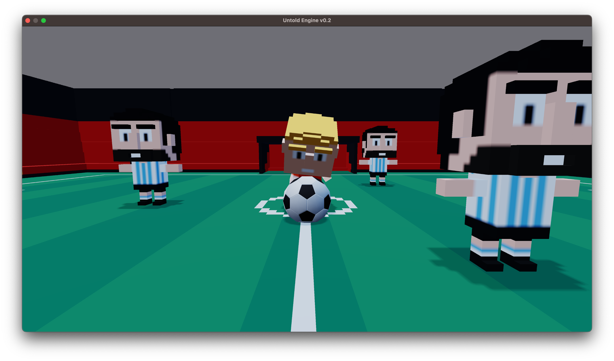

# Overview

This section is for **engine developers and contributors** who want to work on the core of Untold Engine.

It assumes familiarity with engine concepts and systems programming.

---

## What You’ll Work On

In this section, you’ll learn about:
- The engine architecture
- The ECS design
- Rendering systems
- Simulation and update flow
- Platform-specific layers

This is where the **core behavior** of Untold Engine lives.

---

## Installing the Engine for Development

Engine development requires installing Untold Engine via the command line and working from source.

Detailed installation steps are provided here:


1. Clone the Repository

```bash
git clone https://github.com/untoldengine/UntoldEngine
cd UntoldEngine
open Package.swift
```

**How to Run**
1. Select the **DemoGame** scheme.  
2. Download the [Demo Game Assets v1.0](https://github.com/untoldengine/UntoldEngine-Assets/releases/tag/v1) and place them in your Desktop folder.  
3. Set the Scheme to **Demo Game**. Then set **My Mac** as the target device and hit **Run**.  
4. Use **WASD** keys to move the player around.  





You do not need Untold Engine Studio to work on the engine itself.

---

## Engine Architecture

Untold Engine is built around:
- A clear ECS model
- Explicit system update order
- Minimal hidden state
- Platform-specific rendering backends

The architecture favors **clarity over abstraction**.

A high-level breakdown is provided in:

> **Engine Development → Architecture**

---

## Rendering and Systems

Rendering, physics, and other systems are implemented as:
- Independent modules
- Explicit update stages
- Predictable data flow

Rendering is designed to expose low-level control while remaining approachable.

---

## Who This Section Is Not For

This section is **not** intended for:
- Game developers writing gameplay scripts
- Users who only want to use the editor
- Beginners to engine development

If you want to make a game, see:

> **Game Development → Overview**

---

## Where to Go Next

- Learn the engine structure: **Architecture**
- Explore rendering systems: **Rendering**
- Contribute to the engine: **Extending the Engine**
