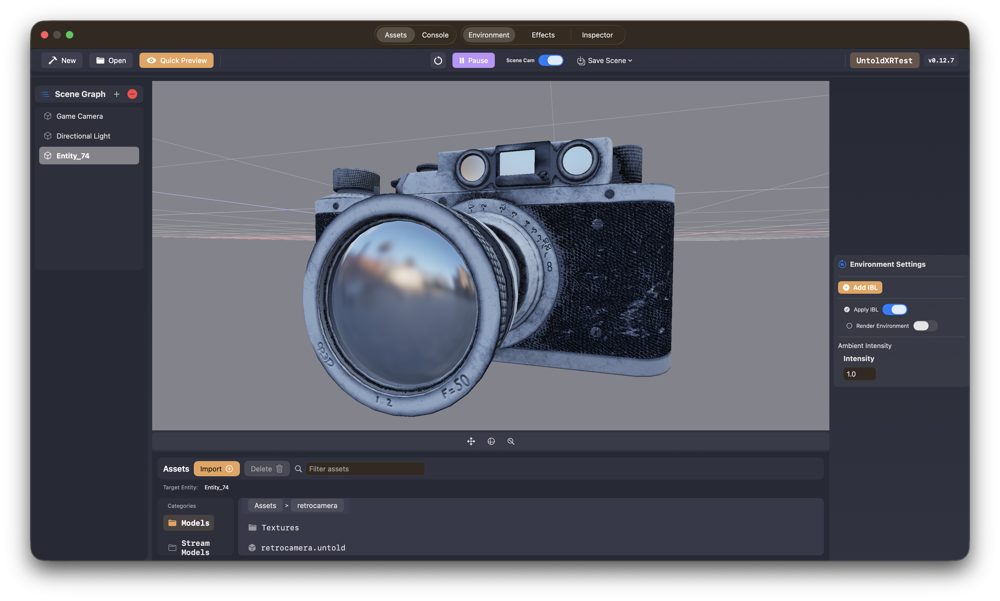

# Getting Started

This guide takes you from a fresh Untold Engine checkout to a working game
project. You will run the demo, create an Xcode project, export assets into the
engine's `.untold` runtime format, and load those assets from a `GameScene`.

You can create projects and export assets in two ways:

- Use the CLI if you prefer terminal commands or want a repeatable workflow.
- Use Untold Engine Studio if you prefer a visual editor for project setup,
  asset import, and scene preparation.

After your project is created, both workflows lead to the same place: an Xcode
project with a `GameData` folder that contains the assets your game loads at
runtime.

---

## Clone the Untold Engine

> **Recommendation:** Use the latest stable release instead of the `develop`
> branch. The `develop` branch is the bleeding-edge version of Untold Engine and
> is updated frequently, so it may contain unstable changes or regressions.

Clone the repository and launch the demo:

```bash
git clone https://github.com/untoldengine/UntoldEngine.git
cd UntoldEngine
git checkout v0.12.15
swift run untolddemo
```

## Create an Xcode Project

You can create a project with either Untold Engine Studio or the CLI. If you are
new to Untold Engine, start with the Editor. If you prefer terminal workflows or
want repeatable project setup, use the CLI.

### Option 1: Editor

Use **Untold Engine Studio** for a visual workflow. It is a standalone editor for
creating projects, preparing assets, composing scenes, and generating scene files
used inside your game.

[Download Untold Engine Studio](https://github.com/untoldengine/UntoldEditor/releases)



To set up a project:
1. Click on "New".
2. Provide a Project name
3. Provide a Bundle name
4. Select the Target Platform
5. Provide an output path

Untold Engine Studio will create an Xcode project ready to be used with Untold Engine.

### Option 2: CLI

Use `untoldengine-create` to generate a ready-to-run Xcode project with Untold Engine wired in.

Install it from the repository:

```bash
./scripts/install-untoldengine-create.sh
```

Now create an Xcode project. The example below uses `--platform visionos` to
create a Vision Pro project.

### Vision Pro Example

```bash
cd ~/Projects
untoldengine-create create VisionGame --platform visionos
open VisionGame/VisionGame.xcodeproj
```

If you want to create a project for other platforms, you can use the flags below:

### Platform options

```bash
# visionOS (Apple Vision Pro)
untoldengine-create create MyGame --platform visionos

# macOS (default)
untoldengine-create create MyGame --platform macos

# iOS with ARKit
untoldengine-create create MyGame --platform ios-ar

# iOS
untoldengine-create create MyGame --platform ios
```

Dependency behavior by platform:

- `visionos`: `UntoldEngineXR` + `UntoldEngineAR`
- `ios-ar`: `UntoldEngineAR`
- `ios` and `macos`: `UntoldEngine`

## Native Asset Format: `.untold`

Untold Engine uses `.untold` as its native runtime asset format. USDZ/USD remains
the authoring format — you model assets in your DCC tool, export to USDZ, then
convert to `.untold` before loading them in the engine.

The `.untold` format is a binary container optimised for fast runtime parsing with
no ModelIO dependency. It supports runtime mesh data, PBR materials, texture references,
transforms, bounds, and exported animation clips.

You can convert assets with either the Untold Engine Blender addon or the CLI.

### Option 1: Blender add-on

To convert a USDZ file into the `.untold` format using the add-on, follow the directions in [Using Blender Addon](UsingBlenderAddon.md).

After the model has been converted to `.untold` format:

1. Click on "Import" in the Asset Browser View in the Editor.
2. Click on "Import Models"
3. When the import has completed, you will see your new `.untold` model under the Model Category.

At this point, head over to your Xcode project. You will also notice that your `.untold` model is under `Sources/<ProjectName>/GameData/Models`.

### Option 2: CLI

Use the `export-untold` script to convert a single USDZ asset:

```bash
./scripts/export-untold \
  --input /path/to/your/model/robot/robot.usdz \
  --output /path/to/your/project/GameData/Models/robot/robot.untold \
  --ConvertOrientation \
  --source-orientation blender-native
```

For animation assets, use the `--animation` flag:

```bash
./scripts/export-untold \
  --input /path/to/your/animation/robot/robot.usdz \
  --output /path/to/your/project/GameData/Animations/robot/robot.untold \
  --ConvertOrientation \
  --source-orientation blender-native \
  --animation
```

For large scenes that need tile-based streaming, use `export-untold-tiles` to
partition the scene and generate a manifest JSON:

```bash
./scripts/export-untold-tiles \
  --input /path/to/your/model/dungeon/dungeon.usdz \
  --output-dir /path/to/your/project/GameData/StreamModels/dungeon/tile_exports \
  --tile-size-x 25 \
  --tile-size-z 25 \
  --generate-hlod \
  --generate-lod
```

For the full list of options, validation flags, and expected output layout see
[Using The Exporter](UsingTheExporter.md). For optional asset optimization
workflows, see [Optimizations](Optimizations.md).

---

## Loading a Single Asset

Once in your Xcode project, head over to the init function in Sources/<ProjectName>/GameScene.swift.

Use `setEntityMeshAsync` to load an `.untold` file as an always-resident asset.
This is the right choice for props, characters, and any object that should stay
in memory for the lifetime of the scene.

```swift

//...After configureEngineSystems()

let entity = createEntity()
setEntityName(entityId: entity, name: "robot")

setEntityMeshAsync(entityId: entity, filename: "robot", withExtension: "untold") { success in
    if success {
        translateBy(entityId: entity, position: simd_float3(0.0, 0.0, 0.0))
        setEntityKinetics(entityId: entity)
    }
    setSceneReady(success)
}
```

`setEntityMeshAsync` is non-blocking. The completion block fires on the main thread
once the mesh is parsed and uploaded to GPU memory.

---

## Loading an Untold Scene File

Untold Engine Studio can save a composed scene as a `.untoldscene` file. A saved
scene can include model placement, light properties, post-processing settings,
and other scene data configured in the editor.

Use `loadUntoldScene` to load that scene in your Xcode project. Place the
`.untoldscene` file in `Sources/<ProjectName>/GameData/Scenes`, then pass the
scene name without an extension, or with the `.untoldscene` extension.

```swift

//...After configureEngineSystems()

loadUntoldScene(named: "LevelOne") { success in
    if success {
        moveCameraTo(entityId: findGameCamera(), 0.0, 3.0, 10.0)
        ambientIntensity = 0.4
    }
    setSceneReady(success)
}
```

By default, scene meshes load asynchronously. For tests or tools that need a
blocking load, pass `meshLoadingMode: .sync`.

---

## Loading a Streamed Scene

Use `setEntityStreamScene` to load a large scene that streams tiles in and out of
GPU memory based on camera proximity. Pass either a local manifest path or a remote
`https://` URL — the engine handles downloading and caching automatically.

```swift

//..After configureEngineSystems()


let sceneRoot = createEntity()
setEntityName(entityId: sceneRoot, name: "dungeon")

// Local manifest
setEntityStreamScene(entityId: sceneRoot, manifest: "dungeon", withExtension: "json") { success in
    setSceneReady(success)
}
```

## Loading a Remote Streamed Scene

To stream a remote scene, use the same `setEntityStreamScene(...)` API with a URL to your manifest JSON file.

```swift
// Remote manifest (downloaded and cached on demand)
if let url = URL(string: "https://cdn.example.com/dungeon/dungeon.json") {
    setEntityStreamScene(entityId: sceneRoot, url: url) { success in
        setSceneReady(success)
    }
}
```

`setEntityStreamScene` registers lightweight stub entities for every tile in the
manifest, all parented under `sceneRoot` (no geometry is parsed at this point).
`GeometryStreamingSystem` then loads and unloads tile geometry as the camera moves.
See [Tile-Based Streaming](../Architecture/tilebasedstreaming) for the full streaming
architecture.

> **Legacy overloads** — `loadTiledScene(manifest:)` and `loadTiledScene(url:)` remain
> available for backwards compatibility. They create an internal root entity automatically.

---

## Finding Entities in the Loaded Scene

Retrieve a named entity with `findEntity(name:)` inside the completion block or
after `setSceneReady`:

```swift
setEntityMeshAsync(entityId: entity, filename: "stadium", withExtension: "untold") { success in
    if let player = findEntity(name: "player") {
        rotateTo(entityId: player, angle: 0, axis: simd_float3(0.0, 1.0, 0.0))
        setEntityKinetics(entityId: player)
    }
    setSceneReady(success)
}
```

---

## Camera and Lighting

Create a camera and directional light manually in your scene setup, then position
the camera after assets load:

```swift
let gameCamera = createEntity()
setEntityName(entityId: gameCamera, name: "Main Camera")
createGameCamera(entityId: gameCamera)
CameraSystem.shared.activeCamera = gameCamera

let light = createEntity()
setEntityName(entityId: light, name: "Directional Light")
createDirLight(entityId: light)
```

After loading:

```swift
moveCameraTo(entityId: findGameCamera(), 0.0, 3.0, 10.0)
ambientIntensity = 0.4
```

---

## Putting It All Together

A complete `GameScene` using the patterns above:

```swift
final class GameScene {

    init() {
        // Camera and light
        let gameCamera = createEntity()
        setEntityName(entityId: gameCamera, name: "Main Camera")
        createGameCamera(entityId: gameCamera)
        CameraSystem.shared.activeCamera = gameCamera

        let light = createEntity()
        setEntityName(entityId: light, name: "Directional Light")
        createDirLight(entityId: light)

        // Load a single always-resident asset
        let stadium = createEntity()

        setEntityMeshAsync(entityId: stadium, filename: "stadium", withExtension: "untold") { success in
            if let player = findEntity(name: "player") {
                rotateTo(entityId: player, angle: 0, axis: simd_float3(0.0, 1.0, 0.0))
                setEntityAnimations(entityId: player, filename: "running", withExtension: "untold", name: "running")
                setEntityAnimations(entityId: player, filename: "idle",    withExtension: "untold", name: "idle")
                setEntityKinetics(entityId: player)
            }

            moveCameraTo(entityId: findGameCamera(), 0.0, 3.0, 10.0)
            ambientIntensity = 0.4
            setSceneReady(success)
        }
    }
}
```

For a large streaming scene, replace the `setEntityMeshAsync` call with `setEntityStreamScene`:

```swift
let sceneRoot = createEntity()
setEntityName(entityId: sceneRoot, name: "dungeon")

setEntityStreamScene(entityId: sceneRoot, manifest: "dungeon", withExtension: "json") { success in
    moveCameraTo(entityId: findGameCamera(), 0.0, 3.0, 10.0)
    ambientIntensity = 0.4
    setSceneReady(success)
}
```
