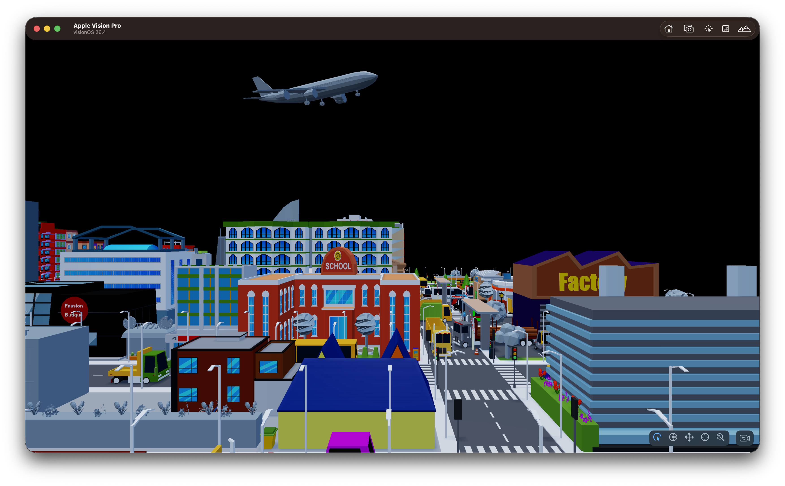

# Getting Started

This guide takes you from a fresh Untold Engine checkout to a working Vision Pro
project. By the end of this short tutorial, you will be able to render this Archviz model in the Vision Pro/Simulator

Click the image below for a video.
[](https://vimeo.com/1176995991?fl=ip&fe=ec) 

---

## Clone the Untold Engine

> **Recommendation:** Use the latest stable release instead of the `develop`
> branch. The `develop` branch is the bleeding-edge version of Untold Engine and
> is updated frequently, so it may contain unstable changes or regressions.

Clone the repository and launch the demo:

```bash
git clone https://github.com/untoldengine/UntoldEngine.git
cd UntoldEngine
git checkout v0.18.0
swift run ShowcaseDemo
```

## Create an Xcode Project

You can create projects using the Untold Engine Command Line Interface.

Use `untoldengine` to generate a ready-to-run Xcode project with Untold Engine wired in.

Install it from the repository:

```bash
./scripts/install-untoldengine-create.sh
```

Now create an Xcode project. The example below uses `--platform visionos` to
create a Vision Pro project.

### Vision Pro Example

```bash
cd ~/Projects
untoldengine create VisionGame --platform visionos
open VisionGame/VisionGame.xcodeproj
```

If you want to create a project for other platforms, you can use the flags below:

### Platform options

```bash
# visionOS (Apple Vision Pro)
untoldengine create MyGame --platform visionos

# macOS (default)
untoldengine create MyGame --platform macos

# iOS with ARKit
untoldengine create MyGame --platform ios-ar

# iOS
untoldengine create MyGame --platform ios
```

Dependency behavior by platform:

- `visionos`: `UntoldEngineXR` + `UntoldEngineAR`
- `ios-ar`: `UntoldEngineAR`
- `ios` and `macos`: `UntoldEngine`

After your project is created, you'll get an Xcode project with a `GameData` folder that contains the assets your game loads at runtime.

## Get Starter Assets

Once your project is created, install the Archviz Starter Asset Pack directly from the CLI:

```bash
cd MyGame
untoldengine assets install starter-archviz
```

The Archviz Starter Pack includes an archviz model ready to run immediately. The CLI downloads the pack and merges its contents into your project's `GameData` folder automatically. If a file already exists you will be prompted before it is overwritten.

To see all available asset packs:

```bash
untoldengine assets list
```

## Loading a Single Asset

Once in your Xcode project, head over to the `init()` function in `Sources/<ProjectName>/GameScene.swift`.

Use `setEntityMeshAsync` to load an `.untold` file as an always-resident asset.
This is the right choice for props, characters, and any object that should stay
in memory for the lifetime of the scene.

```swift

//...After configureEngineSystems()

let entity = createEntity()

setEntityMeshAsync(entityId: entity, filename: "Bedroom", withExtension: "untold"){ success in
    if success {
        
        // Load blender authored color management
        loadSceneAuthored(filename: "Bedroom", withExtension: "untold")
        
        // Enable environement settings
        
        setRendering(.environment(.ibl(true)))
        setRendering(.environment(.asset("forest.exr")))
        setRendering(.environment(.intensity(0.9)))
        setRendering(.environment(.visible(true)))
    
        // set scene ready if loading was successful
        setSceneReady(success)
    }
    
}

```

`setEntityMeshAsync` is non-blocking. The completion block fires on the main thread
once the mesh is parsed and uploaded to GPU memory.

---

## Configuring the Engine

Now, let's configure the Untold Engine so that it can accept input gestures along with other important settings:

Head to configureEngineSystems() and make sure to add the following:

```swift 
private func configureEngineSystems() {
    
    gameMode = true
    
    // Register XR input gestures
    registerXREvents()
    setInput(.xr(.pickingBackend(.octreeGPUPreferred)))
    setInput(.xr(.twoHandRotateAxisMode(.dynamicSnapped)))
    setInput(.xr(.sceneReady(true)))
    
    // Enable post processing and anti-aliasing
    setRendering(.postProcessing(.enabled))
    setRendering(.antiAliasing(.msaa))
    setPostFX(.ssao(.enabled(false)))
    
    // Enable super detail textures
    TextureStreamingSystem.shared.apply(.superdetailed)
}
```

## Handle Input

Now let's add logic to the input handling function. For this tutorial, we want to be able to drag the root scene by pinching our fingers, to do so, we call the Spatial Manipulation System, as shown below:

```swift
func handleInput() {
    // Skip logic if not in game mode
    if gameMode == false { return }
    if isSceneReady() == false {return}
   
    let state = getXRSpatialInputState()
            
    // transform scene root.
    // Pinch + Drag to move scene root
    // Two-hands rotate to rotate the scene root
    SpatialManipulationSystem.shared.processAnchoredSceneManipulationLifecycle(
        from: state,
        dragSensitivity: 10.0,
        rotateSensitivity: 1.0
    )
}
```

---

Now, Build and Run. Click on Start Experience and you should see the archviz rendered on either the Vision Pro Simulator or in the actual device.

[](https://vimeo.com/1176995991?fl=ip&fe=ec)

## Loading a Streamed Scene

Now, let's say that you want to load a large scene, for example a city model with many buildings. In those instances, you should render the scene using the Tile Streaming feature of the engine. More especifically, you should use `setEntityStreamScene` to load a large scene that streams tiles in and out of GPU memory based on camera proximity. 

Let's download a Stream Starter Scene

```bash

untoldengine assets install starter-streamed-city

```

To load a Tiled-Stream scene, you need to use `setEntityStreamScene` and pass the `json` extension as shown below.

```swift

//..After configureEngineSystems()


let sceneRoot = createEntity()
setEntityName(entityId: sceneRoot, name: "LowPolyCity")

// Local manifest
setEntityStreamScene(entityId: sceneRoot, manifest: "LowPolyCity", withExtension: "json") { success in
    setSceneReady(success)
}
```

Now, build and run the vision pro app and you should see a streaming city getting rendered. Click the image below for a video.

[](https://vimeo.com/1176823067?share=copy&fl=sv&fe=ci)

## Loading a Remote Streamed Scene

To stream a remote scene, use the same `setEntityStreamScene(...)` API with a URL to your manifest JSON file.

```swift
// Remote manifest (downloaded and cached on demand)
if let url = URL(string: "https://cdn.example.com/City/City.json") {
    setEntityStreamScene(entityId: sceneRoot, url: url) { success in
        setSceneReady(success)
    }
}
```

`setEntityStreamScene` registers lightweight stub entities for every tile in the
manifest, all parented under `sceneRoot` (no geometry is parsed at this point).
`GeometryStreamingSystem` then loads and unloads tile geometry as the camera moves.
See [Tile-Based Streaming](../Architecture/tilebasedstreaming.md) for the full streaming
architecture.

> **Legacy overloads** — `loadTiledScene(manifest:)` and `loadTiledScene(url:)` remain
> available for backwards compatibility. They create an internal root entity automatically.

## Using Your Own Assets

Everything up to this point uses the Starter Pack. Eventually, you will want to
use your own 3D models. The sections that follow cover installing the exporter
tools, converting assets to the engine's `.untold` format, and streaming large
scenes.

## Bootstrap Exporter Dependencies

Before exporting or optimizing assets, install the external tools the CLI
relies on — the `astcenc` texture compressor and the `Pillow`/`lz4` Python
packages — in one step:

```bash
untoldengine bootstrap
```

This downloads a pinned, checksum-verified `astcenc` release into
`~/.untoldengine/tools` and `pip install`s the Python packages. Nothing to
download by hand or wire up with environment variables. Re-running `bootstrap`
is a no-op once everything is installed; pass `--force` to reinstall. See
[Optimizations](Optimizations.md) for details.

## Native Asset Format: `.untold`

Untold Engine uses `.untold` as its native runtime asset format. You author
assets in Blender (or any DCC tool that exports USD/USDZ), then convert them
to `.untold` before loading them in the engine. The exporter accepts either a
`.blend` file directly or a USD/USDZ asset.

The `.untold` format is a binary container optimised for fast runtime parsing with
no ModelIO dependency. It supports runtime mesh data, PBR materials, texture references,
transforms, bounds, and exported animation clips.

`.untold` assets can also carry scene-authored data from Blender, including
lights, cameras, and an optional baked color-management LUT. Mesh loading APIs
load geometry and materials; call `loadSceneAuthored(...)` when you want the
Blender-authored scene lighting, cameras, and color transform too. See
[Load Blender-Authored Lights, Cameras, and Color Management](UsageExamples.md#load-blender-authored-lights-cameras-and-color-management)
for the runtime pattern.

You can convert assets with either the Untold Engine Blender addon or the CLI.

### Option 1: Blender add-on

To convert a USDZ file into the `.untold` format using the add-on, follow the directions in [Using Blender Addon](UsingBlenderAddon.md).

After the model has been converted to `.untold` format, copy it into your Xcode project under `Sources/<ProjectName>/GameData/Models/<assetname>/`.

### Option 2: CLI

Use `untoldengine export` to convert a single asset — a `.blend` file or a USD/USDZ asset — into `.untold`:

```bash
untoldengine export \
  --input /path/to/your/model/robot/robot.blend \
  --output /path/to/your/project/GameData/Models/robot/robot.untold \
  --convert-orientation
```

USD/USDZ input works the same way:

```bash
untoldengine export \
  --input /path/to/your/model/robot/robot.usdz \
  --output /path/to/your/project/GameData/Models/robot/robot.untold \
  --convert-orientation
```

Add `--optimize` to also LZ4-compress geometry and, if the asset has textures,
compress them with `astcenc` into `.utex` — equivalent to running
`--compress-geometry` followed by `untoldengine texbake --dir` and
`--patch-refs`. Run `untoldengine bootstrap` once beforehand so the tools it
needs are available:

```bash
untoldengine export \
  --input /path/to/your/model/robot/robot.blend \
  --output /path/to/your/project/GameData/Models/robot/robot.untold \
  --convert-orientation \
  --optimize
```

For animation assets, use the `--animation` flag:

```bash
untoldengine export \
  --input /path/to/your/animation/robot/robot.usdz \
  --output /path/to/your/project/GameData/Animations/robot/robot.untold \
  --convert-orientation \
  --animation
```

For large scenes that need tile-based streaming, use `export-untold-tiles` to
partition the scene and generate a manifest JSON:

```bash
./scripts/export-untold-tiles \
  --input /path/to/your/model/dungeon/dungeon.usdz \
  --output-dir /path/to/your/project/GameData/StreamModels/dungeon/tile_exports \
  --tile-size-x 25 \
  --tile-size-z 25 \
  --generate-hlod \
  --generate-lod
```

For the full list of options, validation flags, and expected output layout see
[Using The Exporter](UsingTheExporter.md). For optional asset optimization
workflows, see [Optimizations](Optimizations.md).

---
