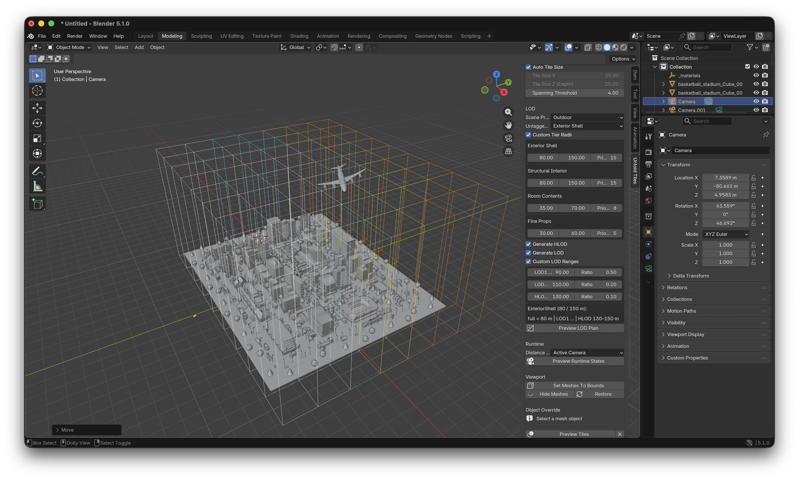

# Using The Blender Plugin

The Untold Engine Blender plugin exports assets from the current Blender scene
to the engine-native `.untold` format.

Use it when you want to import or open a model in Blender, inspect or edit it,
then export it without caring whether the original source was `.usdz`, `.fbx`,
`.glb`, `.obj`, or another Blender-supported format.

## Install From A Release

If you are new to Untold Engine or only want to use the engine/editor, you do
not need to clone the repository to install the Blender add-on.

Download the packaged add-on from the GitHub release page:

```text
https://github.com/untoldengine/UntoldEngine/releases
```

Each release includes `untold_exporter.zip` as a downloadable asset. Download
that file directly and keep it as a `.zip`; do not unzip it before installing.

In Blender:

1. Open `Edit > Preferences > Add-ons`.
2. Click `Install...`.
3. Select the downloaded `untold_exporter.zip`.
4. Enable `Untold Engine Exporter`.

After enabling the add-on, Blender adds:

- `File > Export > Untold (.untold)`
- `File > Export > Untold Animation (.untold)`
- `File > Export > Untold Tiled Scene`

For best results, install the add-on from the same release version as the
engine/editor you are using.

## Install From A Repository Checkout

Use this path if you are developing the engine or want to build the add-on zip
from source.

Build the plugin zip from the repo root:

```bash
untoldengine blender-addon
```

In Blender:

1. Open `Edit > Preferences > Add-ons`.
2. Click `Install...`.
3. Select `scripts/untold-blender-addon/build/untold_exporter.zip`.
4. Enable `Untold Engine Exporter`.

After installing, the plugin adds the same export menu entries:

- `File > Export > Untold (.untold)`
- `File > Export > Untold Animation (.untold)`
- `File > Export > Untold Tiled Scene`

## Export A Model

1. Open or import a model in Blender.
2. Choose `File > Export > Untold (.untold)`.
3. Pick an output filename.

If you choose:

```text
RetroCameraBlender.untold
```

the plugin writes:

```text
RetroCameraBlender/
  RetroCameraBlender.untold
  Textures/
```

By default, the plugin exports the visible scene. You can change `Scope` to
`Selected Objects` if you only want to export part of the scene.

## Export Animation

Use `File > Export > Untold Animation (.untold)`.

The animation exporter can use:

- the selected armature,
- the armature linked to a selected mesh, or
- the only visible armature in the scene.

You can export the current action or all Blender actions.

## Export A Tiled Scene

Use `File > Export > Untold Tiled Scene`.

The tiled scene exporter partitions the current Blender scene and writes a
streaming manifest plus tile `.untold` payloads.

Select a scene folder in the file picker. The plugin creates the payload
subfolder automatically.

For example, selecting:

```text
/Users/you/Downloads/CityBlender
```

writes:

```text
CityBlender/
  CityBlender.json
  tile_exports/
    tile_0_0_0.untold
    tile_0_0_1.untold
    ...
    Textures/
```

The manifest lives beside `tile_exports`, and all paths in the manifest are
relative to the manifest location.

### Visualize Tiles

Use the viewport tile preview before exporting to check how the scene will be
partitioned, which objects become shared assets, and which LOD/HLOD
representation would be active at runtime.

In Blender's 3D viewport, press `N` to open the sidebar, then select the
`Untold Tiles` tab. The `Tile & LOD Setup` panel exposes the same high-level
partitioning choices used by `File > Export > Untold Tiled Scene`:

- `Uniform Grid`: a regular X/Z grid. Use this for simple outdoor scenes or
  scenes where evenly sized tiles are enough. `Auto Tile Size` lets the exporter
  choose a grid size from scene complexity; disabling it enables manual
  `Tile Size X` and `Tile Size Z (Depth)` values. `Spanning Threshold` controls
  when very large objects are placed in the shared bucket instead of a single
  local tile.
- `Quadtree`: a floor-aware hierarchy that recursively subdivides dense areas.
  This is usually the best starting point for multi-floor buildings.
- `KD-Tree`: a floor-aware hierarchy that splits along scene density. This can
  produce better balance when objects are clustered unevenly.

Enable `Visible Objects Only` when you want the preview to match the default
export scope. Disable it when hidden scene meshes should still participate in
the partition.

Press `Preview Tiles` to draw the tile overlay in the viewport. In density mode,
the overlay colors mean:

- `Green`: low object density.
- `Yellow`: medium object density.
- `Red`: high object density.
- `Blue`: shared bucket geometry, usually objects too large to belong cleanly to
  one tile.


Use `Tile Floor Fill` to toggle translucent tile floors. Leave it off when you
want wireframe-only boxes for inspecting dense or stacked geometry.

The panel also previews runtime LOD state. Choose a `Scene Profile` (`auto`,
`indoor`, or `outdoor`) and optionally enable `Custom Tier Radii` to override
the stream, unload, and priority values for `ExteriorShell`,
`StructuralInterior`, `RoomContents`, and `FineProps`. Enable `Generate HLOD`
or `Generate LOD` when you want the preview and export to include those payloads;
`Preview LOD Plan` reports how many payloads would be generated before any files
are written.

To simulate runtime streaming, choose the `Distance Source`:

- `Active Camera`: measure tile distance from the active scene camera.
- `3D Cursor`: measure from the cursor position.
- `Selected Object`: measure from the active selected object.

Move the chosen source, then press `Preview Runtime States`. The overlay changes
from density colors to runtime colors:

- `White`: full-detail tile, also called LOD0.
- `Cyan`: LOD1.
- `Yellow`: LOD2.
- `Orange`: HLOD.
- `Red`: unloaded.
- `Blue`: shared bucket geometry.



For heavy scenes, use `Set Meshes To Bounds` to draw meshes as bounding boxes
while keeping them exportable. `Hide Meshes` hides scene meshes after a preview
so the tile overlay is easier to inspect, and `Restore` returns the saved
viewport display state. If `Visible Objects Only` is enabled, restore hidden
meshes before running another preview or export so they are included.

The `Object Override` area lets you toggle `Force Local` on the active mesh. Use
this when an object is being classified into the shared bucket but should instead
belong to a regular tile and receive its own LOD/HLOD ladder.

### Object Annotations

Select a mesh object and open `Object Properties > Untold` to author
mesh-level hints used by tiled scene export.

- `Object Semantic`: choose `Auto`, `ExteriorShell`, `StructuralInterior`,
  `RoomContents`, or `FineProps`. These are mesh semantics; the exporter groups
  meshes by spatial node and semantic tier, then writes the generated tile's
  `semantic_tier` in the manifest.
- `Priority Hint`: choose `Auto`, `Low`, `Normal`, `High`, or `Critical`. This
  is aggregated into the generated tile's manifest `priority`; when all objects
  are `Auto`, the semantic tier default priority is used.

Tiled scene export supports static mesh geometry only. Armatures and meshes
bound to armatures should be exported through the animation workflow instead.

### Tiled Scene Options

- `Visible Objects Only`: export only visible mesh objects.
- `Partitioning`: choose the tiling algorithm. Only one algorithm is active per
  export.
- `Scene Profile`: choose `auto`, `indoor`, or `outdoor` streaming radius bands.
  For CLI exports, use `--tier-radius Tier=stream,unload[,priority]` to override
  the profile's quadtree semantic-tier bands. See [Using The Exporter](UsingTheExporter.md#quadtree-tier-radius-overrides).
- `Generate HLOD`: create simplified coarse HLOD assets for eligible tiles.
- `Generate LOD`: create per-tile LOD assets for eligible tiles.
- `Compress Geometry`: LZ4-compress vertex and index chunks in tile payloads.
- `Dry Run`: analyze the partition without writing tile payloads.
- `Write Manifest In Dry Run`: write the manifest JSON even during a dry run.

The `Tile Preview` panel in the 3D viewport also includes LOD planning controls.
Use `Preview LOD Plan` to report how many HLOD/LOD payloads the current tiled
export settings will generate before writing files. For quadtree and KD-tree
exports, LOD/HLOD generation is limited to eligible semantic tiers such as
`ExteriorShell` and `StructuralInterior`; `RoomContents` and `FineProps`
normally stream at close range and are skipped.

Use `Preview Runtime Bands` to color the current tile overlay by camera,
3D cursor, or selected-object distance. Runtime colors show the representation
that would be active inside each tile's distance band: full tile, LOD, HLOD,
unloaded, or shared bucket.

For very large scenes, use the Tile Preview panel's viewport utilities to reduce
Blender viewport load while keeping mesh data available for export. `Set Meshes
To Bounds` draws mesh objects as bounding boxes. `Hide Meshes` hides them in the
viewport after a preview has been generated, and `Restore` returns the saved
display state. Restore the meshes before rerunning preview/export when `Visible
Objects Only` is enabled.

### Uniform Grid

Use `Partitioning > Uniform Grid` for regular X/Y/Z grid tiles.

Uniform Grid uses:

- `Uniform Grid: Auto Tile Size`
- `Uniform Grid: Tile Size X`
- `Uniform Grid: Tile Size Y`
- `Uniform Grid: Tile Size Z`

When `Auto Tile Size` is enabled, the exporter chooses tile dimensions from the
scene complexity. When it is disabled, the manual tile size values are used.

### Quadtree

Use `Partitioning > Quadtree` for floor-aware quadtree partitioning with
semantic tiers.

Quadtree uses:

- `Quadtree: Floor Count`
- `Quadtree: Floor Band Height`

Set either value to `0` to use automatic detection.

`Quadtree: Floor Count = 0` matches the script default: the exporter estimates
floor bands from object height distribution and scene Z span.

When `Quadtree` is selected, uniform-grid tile size options are ignored.

### Plugin vs CLI

The plugin runs tiled export in sequential mode from the current Blender scene.
This is simpler and avoids reopening or re-importing the scene from inside
Blender.

For large production scenes where you want parallel worker processes, use the
CLI:

```bash
scripts/export-untold-tiles --input /path/to/scene.usdz --output-dir /path/to/Scene/tile_exports --quadtree
```

## Dependencies

The model exporter works with Blender's built-in Python environment. Optional
features require extra tools inside the environment that Blender is actually
running.

This distinction matters: installing a Python package in your terminal Python
does not necessarily install it into Blender's Python.

## LZ4 Geometry Compression

`Compress Geometry` compresses only the `.untold` vertex and index chunks. It
does not compress files in the `Textures/` folder.

It requires the `lz4` Python package in Blender's Python.

Verify inside Blender's Python console:

```python
import lz4.block
print("lz4 works")
```

Install into Blender's Python:

```python
import sys, subprocess
subprocess.check_call([sys.executable, "-m", "ensurepip"])
subprocess.check_call([sys.executable, "-m", "pip", "install", "lz4"])
```

Restart Blender after installing.

## Material Fidelity

The exporter reads a fixed set of material inputs: base color, roughness,
metallic, normal, and emissive. It does not evaluate arbitrary Blender
shader nodes — a `Mix` node blending two textures, a `Math` node adjusting a
value, a procedural `Noise Texture`, and similar setups will look different
in the engine than in Blender unless you bake them to flat textures with a
third-party tool (e.g. Blender's own Cycles bake, Substance, or similar)
before export.

Before exporting, open the `Untold Materials` tab in the 3D viewport
sidebar (press `N` if the sidebar is hidden) and click `Scan Materials`. It
lists every material as supported or divergent, with the specific node and
reason for anything that isn't a plain match, and separates divergences
that baking can fix from ones no bake can fix (view-dependent nodes,
shader-level blending above the Principled BSDF) — the exact same
classification the export will use, without needing to actually export
first. Re-run it after editing materials; it does not update automatically.

## Compress Textures To .utex

`Compress Textures` converts staged PNG/JPEG/TGA textures to the engine's
native `.utex` texture container and patches the `.untold` file to reference the
`.utex` files.

This option requires:

- `Pillow` in Blender's Python.
- `astcenc`, the ARM ASTC encoder binary.

### Pillow

Verify inside Blender's Python console:

```python
from PIL import Image
print("Pillow works")
```

Install into Blender's Python:

```python
import sys, subprocess
subprocess.check_call([sys.executable, "-m", "ensurepip"])
subprocess.check_call([sys.executable, "-m", "pip", "install", "Pillow"])
```

Restart Blender after installing.

### astcenc

The texture baker searches for `astcenc` in this order:

1. The `ASTCENC_BIN` environment variable.
2. `Tools/astcenc/astcenc` beside the repo root when running from the repo.
3. `astcenc`, `astcenc-native`, `astcenc-avx2`, or `astcenc-sse4.2` on `PATH`.

When the plugin is installed as a packaged zip, the most reliable option is to
launch Blender with `ASTCENC_BIN` set.

Example:

```bash
ASTCENC_BIN="/path/to/your/astcenc" \
/Applications/Blender.app/Contents/MacOS/Blender
```

Check that the binary exists and is executable:

```bash
ls -l /path/to/your/astcenc
/path/to/your/astcenc -help
```

If needed, make it executable:

```bash
chmod +x /path/to/your/astcenc
```

You can also download `astcenc` from:

```text
https://github.com/ARM-software/astc-encoder/releases
```

Use the downloaded binary's absolute path for `ASTCENC_BIN`.

## Texture Quality

The `Texture Quality` setting maps to `astcenc` quality presets:

- `fastest`: fastest encode, lowest search quality.
- `fast`: fast encode.
- `medium`: balanced.
- `thorough`: slower, better quality. This is the default.
- `exhaustive`: slowest, highest search effort.

This does not change texture resolution or ASTC block size. Block size is chosen
by texture slot:

- base color and emissive: ASTC 4x4 sRGB
- normal: ASTC 4x4 LDR
- roughness, metallic, occlusion: ASTC 6x6 LDR

## Troubleshooting

If `Compress Geometry` appears not to reduce the full asset folder size, compare
only the `.untold` file. Texture files are separate and are not affected by LZ4
geometry compression.

If texture baking fails with `Pillow is required`, install Pillow into Blender's
Python, not only your terminal Python.

If texture baking fails with `astcenc not found on PATH`, launch Blender with
`ASTCENC_BIN=/full/path/to/astcenc`.

If a material looks wrong in-engine, scan it in the `Untold Materials`
panel first (see [Material Fidelity](#material-fidelity)) — it may be
classified as a divergence no bake can fix (shader-level mixing or a
view-dependent node), in which case the graph needs to change instead.
