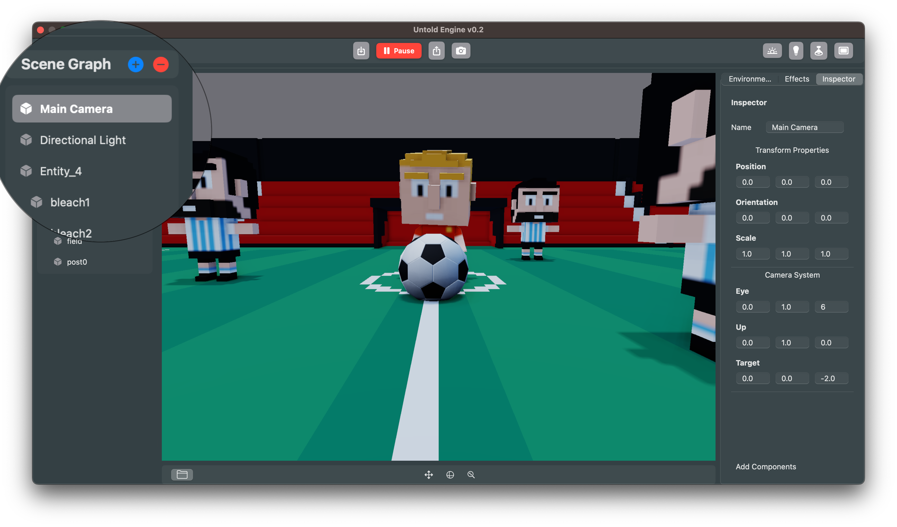
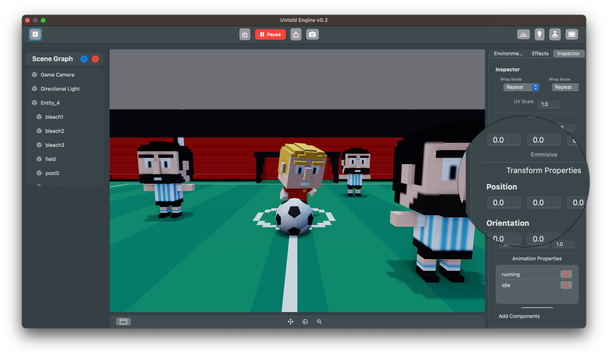
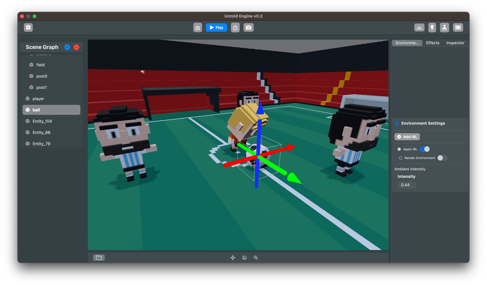
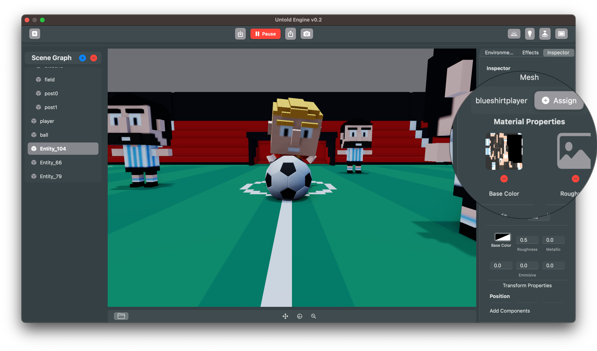
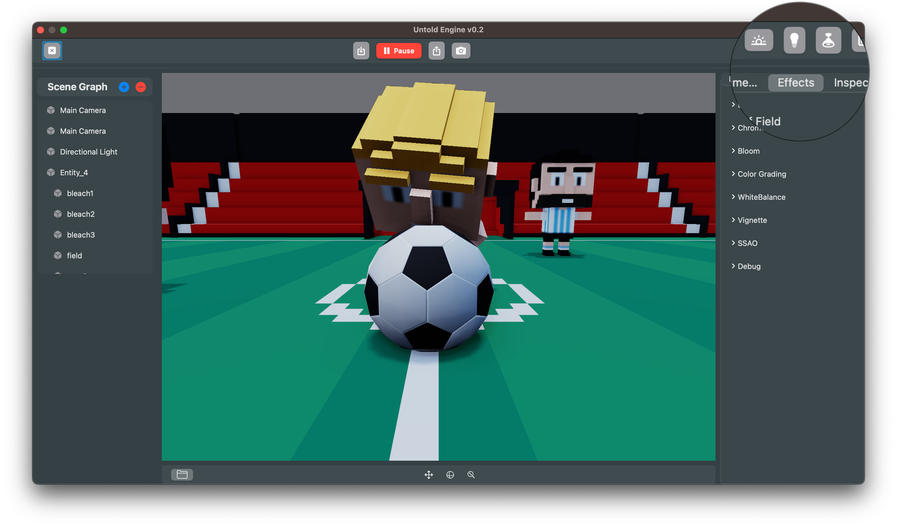
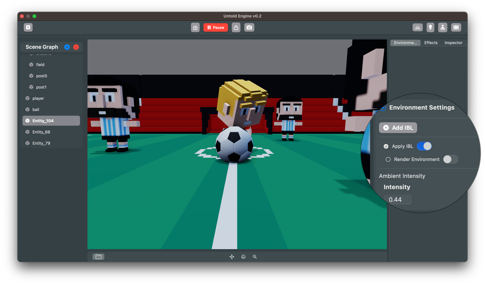
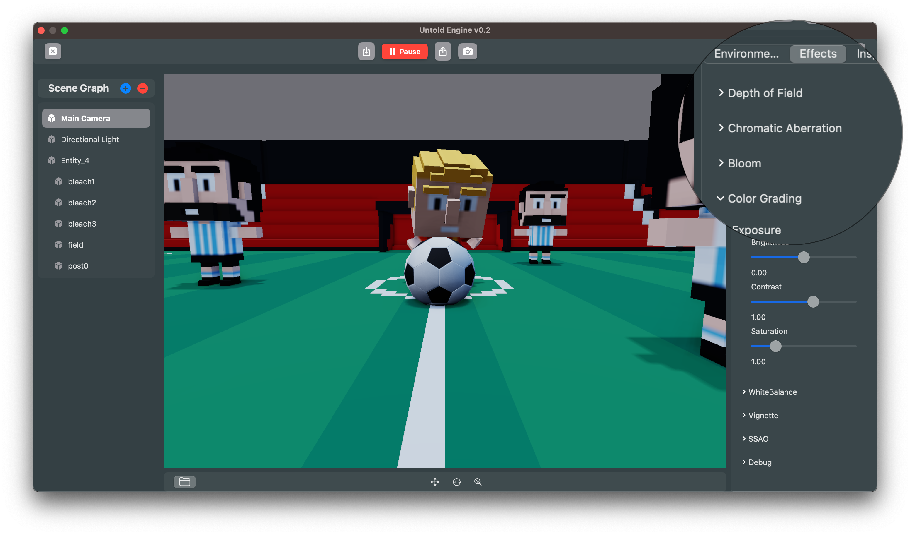
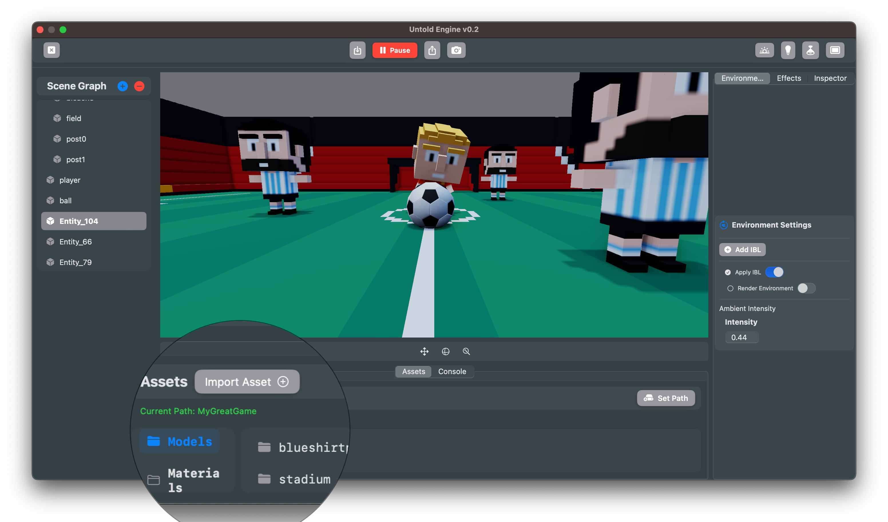
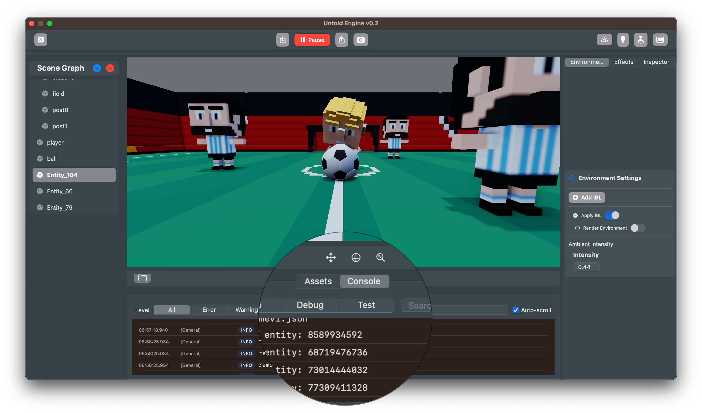

# Introducing the Untold Engine Editor

The Untold Engine Editor makes it easier than ever to set up your scenes and entities without touching code. With the Editor, you can visually create, configure, and organize your game world, while keeping Swift code focused on game logic and behaviors.  

Here’s a quick tour of the Editor’s main features:

---

## Scene Graph

The **Scene Graph** shows all the entities in your scene in a hierarchical view. You can add, rename, and organize entities, as well as set up parent–child relationships. This is where you’ll find your cameras, lights, and models at a glance.

---

## Inspector

The **Inspector** lets you configure properties of the selected entity. Adjust position, rotation, and scale, or fine-tune camera settings and add components. Think of it as the control panel for whatever you’re working on.

---

## Gizmo Manipulation

Use the **3D gizmo** to interactively move, rotate, and scale entities directly in the scene. This makes it quick to place objects exactly where you want them.

---

## Materials

Assign meshes and materials through the **Inspector**. You can drop in textures for base color, roughness, metallic, and emissive maps, then tweak material properties to get the right look.

---

## Lighting & Environment

  

The **Lighting panel** give you control over your scene’s mood. Add directional, point, spotlight and area lights, adjust intensities. 

## Environment

The **Environment panel** enable **Image-Based Lighting (IBL)** for realistic reflections and ambient light.

---

## Post-Processing Effects

The **Effects tab** lets you add and tweak post-processing features such as:  
- Depth of Field  
- Chromatic Aberration  
- Bloom  
- Color Grading  
- SSAO, Vignette, White Balance, and more  

These effects bring your scenes closer to a polished, production-ready look.

---

## Asset Browser

The **Asset Browser** keeps your models, textures, and materials organized. Import new assets, set paths for your project, and quickly assign resources to entities in your scene.

---

## Console Log

The **Console Log** provides real-time feedback from the engine. Use it to debug entity creation, monitor system messages, and track issues while working on your scene.

---

## Putting It All Together

With the Editor, you now have a clear separation of responsibilities:  
- **Use the Editor** for entity initialization, scene setup, materials, and visual configuration.  
- **Use Swift code** for gameplay logic, physics tweaks, and systems that bring your game to life.  

This workflow makes iteration faster and keeps your codebase focused on what matters most: gameplay.  

