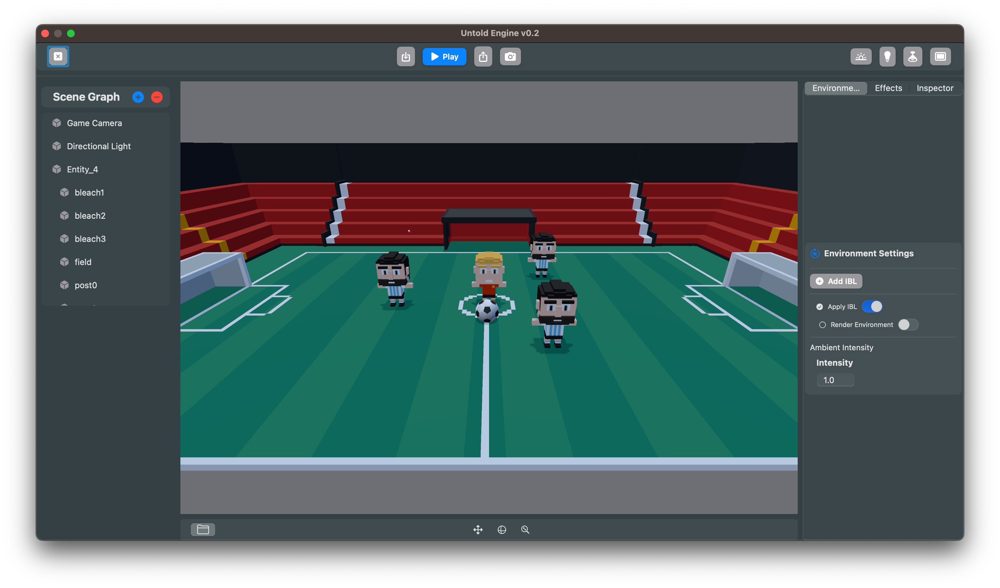

# Getting Started

The Untold Engine is a game engine distributed as a Swift Package using Swift Package Manager (SPM) for easy integration and maintenance.

There are now **two main entry points**, depending on whether you want to **develop the engine** or **build a game with it**:

- **Engine Developers** → Clone the core [UntoldEngine](https://github.com/untoldengine/UntoldEngine) repo to explore, modify, or contribute to the engine itself.  
- **Game Developers** → Use the [UntoldEngineExamples](https://github.com/untoldengine/UntoldEngineExamples) repo, which provides ready-to-run demo games built on top of the engine.

---

## Prerequisites

To use the Untold Engine, you’ll need:

- An Apple computer.  
- The latest version of Xcode, available from the App Store.  

---

## Option 1: For Engine Developers

If you want to work directly on the engine’s source code:

1. Clone the core repo:

```bash
git clone https://github.com/untoldengine/UntoldEngine
cd UntoldEngine
open Package.swift
```

2. Build and run in Xcode.

This opens the engine library and test targets, so you can contribute or experiment with the engine internals.

## Option 2: For Game Developers

If you just want to try the engine in action or kickstart your own game:

1. Clone the examples repo:

```bash 
git clone https://github.com/untoldengine/UntoldEngineExamples
cd UntoldEngineExamples/Examples
open SoccerGame.xcodeproj
```

2. In Xcode, choose a scheme: SoccerGame 

3. Press Run.
You’ll see the chosen game launch, powered by Untold Engine.



Press WASD keys to dribble.

## Preloaded Assets to Kickstart Development (Download first before Pressing Run in Xcode)

To save time, the Untold Engine includes preloaded assets you can use right away:

- **Models**: Soccer stadium, player, ball, and more.  
- **Animations**: Prebuilt running, idle, and other character motions.  

You can download them [Demo Game Assets v1.0](https://github.com/untoldengine/UntoldEngine-Assets/releases/tag/v1).

