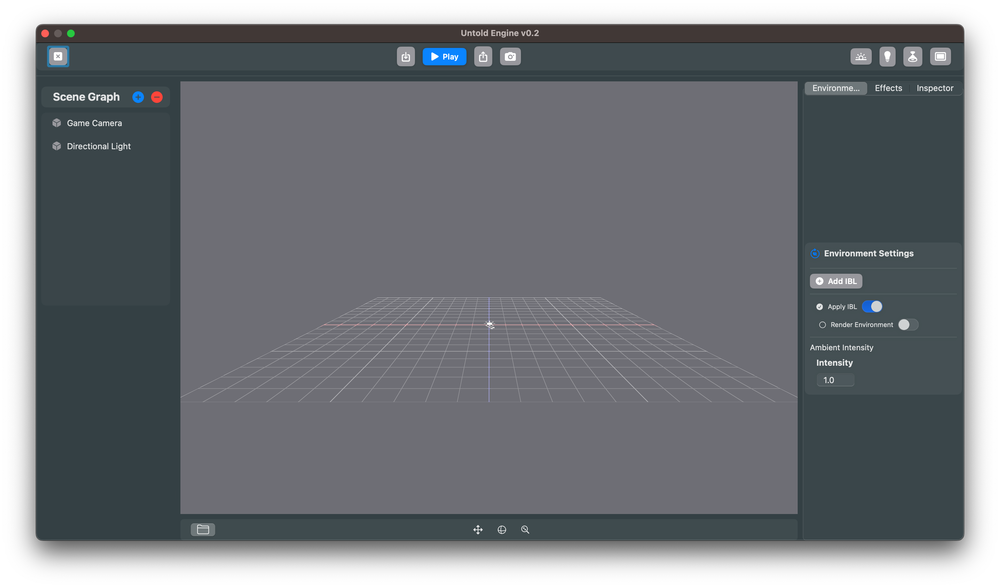

# Getting Started
The Untold Engine is a game engine designed to be integrated into your game projects. It is distributed as a Swift Package using Swift Package Manager (SPM) for easy integration and maintenance.

There are two primary ways to use the engine:

- **Running the Engine Standalone** – Ideal for contributors and developers who want to explore, modify, or contribute to the engine itself. This mode allows you to test the engine independently using its built-in demo assets and functionalities.
- **Integrating the Engine into Your Game Project** – Perfect for game developers who want to build a game using the engine. This requires adding the engine as a Swift Package Dependency in a game project.

### Prerequisites

To begin using the Untold Engine, you’ll need:

- An Apple computer.
- The latest version of Xcode, which you can download from the App Store.

## How to install the Untold Engine

Follow these steps to set up and run the Untold Engine.

1. Clone the Repository

```bash
git clone https://github.com/untoldengine/UntoldEngine
cd UntoldEngine
open Package.swift
```

2. Configure the Scheme in Xcode

- In Xcode, select the "DemoGame" scheme.
- Set "My Mac" as the target device.

3. Click on Run

You should see the editor show up.



### Controls

The Untold Engine provides two distinct modes for interaction: **Edit Mode** and **Play Mode**. You can switch between these modes at any time by clickin on the **Play** button in the editor.

#### **Edit Mode**
In **Edit Mode**, you can navigate the scene and adjust the environment with ease using the following controls:

- **Orbit**: Click and drag to rotate the view around the scene.
- **Move**: 
  - Use the **W**, **A**, **S**, and **D** keys to move forward, backward, left, and right.
  - Use the **Q** and **E** keys to move vertically (up and down).
- **Zoom**: Pinch to zoom in or out for a closer or wider view.


---

## Preloaded Assets to Kickstart Development

To save time, the Untold Engine includes preloaded assets you can use right away:

- **Models**: Soccer stadium, player, ball, and more.  
- **Animations**: Prebuilt running, idle, and other character motions.  

You can download them [Demo Game Assets v1.0](https://github.com/untoldengine/UntoldEngine-Assets/releases/tag/v1).

