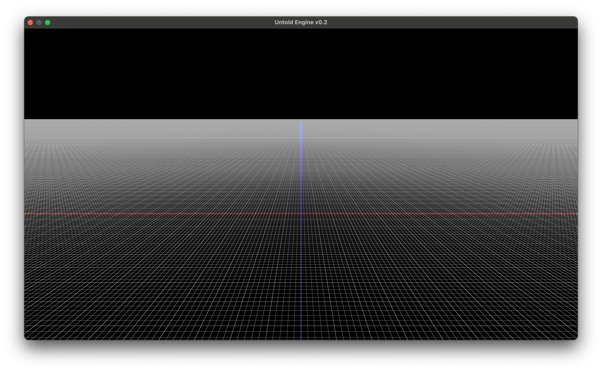
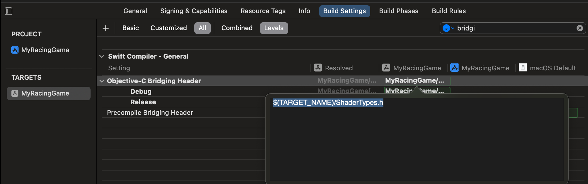

# Getting Started

To start using the Untold Engine to create your game, follow these steps

## Step 1. Create a macOS game in Xcode

Open up Xcode -> File -> New -> Project

Create a game for the macOS platform.

Click Next. Give your Game a name and make sure to Select Swift and Metal as the Languages.

## Step 2. Delete default files

When you created the Xcode project, Xcode may have generated the following default files:

```swift
GameViewController.swift
Renderer.swift
Shaders.metal
ShaderTypes.h
```
Go ahead and remove/delete these files.

## Step 3. Add the engine as a Package Dependency

1. Let's say you created a macOS Game project Xcode called "MyRacingGame".

2. In your Xcode project go to File-> Add Packages...

3. In the search field, enter the URL of the Untold Engine repository:

https://github.com/untoldengine/UntoldEngine.git 

4. Xcode will fetch the package. Select the appropriate version or branc( i.e. Master)

5. Choose the target where you want to add the engine, then click Add Package 


## Step 4. Add boiler plate code to the AppDelegate

Once the package is added, you can import the Untold Engine in your Swift files. 

Go to AppDelegate.swift and add the following:

`import UntoldEngine`

For the engine to be initialized properly, we need to execute several initializations functions. These functions are only called once. I created a boiler plate code which you can just copy and paste. Make sure that your AppDelegate.swift file looks as shown in the code snippet below.

Note that aside from the boiler plate, we also created a GameScene class. This is where you will initialize your game assets and define its logic.

```swift

import Cocoa
import UntoldEngine
import MetalKit

// The GameScene class is where you will declare and define your game logic.

class GameScene {
    
    init(){
        
    }
    
    func update(_ deltaTime: Float) {

    }

    func handleInput() {

    }
    
}


@main
class AppDelegate: NSObject, NSApplicationDelegate {
    var window: NSWindow!
    var metalView: MTKView!
    var renderer: UntoldRenderer!
    var gameScene: GameScene!


    func applicationDidFinishLaunching(_ aNotification: Notification) {
        // Insert code here to initialize your application
        
        print("Launching Untold Engine v0.2")

        // Create and configure the window
        window = NSWindow(
            contentRect: NSRect(x: 0, y: 0, width: 1280, height: 720),
            styleMask: [.titled, .closable, .resizable],
            backing: .buffered,
            defer: false
        )
        
        metalView = MTKView(frame: window.contentView!.bounds)
        metalView.device = MTLCreateSystemDefaultDevice()
        metalView.depthStencilPixelFormat = .depth32Float
        metalView.colorPixelFormat = .rgba16Float
        metalView.preferredFramesPerSecond = 60
        metalView.framebufferOnly = false

        // Initialize the renderer and set it as the MTKView delegate
        renderer = UntoldRenderer(metalView)
        renderer?.mtkView(metalView, drawableSizeWillChange: metalView.drawableSize)
        metalView.delegate = renderer

        // Create the game scene
        gameScene = GameScene()

        // Connect renderer callbacks to the game scene
        renderer.gameUpdateCallback = { [weak self] deltaTime in
            self?.gameScene.update(deltaTime)
        }
        renderer.handleInputCallback = { [weak self] in
            self?.gameScene.handleInput()
        }

        // Set up window and display it
        window.contentView = metalView
        window.makeKeyAndOrderFront(nil)
        window.center()
        window.title = "Untold Engine v0.2"

        NSApp.setActivationPolicy(.regular)
        NSApp.activate(ignoringOtherApps: true)
    }

    func applicationWillTerminate(_ aNotification: Notification) {
        // Insert code here to tear down your application
    }

    func applicationShouldTerminateAfterLastWindowClosed(_ sender: NSApplication) -> Bool {
        return true
    }

}

```

If everything was done correctly, you should see a window with a grid once you hit "Run".




Note: Xcode may fail stating that it can't find a ShaderyType.h file. If that is the case, simply go to your build settings, search for "bridging". Head over to 'Objective-C Bridging Header' and make sure to remove the path as shown in the image below




Next: [Importing USDC Files](Importing-USD-Files.md)
