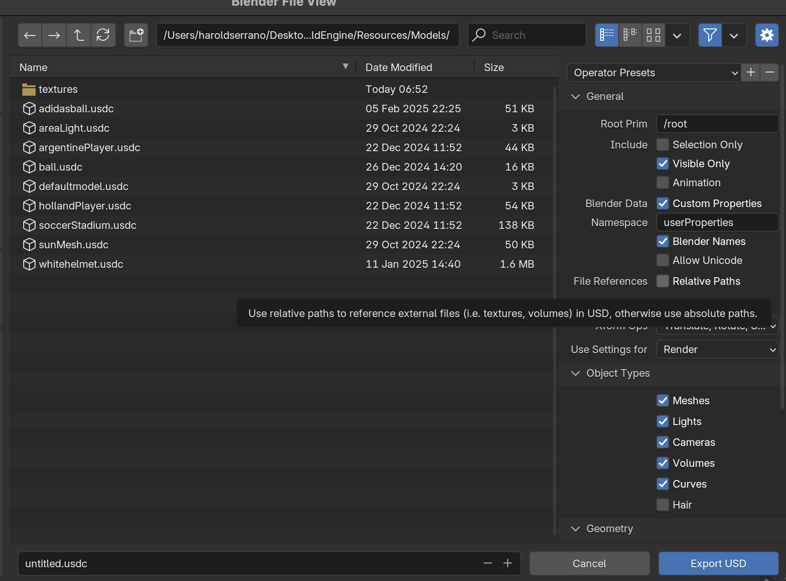
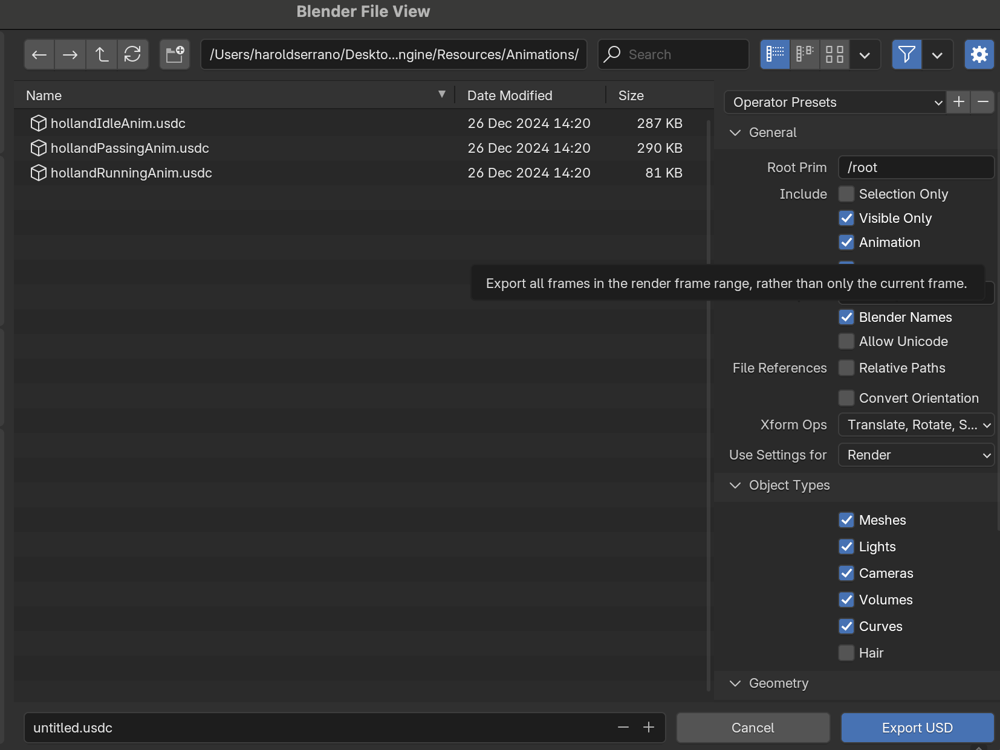

# Importing Asset files for your game

The Untold Engine supports .usdc files, making it easy to import 3D models and scenes into your game. This tutorial will guide you through the correct export settings in Blender, adding files to your project, and loading them into your game.

There are two primary ways to use the engine:

- **Running the Engine Standalone** – Ideal for contributors and developers who want to explore, modify, or contribute to the engine itself. This mode allows you to test the engine independently using its built-in demo assets and functionalities.
- **Integrating the Engine into Your Game Project** – Perfect for game developers who want to build a game using the engine. This requires adding the engine as a Swift Package Dependency in a game project.


The process to import assets differ depending if you are using the engine as either standalone or in your game project. Please refer to the proper section below.

---

## Requirements

Make sure to use Blender 4.2.3 or later

## How to export a file to USDC (engine standalone)

The Untold Engine requires all files to be of type usdc. To export your model or scene from Blender, click on File->Export->USD

### Exporting 3D Models

To ensure proper export of .usdc files from Blender:

1. Make sure to **uncheck** the "Relative Paths" Option during export. This ensures that all referenced assets, such as textures, are correctly linked relative to the .usdc file.





If you are exporting a 3D Model, make sure to save the model inside this directory

```
UntoldEngine/Sources/UntoldEngine/Resources/Models/
```

Once you hit export, the model should show up in the Resources/Model folder.

### Exporting models for Animation

Exporting models with animations require that you also export its rig/armature. During exporting, make sure to have "Rigging" selected.


### Exporting Animations

Similarly, to export an animation, make sure Animation is selected.



Make sure to save the animation in this directory

```
UntoldEngine/Sources/UntoldEngine/Resources/Animations/
```

Once you hit export, the model should show up in the Resources/Animations folder.


## How to export a file to USDC (your game project)

The Untold Engine requires all files to be of type usdc. To export your model or scene from Blender, click on File->Export->USD


### Exporting models 

To ensure proper export of .usdc files from Blender:

1. Check the "Relative Paths" Option during export. This ensures that all referenced assets, such as textures, are correctly linked relative to the .usdc file.


2. The Untold Engine coordinate system follows a righ-hand coordinate system. +Y is up and +Z is forward (out of the screen). Unfortunately, Blender's coordinate system is +Z up and +Y is forward. While exporting make sure to set the coordinate system that corresponds to the Untold Engine as shown below:


3. Save the exported .usdc files into your project and ensure they are added to the main bundle, as shown below:


---

### Exporting models for Animation

Exporting models with animations require that you also export its rig/armature. During exporting, make sure to have "Rigging" selected.


---

### Exporting Animations

Similarly, to export an animation, make sure Animation is selected.


