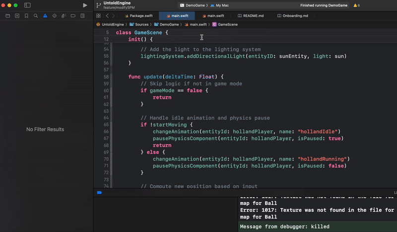

# How to install the Untold Engine

Follow these steps to set up and run the Untold Engine. Or if you are a visual learner, you can watch this [video tutorial](https://youtu.be/rfxQU4MZEAg):

1. Clone the Repository

```bash
git clone https://github.com/untoldengine/UntoldEngine

cd UntoldEngine
```

2. Open the Swift Package

```bash
open Package.swift
```
3. Configure the Scheme in Xcode

- In Xcode, select the "DemoGame" scheme.
- Set "My Mac" as the target device.



4. Click on Run

You should see models being rendered.


### Controls

The Untold Engine provides two distinct modes for interaction: **Edit Mode** and **Play Mode**. You can switch between these modes at any time by pressing the **P** key.

#### **Edit Mode**
In **Edit Mode**, you can navigate the scene and adjust the environment with ease using the following controls:

- **Orbit**: Click and drag to rotate the view around the scene.
- **Move**: 
  - Use the **W**, **A**, **S**, and **D** keys to move forward, backward, left, and right.
  - Use the **Q** and **E** keys to move vertically (up and down).
- **Zoom**: Pinch to zoom in or out for a closer or wider view.


#### **Play Mode**
In **Play Mode**, the scene comes to life! You will experience:

- Animated characters performing actions.
- Physics simulations running dynamically.

Toggle between Edit Mode and Play Mode with the **P** key to seamlessly explore or interact with the scene.

