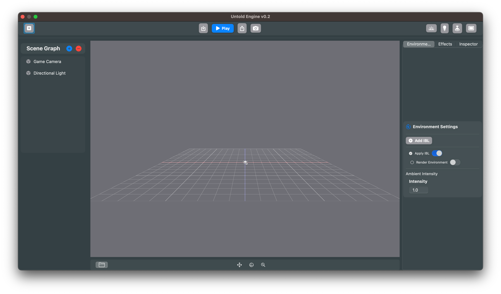

# How to install the Untold Engine

Follow these steps to set up and run the Untold Engine.

1. Clone the Repository

```bash
git clone https://github.com/untoldengine/UntoldEngine

cd UntoldEngine
```

2. Open the Swift Package

```bash
open Package.swift
```
3. Configure the Scheme in Xcode

- In Xcode, select the "DemoGame" scheme.
- Set "My Mac" as the target device.


4. Click on Run

You should see the editor show up.



### Controls

The Untold Engine provides two distinct modes for interaction: **Edit Mode** and **Play Mode**. You can switch between these modes at any time by pressing the **P** key.

#### **Edit Mode**
In **Edit Mode**, you can navigate the scene and adjust the environment with ease using the following controls:

- **Orbit**: Click and drag to rotate the view around the scene.
- **Move**: 
  - Use the **W**, **A**, **S**, and **D** keys to move forward, backward, left, and right.
  - Use the **Q** and **E** keys to move vertically (up and down).
- **Zoom**: Pinch to zoom in or out for a closer or wider view.

## Editor & Workflow

The Editor is now the primary way to initialize and manage entities.  

- [Editor Overview](docs/editoroverview.md): Walkthrough of Scene Graph, Inspector, Gizmos, Materials, Lighting, Post-Processing, Asset Browser, and Console.  
- [How to Import Assets](docs/importingassetseditor.md): Learn how to set asset paths and import models, materials, and animations.  

⚠️ **Important**: Entities should be created and configured in the Editor. Code is used for gameplay logic only.  
