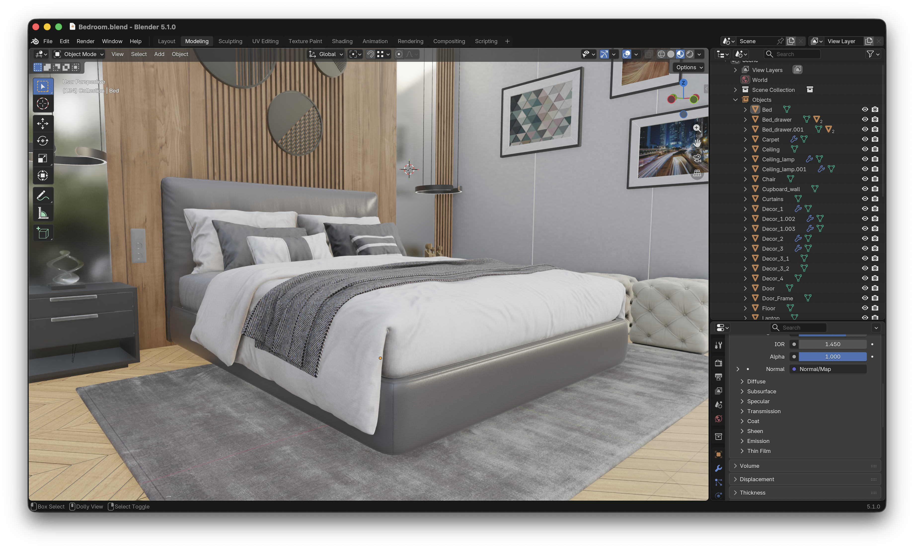
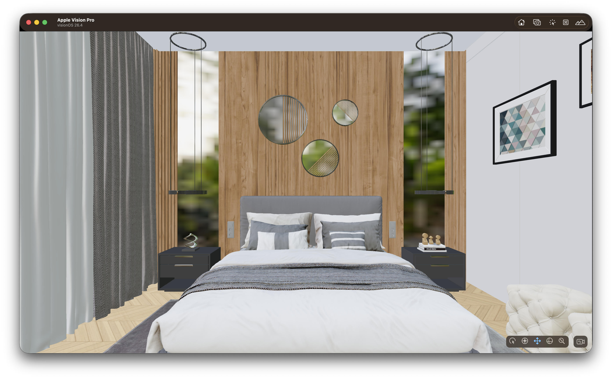

# Archviz To Vision Pro

This learning path takes an architectural visualization scene from Blender and turns it into a Vision Pro app with Untold Engine.

You will start with this archviz model in Blender:



Then you will load the exported scene on Apple Vision Pro:

[](https://vimeo.com/1176995991?fl=ip&fe=ec)

By the end of the path, you will have:

- A standalone visionOS Xcode project.
- An archviz `.untold` asset inside the project's `GameData` folder.
- A scene that loads the model asynchronously.
- Blender-authored scene data such as lights, cameras, and color management loaded at runtime.
- Vision Pro input configured so the user can move and rotate the scene root with spatial gestures.

## What You Will Build

The goal is a simple but complete archviz viewer:

1. Create a new visionOS project with the Untold Engine CLI.
2. Install the starter archviz asset pack.
3. Load the `Bedroom.untold` model in `GameScene.swift`.
4. Configure rendering and XR input.
5. Use spatial manipulation so the scene can be moved and rotated in mixed reality.
6. Build and run on Apple Vision Pro or the Vision Pro Simulator.

This path uses the starter archviz asset so you can focus on the engine workflow first. After this is working, you can replace the starter asset with your own Blender export.

Want to run it right away instead of building it step by step? The finished project, **ArchvizViewer**, is in the [UntoldArcade](https://github.com/untoldengine/UntoldArcade) demo collection: [github.com/untoldengine/UntoldArcade/tree/main/ArchvizViewer](https://github.com/untoldengine/UntoldArcade/tree/main/ArchvizViewer). Clone it, open the Xcode project, and run.

## Prerequisites

You need:

- Xcode with visionOS support.
- A local Untold Engine checkout.
- The `untoldengine` CLI installed from the repository.
- An Apple Vision Pro device or the Vision Pro Simulator.

Clone the engine and use a stable release:

```bash
git clone https://github.com/untoldengine/UntoldEngine.git
cd UntoldEngine
git checkout v0.16.0
```

Install the CLI:

```bash
./scripts/install-untoldengine-create.sh
```

Verify the command is available:

```bash
untoldengine --help
```

## Create The Vision Pro Project

Create a standalone Xcode project:

```bash
cd ~/Projects
untoldengine create ArchvizViewer --platform visionos
open ArchvizViewer/ArchvizViewer.xcodeproj
```

The generated project already depends on the correct engine products for visionOS:

- `UntoldEngineXR`
- `UntoldEngineAR`

The project also includes a bundled `GameData` folder. Runtime assets should live there.

```text
ArchvizViewer/
  Sources/
    ArchvizViewer/
      GameScene.swift
      GameData/
        Models/
        StreamModels/
        Textures/
        Scenes/
        Scripts/
```

## Install The Starter Archviz Asset

From the generated project folder, install the starter asset pack:

```bash
cd ~/Projects/ArchvizViewer
untoldengine assets install starter-archviz
```

The CLI finds the project's `GameData` folder and merges the asset files into it.

The important file for this path is the `Bedroom.untold` model. The generated project should now contain the model and its supporting textures and resources under `GameData`.

## Open GameScene.swift

In Xcode, open:

```text
Sources/ArchvizViewer/GameScene.swift
```

This is where the generated project sets up the engine scene. The two important places are:

- `init()` for one-time scene setup and asset loading.
- `configureEngineSystems()` for rendering, input, and runtime settings.

## Load The Archviz Model

In `init()`, after `configureEngineSystems()`, create an entity and load the archviz model with `setEntityMeshAsync`.

```swift
let entity = createEntity()
setEntityName(entityId: entity, name: "Bedroom")

setEntityMeshAsync(entityId: entity, filename: "Bedroom", withExtension: "untold") { success in
    guard success else {
        setSceneReady(false)
        return
    }

    loadSceneAuthored(filename: "Bedroom", withExtension: "untold")

    setRendering(.environment(.ibl(true)))
    setRendering(.environment(.asset("forest.exr")))
    setRendering(.environment(.intensity(0.9)))
    setRendering(.environment(.visible(true)))

    setSceneReady(true)
}
```

What this does:

- `createEntity()` creates the root entity for the archviz model.
- `setEntityName(...)` gives the entity a stable runtime name.
- `setEntityMeshAsync(...)` loads the `.untold` model without blocking the app.
- `loadSceneAuthored(...)` loads Blender-authored lights, cameras, and color-management data from the asset.
- `setSceneReady(true)` tells the rest of the app that the scene can now respond to input.

`setEntityMeshAsync` looks for the asset by name in `GameData`, so the filename is `"Bedroom"` and the extension is `"untold"`.

## Configure Rendering And XR Input

In `configureEngineSystems()`, enable game mode, register XR input, and configure the rendering defaults:

```swift
private func configureEngineSystems() {
    gameMode = true

    registerXREvents()
    setInput(.xr(.pickingBackend(.octreeGPUPreferred)))
    setInput(.xr(.twoHandRotateAxisMode(.dynamicSnapped)))
    setInput(.xr(.sceneReady(true)))

    setRendering(.postProcessing(.enabled))
    setRendering(.antiAliasing(.msaa))
    setPostFX(.ssao(.enabled(false)))

    TextureStreamingSystem.shared.apply(.superdetailed)
}
```

The important calls are:

- `registerXREvents()` enables Vision Pro gesture input.
- `setInput(.xr(.pickingBackend(.octreeGPUPreferred)))` asks the engine to use the GPU-preferred spatial picking path.
- `setInput(.xr(.twoHandRotateAxisMode(.dynamicSnapped)))` configures two-hand scene rotation behavior.
- `setRendering(...)` and `setPostFX(...)` configure the render path.
- `TextureStreamingSystem.shared.apply(.superdetailed)` asks the texture system to use high-detail texture settings.

## Add Spatial Manipulation

In the generated input handling function, use the spatial manipulation system to move and rotate the scene root.

```swift
func handleInput() {
    if gameMode == false { return }
    if isSceneReady() == false { return }

    let state = getXRSpatialInputState()

    SpatialManipulationSystem.shared.processAnchoredSceneManipulationLifecycle(
        from: state,
        dragSensitivity: 10.0,
        rotateSensitivity: 1.0
    )
}
```

This lets the user:

- Pinch and drag to move the scene.
- Use two hands to rotate the scene.

The scene-readiness check matters because spatial input should not manipulate the scene before the model has finished loading.

## Build And Run

In Xcode:

1. Select the Vision Pro Simulator or a connected Apple Vision Pro.
2. Build and run.
3. Start the experience.
4. Confirm the archviz scene appears.
5. Pinch and drag to move the scene.
6. Use two hands to rotate the scene.

## Replace The Starter Asset With Your Own Blender Scene

Once the starter asset works, the next step is to export your own Blender archviz model.

At a high level:

1. Prepare the model in Blender.
2. Export it to `.untold` with the Blender add-on or CLI exporter.
3. Place the exported asset under the project's `GameData` folder.
4. Update the filename passed to `setEntityMeshAsync`.

For example, if your exported model is `ModernHouse.untold`, load it like this:

```swift
setEntityMeshAsync(entityId: entity, filename: "ModernHouse", withExtension: "untold") { success in
    guard success else {
        setSceneReady(false)
        return
    }

    loadSceneAuthored(filename: "ModernHouse", withExtension: "untold")
    setSceneReady(true)
}
```

## Where To Go Next

- [Blender Add-On Workflow](../Tutorials/BlenderAddonTutorial.md)
- [Export Assets With The CLI](../Tutorials/CLIExporterTutorial.md)
- [Create A New Xcode Project](../Tutorials/CreateXcodeProjectTutorial.md)
- [XR App Basics](../Tutorials/XRTutorial.md)
- [Spatial Input And Manipulation](../Tutorials/SpatialInputTutorial.md)
- [Materials, Textures, And Color Management](../Tutorials/MaterialsPipelineTutorial.md)
- [Light Portals](../Tutorials/LightPortalsTutorial.md)
