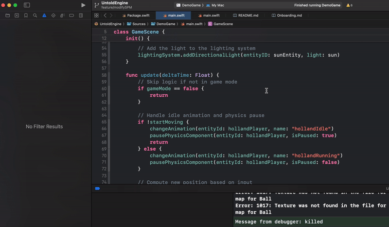

# Choose Your Starting Path

I’ve designed three different ways for you to get started with the Untold Engine. Whether you just want to explore or are ready to make your own game, we’ve got you covered.  

👉 Before you begin, make sure to [clone the Untold Engine](Installation.md).

---

## Demo Game – Jump Right In

Want to see the Untold Engine in action with zero setup? The **Demo Game** is for you! It’s a simple, ready-to-run soccer dribbling game — perfect for testing the engine and getting a feel for how it works.

**What’s Included**
- A fully functional dribbling game.  

**How to Run**
1. Select the **DemoGame** scheme.  
2. Set **My Mac** as the target device and hit **Run**.  
3. Download the [game assets](linktogameassets) and place them in your Desktop folder.  
4. In the Editor, click **Set Path** and point to that folder.  
5. Click the **Load** button in the Editor toolbar, navigate to the folder above and select `soccergamedemo.json`.  
6. Press **Play** to toggle between game mode and edit mode.  
7. Use **WASD** keys to move the player around.  

🔍 Take a look at the `GameScene` class in `main.swift` (inside `Sources/DemoGame`) to see how the game is structured and get familiar with the Untold Engine API.

---

## Starter Game – Experiment and Learn

If you want to tinker and get hands-on, the **Starter Game** is your playground. It’s a minimal setup that gives you just enough to start experimenting, importing assets, and building your own mechanics.

**What’s Included**
- A blank canvas with the basic engine hooks you need to begin.  

**How to Run**
1. Select the **StarterGame** scheme.  
2. Set **My Mac** as the target device and hit **Run**.  

📚 Recommended Reading:
- [Editor Overview](docs/EditorOverview.md): Scene Graph, Inspector, Gizmos, Materials, Lighting, Post-Processing, Asset Browser, and Console.  
- [How to Import Assets](docs/ImportAssets.md): How to set paths and import models, materials, and animations.  
- [Asset Folder Structure](docs/assetfilestructure.md): Best practices for organizing your assets.  

---

## Xcode Template Game – Build Your Masterpiece

Ready to go big? The **Xcode Template Game** is designed for creating your own full-fledged macOS game. It comes with everything you need to integrate assets, write gameplay logic, and ship something original.

**What’s Included**
- A fully set-up Xcode project that works out of the box.  
- Easy integration with your own assets or custom code.  

**How to Start**
Follow the step-by-step guide here: [Create a Mac OS Game](CreateMacOSGame.md).  

---

## Preloaded Assets to Kickstart Development

To save time, the Untold Engine includes preloaded assets you can use right away:

- **Models**: Soccer stadium, player, ball, and more.  
- **Animations**: Prebuilt running, idle, and other character motions.  

You can download them [here](linktogameassets).

