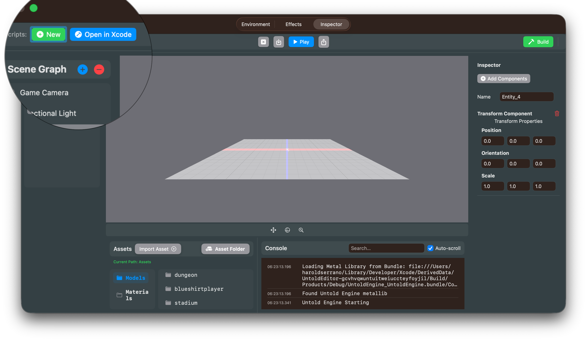
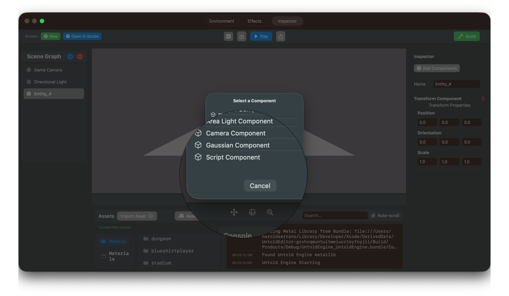
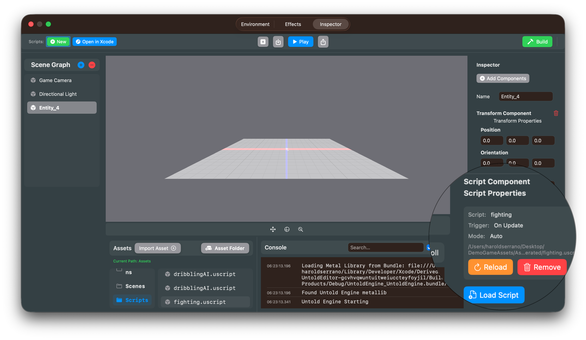

# USC Scripting Quick Start Tutorial

This tutorial will walk you through creating your first script in the Untold Engine, from setup to testing in Play mode.

**What you'll build:** A cube that moves upward by changing its position every frame.

**Time:** ~10 minutes

---

## Step 1: Set Up Your Project

### 1.1 Configure Asset Path

If you haven't already:
1. Open UntoldEditor
2. Go to **File → Set Asset Folder**
3. Select your project's asset directory

This is where your Scripts folder will be created.

### 1.2 Create Your First Script

1. In the editor toolbar, click **Scripts: New** (green button)
2. Enter the script name: `MovingCube`
3. Click OK



**What just happened:**
- Created `{AssetPath}/Scripts/` directory structure
- Generated `Scripts/Package.swift` (Swift package configuration)
- Created `Scripts/Sources/GenerateScripts/MovingCube.swift`
- Created `Scripts/Sources/GenerateScripts/GenerateScripts.swift` (main entry point)

---

## Step 2: Wire Up the Script

⚠️ **IMPORTANT MANUAL STEP**

The editor created your script file, but you need to tell the build system to generate it.

1. Click **Scripts: Open in Xcode** (blue button in toolbar)
2. In Xcode, open `GenerateScripts.swift`
3. Add your script to the `main()` function:

```swift
@main
struct GenerateScripts {
    static func main() {
        print("🔨 Generating USC scripts...")
        
        let outputDir = URL(fileURLWithPath: "Generated/")
        try? FileManager.default.createDirectory(at: outputDir, withIntermediateDirectories: true)
        
        // Add this line:
        generateMovingCube(to: outputDir)
        
        print("✅ All scripts generated in Generated/")
    }
}
```

4. Save the file (**Cmd+S**)

---

## Step 3: Write the Script Logic

### 3.1 Open Your Script File

In Xcode, open `MovingCube.swift` in the project navigator.

You'll see a template like this:

```swift
import Foundation
import UntoldEngine

extension GenerateScripts {
    static func generateMovingCube(to dir: URL) {
        // Write your script here
    }
}
```

### 3.2 Write the Movement Logic

Replace the function with this complete script:

```swift
extension GenerateScripts {
    static func generateMovingCube(to dir: URL) {
        let script = buildScript(name: "MovingCube") { s in
            // Run every frame
            s.onUpdate()
                .getProperty(.position, as: "pos")
                .setVariable("offset", to: Vec3(x: 0.0, y: 0.1, z: 0.0))
                .addVec3("pos", "offset", as: "newPos")
                .setProperty(.position, toVariable: "newPos")
        }
        
        let outputPath = dir.appendingPathComponent("MovingCube.uscript")
        try? saveUSCScript(script, to: outputPath)
        print("  ✅ MovingCube.uscript")
    }
}
```

**What this does:**
- `onUpdate()` - Runs every frame:
  - Gets the current position and stores it as "pos"
  - Creates an offset vector (moving upward by 0.1 units)
  - Adds the offset to the current position
  - Sets the new position back to the entity

---

## Step 4: Build the Script

### 4.1 Build in Xcode

1. In Xcode, press **Cmd+R** (or click the Play button)
2. Watch the console output:

```
🔨 Generating USC scripts...
  ✅ MovingCube.uscript
✅ All scripts generated in Generated/
Program ended with exit code: 0
```

**First build?** It may take 30-60 seconds to download dependencies. Subsequent builds are much faster.

### 4.2 Verify the Output

Check that your `.uscript` file was created:
```
{AssetPath}/Scripts/Generated/MovingCube.uscript
```

---

## Step 5: Attach Script to Entity

### 5.1 Add ScriptComponent

1. Return to UntoldEditor
2. Select an entity in your scene (any cube or object)
3. In the right panel, add a **ScriptComponent** if it doesn't have one. (Click on Add Component and select Script Component)



### 5.2 Load the Script

1. With the entity selected, look for the script in the Asset Browser View
2. Select the script 
2. Click the **"Load Script"** button (blue)
3. Navigate to `Scripts/Generated/`
4. Select `MovingCube.uscript`
5. Click OK

**Result:** The script is now attached to your entity.



---

## Step 6: Test in Play Mode

### 6.1 Run the Scene

1. Click **Play** in the editor
2. Watch your entity move upward continuously!

### 6.2 Stop Play Mode

Click **Stop** when done testing.

---

## Step 7: Test Hot Reload - Move Sideways

Let's modify the script to move the cube sideways instead of upward, and test the hot reload feature.

### 7.1 Modify the Offset

In Xcode, modify your script to change the offset direction:

```swift
extension GenerateScripts {
    static func generateMovingCube(to dir: URL) {
        let script = buildScript(name: "MovingCube") { s in
            s.onUpdate()
                .getProperty(.position, as: "pos")
                .setVariable("offset", to: Vec3(x: 0.1, y: 0.0, z: 0.0))  // Changed to move sideways
                .addVec3("pos", "offset", as: "newPos")
                .setProperty(.position, toVariable: "newPos")
        }
        
        let outputPath = dir.appendingPathComponent("MovingCube.uscript")
        try? saveUSCScript(script, to: outputPath)
        print("  ✅ MovingCube.uscript")
    }
}
```

**What changed:** The offset is now `(0.1, 0.0, 0.0)` instead of `(0.0, 0.1, 0.0)`, so the cube will move along the X-axis (sideways) instead of the Y-axis (upward).

### 7.2 Rebuild

1. In Xcode, press **Cmd+R**
2. Wait for "✅ MovingCube.uscript"

### 7.3 Hot Reload

Back in UntoldEditor:
1. With your entity selected
2. Click **"Reload"** (orange button) in the Script Component Inspector
3. Click **Play** to test the changes
4. The cube should now move sideways instead of upward!

---

## What You Learned

✅ How to create a new script in the editor  
✅ How to wire up script generation in `GenerateScripts.swift`  
✅ How to write USC DSL code in Xcode  
✅ How to build scripts with Xcode  
✅ How to attach scripts to entities  
✅ How to test and hot-reload scripts  

---

## Next Steps

### Learn More DSL Commands

Check out `USC_Scripting_API.md` for:
- Input handling (`.ifKeyPressed()`)
- AI behaviors (`.callAction(.seek, ...)`)
- Math operations (`.addVec3()`, `.normalize()`)
- Flow control (`.ifCondition()`, `.loop()`)

### Create Common Scripts

Try building these next:

**Player Controller:**
```swift
s.onUpdate()
    .ifKeyPressed("W") { n in
        n.applyForce(force: Vec3(x: 0, y: 0, z: -5))
    }
    .ifKeyPressed("S") { n in
        n.applyForce(force: Vec3(x: 0, y: 0, z: 5))
    }
    .ifKeyPressed("A") { n in
        n.applyForce(force: Vec3(x: -5, y: 0, z: 0))
    }
    .ifKeyPressed("D") { n in
        n.applyForce(force: Vec3(x: 5, y: 0, z: 0))
    }
```

---

## Resources

- **`USC_Scripting_API.md`** - Complete API reference
- **`USC_Scripting_workflow.md`** - Detailed workflow guide
- UntoldEngine Examples - Browse sample scripts

---

**Ready to build more?** Create a new script with **Scripts: New** and experiment with different behaviors!
