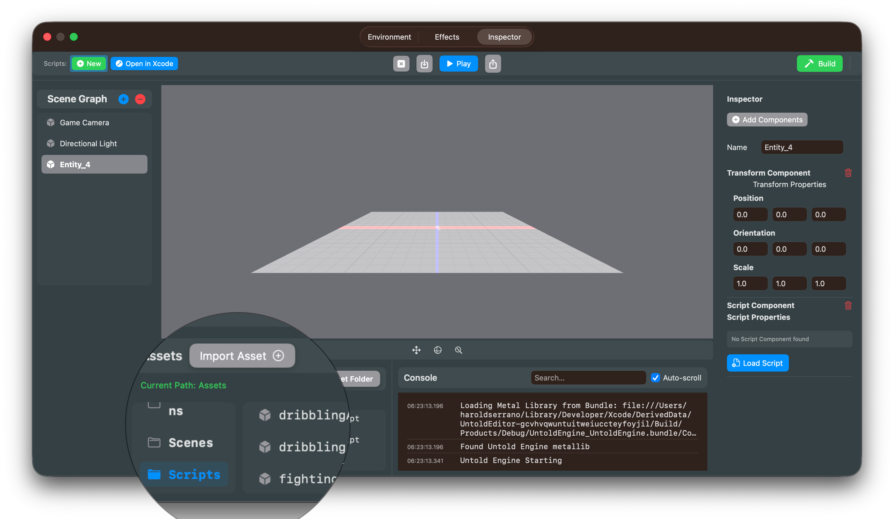

# Script Workflow Integration

## Overview

The UntoldEditor now supports integrated script development using Swift and the USC DSL. This allows you to create, edit, and build game scripts directly within the editor.

## UI Layout

Script management is split into two areas:

### **Toolbar (Top of Editor)**
The toolbar contains project-level script operations:
- **Scripts: New** (green) - Create new script files
- **Scripts: Open in Xcode** (blue) - Opens the Scripts project in Xcode for editing and building

These buttons are **always accessible** regardless of entity selection.


### ** Add Script Component to Entity**
Add a scripting component to the entity by selecting *Script Component* from the Component drop down menu


### **Script Component Inspector (Right Panel - Entity-Specific)**
When an entity with a ScriptComponent is selected, you'll see:
- **Load Script** (blue) - Attach a `.uscript` file to this entity
- **Reload** (orange) - Hot-reload this entity's script

These buttons are **entity-specific** and only available when editing entities with scripts.


---

## Workflow

### 1. **Set Asset Base Path** (Required First)
Before creating scripts, make sure you've set an asset base path in the editor:
- Use File → Set Asset Folder
- This will be the root directory for your project assets
- Scripts will be created in `{AssetBasePath}/Scripts/`
- Scripts will be accessible from the Asset Browser view as shown below



### 2. **Create New Script**
Click the **"New"** button in the toolbar (Scripts section):
- Enter a script name (e.g., `PlayerController`)
- Name must be alphanumeric and start with a letter
- A Swift file will be created at: `Scripts/Sources/GenerateScripts/PlayerController.swift`
- The file will contain a template with the USC DSL structure
- The script editor will open automatically

**Important:** After creating a script, you must manually add the generation function call to `GenerateScripts.swift`:

```swift
@main
struct GenerateScripts {
    static func main() {
        print("🔨 Generating USC scripts...")
        
        let outputDir = URL(fileURLWithPath: "Generated/")
        try? FileManager.default.createDirectory(at: outputDir, withIntermediateDirectories: true)
        
        // Add your script generation calls here:
        generatePlayerController(to: outputDir)  // <-- Add this line manually
        
        print("✅ All scripts generated in Generated/")
    }
}
```

### 3. **Edit & Build Scripts in Xcode**
Click the **"Open in Xcode"** button in the toolbar (Scripts section):
- Opens `Package.swift` in Xcode
- Full IDE experience with autocomplete, syntax highlighting, and debugging
- Edit your script files in Xcode's editor
- **IMPORTANT:** Edit `GenerateScripts.swift` to add your script generation calls (see step 2)
- Build and run in Xcode (**Cmd+R**) to generate `.uscript` files
- Output appears in Xcode's console

### 4. **Write USC DSL Logic in Xcode**
In Xcode, open your script file and write your game logic using the USC DSL:

```swift
extension GenerateScripts {
    static func generatePlayerController(to dir: URL) {
        let script = buildScript(name: "PlayerController") { s in
            s.onUpdate()
                .getProperty(.position, as: "pos")
                .setVariable("offset", to: Vec3(x: 0.0, y: 0.1, z: 0.0))
                .addVec3("pos", "offset", as: "newPos")
                .setProperty(.position, toVariable: "newPos")
        }
        
        let outputPath = dir.appendingPathComponent("PlayerController.uscript")
        try? saveUSCScript(script, to: outputPath)
        print("  ✅ PlayerController.uscript")
    }
}
```

### 5. **Build in Xcode**
In Xcode, press **Cmd+R** (or Product → Run):
- Compiles all scripts and generates `.uscript` files in `Generated/`
- Build output appears in Xcode's console
- First build may take 30-60 seconds (downloading dependencies)
- Subsequent builds are much faster (incremental)
- You can see compilation errors inline in Xcode

### 6. **Load Generated Script**
The new generated `.uscript` will appear in the Script Selection in the Asset Browser View. (You may need to switch back and forth for the script to show up) 
- Select a `.uscript` file to attach to the entity
- The script will be assigned to the entity's ScriptComponent

### 7. **Hot Reload** (Optional)
In the Script Component Inspector, click the **"Reload"** button:
- Reloads the currently attached script from disk
- Useful for testing changes without reassigning

## Project Structure

Once initialized, your project will have this structure:

```
YourAssetFolder/
├── Models/
├── Textures/
└── Scripts/                              (Created by editor)
    ├── Package.swift                     (Swift package definition)
    ├── .gitignore                        (Ignores .build/ and Generated/)
    ├── Sources/
    │   └── GenerateScripts/
    │       ├── GenerateScripts.swift     (Main entry point - YOU CONTROL THIS)
    │       ├── PlayerController.swift    (Your scripts - extensions)
    │       └── EnemyAI.swift            (Your scripts - extensions)
    └── Generated/                        (Output from swift run)
        ├── PlayerController.uscript
        └── EnemyAI.uscript
```

## Tips

### Version Control
**Commit:**
- ✅ `Scripts/Sources/` directory (Swift source code)
- ✅ `Scripts/Package.swift`
- ❌ `Scripts/.build/` directory (build artifacts)
- ❌ `Scripts/Generated/` directory (generated .uscript files)

The `.gitignore` is automatically created to exclude build artifacts.

### Multiple Scripts
- Each script is a separate `.swift` file
- All scripts are extensions of `GenerateScripts`
- You manually control which scripts are generated in `GenerateScripts.swift` main()
- One `swift run` builds all scripts at once

### Debugging Build Errors
- Build output appears in the console
- Swift compiler errors will show file names and line numbers
- Common issue: Forgetting to add the generation function call to `GenerateScripts.swift`

### Development Workflow
1. Click **"Open in Xcode"** in the editor toolbar
2. Edit Swift files in Xcode
3. Build and run in Xcode (**Cmd+R**)
4. Return to UntoldEditor
5. Click **"Load"** or **"Reload"** to attach/update the script on your entity
6. Test changes in Play mode


---

## USC DSL Reference

Common DSL methods available in your scripts:

**Events:**
- `.onStart()` - Runs once when Play mode starts
- `.onUpdate()` - Runs every frame
- `.onCollision(tag: "TagName")` - Runs on collision with tagged entities
- `.onEvent("EventName")` - Runs when custom event fires

**Properties:**
- `.getProperty(.position, as: "varName")` - Read entity property
- `.setProperty(.velocity, toVariable: "varName")` - Write from variable
- `.setProperty(.position, to: Vec3(...))` - Write from literal

**Control Flow:**
- `.ifCondition(lhs: .variableRef("var"), .greater, rhs: .float(10)) { ... }`
- `.ifGreater("var", than: 10.0) { ... }` - Convenience method
- `.ifLess("var", than: 10.0) { ... }` - Convenience method
- `.ifEqual("var", to: 1.0) { ... }` - Convenience method

**Physics:**
- `.applyForce(force: Vec3(...))` - Apply force (literal Vec3 only)

**Transform:**
- `.translateTo(x:, y:, z:)` - Set absolute position
- `.translateBy(x:, y:, z:)` - Move relative
- `.rotateTo(degrees:, axis: Vec3(...))` - Set rotation
- `.rotateBy(degrees:, axis: Vec3(...))` - Rotate relative

**Math:**
- `.addVec3("v1", "v2", as: "result")`
- `.scaleVec3("vec", literal: 2.0, as: "result")`
- `.scaleVec3("vec", by: "scaleVar", as: "result")`
- `.addFloat("a", "b", as: "sum")`
- `.mulFloat("a", "b", as: "product")`
- `.lengthVec3("vec", as: "length")`

**Input:**
- `.ifKeyPressed("W") { ... }`

**Debugging:**
- `.log("message")`

For complete DSL reference, see `USC_Scripting_API.md`.
