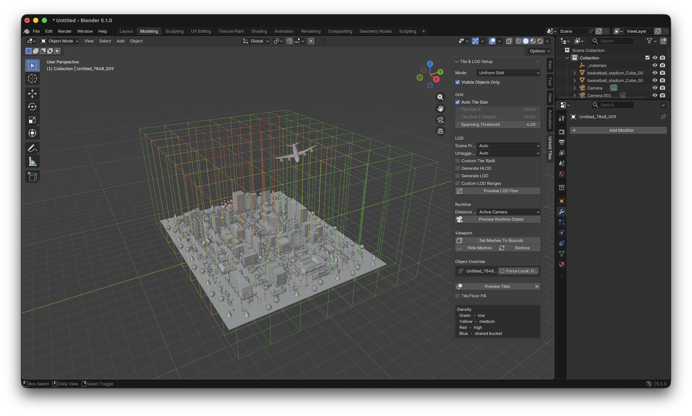

# Blender Add-On Workflow

The Blender add-on exports Blender scenes into Untold Engine's `.untold` runtime
format. Use it when you want a visual authoring workflow for models,
animations, and tiled scenes.

## Install The Add-On

For normal use, download `untold_exporter.zip` from the same [GitHub release](https://github.com/untoldengine/UntoldEngine/releases) as
the engine/editor version you are using.

In Blender:

1. Open `Edit > Preferences > Add-ons`.
2. Click `Install...`.
3. Select `untold_exporter.zip`.
4. Enable `Untold Engine Exporter`.

The add-on adds:

- `File > Export > Untold (.untold)`
- `File > Export > Untold Animation (.untold)`
- `File > Export > Untold Tiled Scene`

If you are developing from a repository checkout, build the zip with:

```bash
untoldengine blender-addon
```

Then install `scripts/untold-blender-addon/build/untold_exporter.zip` as mentioned above.

## Export A Model

Use `File > Export > Untold (.untold)`.

If you export:

```text
RetroCameraBlender.untold
```

the add-on writes:

```text
RetroCameraBlender/
  RetroCameraBlender.untold
  Textures/
```

Load the exported model in the engine with:

```swift
let entity = createEntity()
setEntityName(entityId: entity, name: "Retro Camera")
setEntityMeshAsync(entityId: entity, filename: "RetroCameraBlender", withExtension: "untold") { success in
    setSceneReady(success)
}
```

## Export Animation

Use `File > Export > Untold Animation (.untold)`.

The animation exporter can use:

- the selected armature
- the armature linked to a selected mesh
- the only visible armature in the scene

At runtime, load the mesh first, then register clips:

```swift
setEntityAnimations(entityId: character, filename: "idle", withExtension: "untold", name: "idle")
setEntityAnimations(entityId: character, filename: "running", withExtension: "untold", name: "running")
changeAnimation(entityId: character, name: "idle")
```

Treat the loaded asset root as the animation handle for multi-mesh rigged
assets.

## Export A Tiled Scene

Use `File > Export > Untold Tiled Scene`.

The add-on writes a manifest plus tile payloads:

```text
CityBlender/
  CityBlender.json
  tile_exports/
    tile_0_0_0.untold
    tile_0_0_1.untold
    Textures/
```

Load the manifest with:

```swift
let sceneRoot = createEntity()
setEntityName(entityId: sceneRoot, name: "City")

setEntityStreamScene(entityId: sceneRoot, manifest: "CityBlender", withExtension: "json") { success in
    setSceneReady(success)
}
```

For remote hosting, pass a manifest URL instead:

```swift
setEntityStreamScene(entityId: sceneRoot, url: manifestURL) { success in
    setSceneReady(success)
}
```

## Preview Tiles Before Export

Open the 3D viewport sidebar with `N`, then use the `Untold Tiles` tab.

Use `Preview Tiles` to inspect the partition. Density colors indicate how much
geometry lands in each tile. Use `Preview Runtime States` to simulate which
representation would be active near the camera, 3D cursor, or selected object.

Start with:

- `Quadtree` for multi-floor buildings
- `Uniform Grid` for simple outdoor scenes
- `KD-Tree` when geometry is clustered unevenly

Enable HLOD/LOD generation only when the preview shows a useful runtime
distance plan.



## Author Export Hints

Select a mesh and open `Object Properties > Untold` to set export hints:

- `Object Semantic`: exterior shell, structural interior, room contents, fine props
- `Priority Hint`: low, normal, high, critical
- `Force Local`: keep an object in a local tile instead of the shared bucket

For selectable entities, use the naming workflow from scene channels. Objects
with the `NM_` prefix remain selectable and preserve identity after export.

For window/channel workflows, use project prefixes such as:

```swift
registerSceneChannelPrefix("WIN_", channels: .windowGeometry)
```

## Related Documentation

- [Blender Add-on](../API/UsingBlenderAddon.md)
- [Exporter](../API/UsingTheExporter.md)
- [Animation System](../API/UsingAnimationSystem.md)
- [Geometry Streaming](../API/UsingGeometryStreamingSystem.md)
- [Scene Channels](../API/UsingSceneChannels.md)

