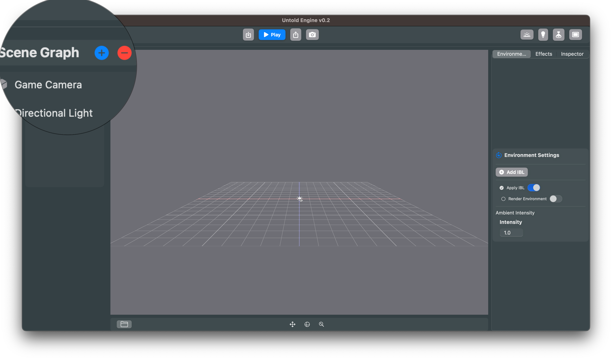
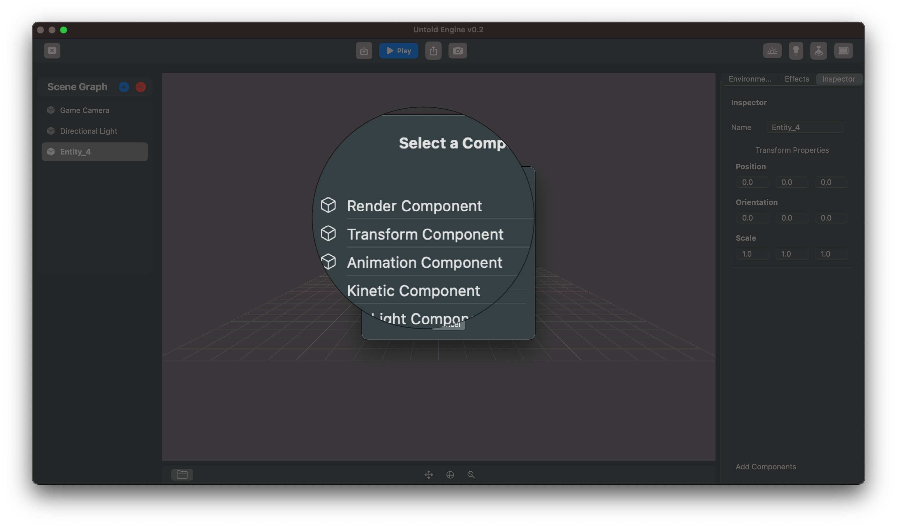
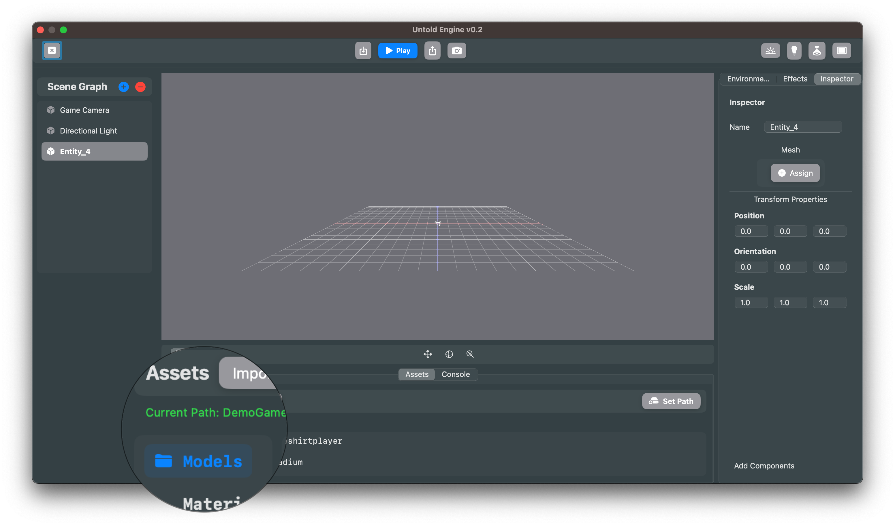

# Adding a Character to the Scene using the Editor

Follow these steps to bring a character into your scene or if you prefer, here is a [short video](https://vimeo.com/1116793858?share=copy#t=0). 

---

### 1. Create a New Entity
- In the **SceneGraph**, click the **➕ button**.  
- A new entity will appear in the SceneGraph list.  

---

### 2. Rename the Entity (Optional)
- Select the new entity and open the **Inspector**.  
- Change its name to something meaningful (e.g., *PlayerCharacter*).  

---

### 3. Add a Render Component
- In the Inspector, click **Add Components**.  
- Choose **Render Component** from the list.  

---

### 4. Select Your Model
- Open the **Asset Browser** and click the **📁 folder icon** to maximize it.  
- Navigate to your game character’s folder.  
- Select the character’s `.usdc` file and click **Assign**.  

---

✅ That’s it! Your character should now appear in the scene. 🎉

