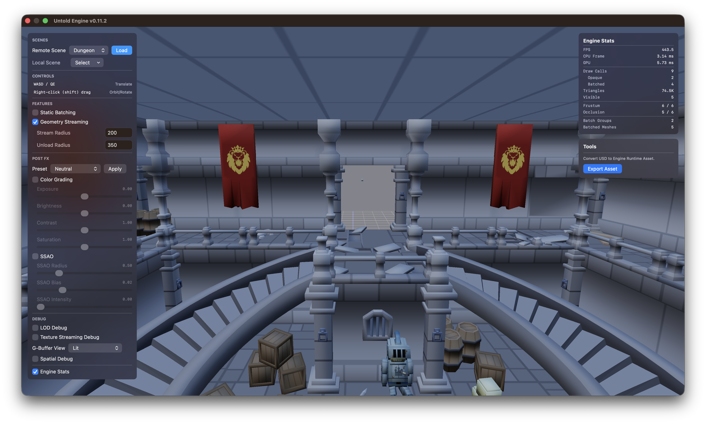
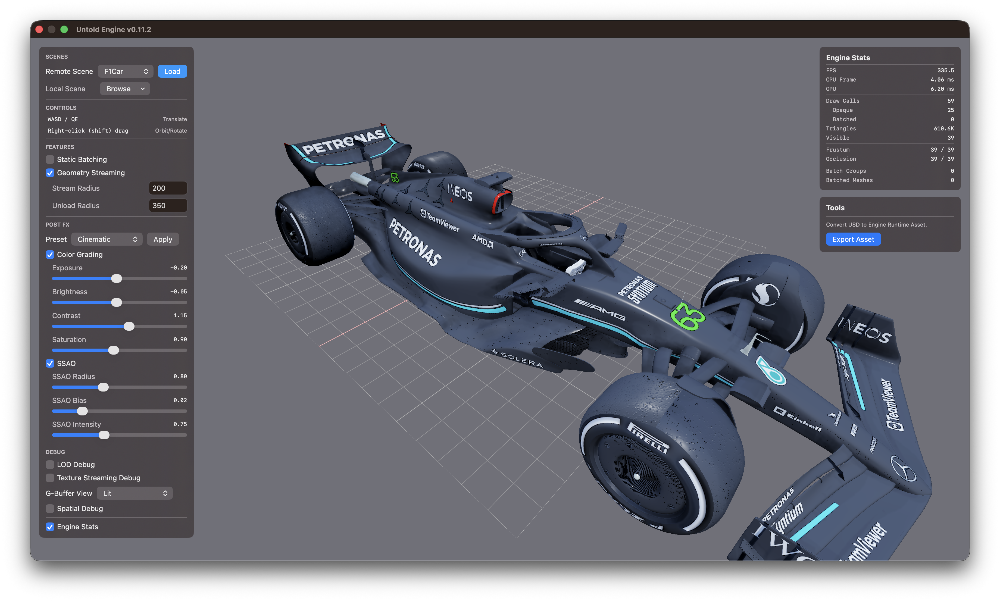
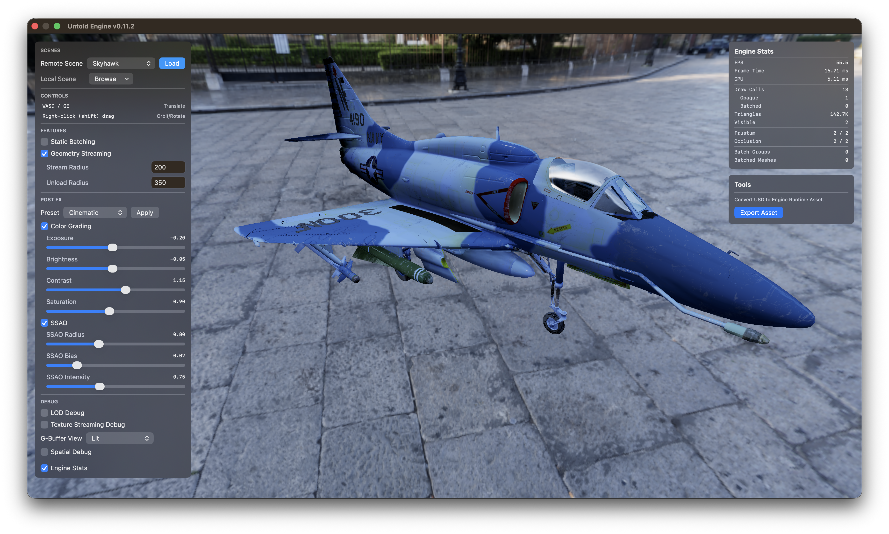

# Untold Engine


[](https://github.com/untoldengine/UntoldEngine/blob/main/LICENSE)
[](https://github.com/untoldengine/UntoldEngine/issues?q=is%3Aissue+is%3Aopen+label%3A%22help+wanted%22)


---

Untold Engine is a **Swift + Metal 3D engine for macOS, iOS, and visionOS** — with native Apple Vision Pro support and a growing focus on spatial computing — built for developers who:

- Want **full control over rendering and systems**
- Prefer working directly with **Swift + Metal**
- Are building **XR, 3D, or visualization applications**
- Need to handle **large scenes, streaming data, or custom pipelines**

If you've hit the ceiling of what existing engines allow on Apple platforms, this is for you.



Creator & Lead Developer:  
[Harold Serrano](http://www.haroldserrano.com)

---

## Watch It in Action — Apple Vision Pro Demos

<table>
  <tr>
    <td><a href="https://vimeo.com/1186637984?share=copy&fl=sv&fe=ci"></a></td>
    <td><a href="https://vimeo.com/1186592834?share=copy&fl=sv&fe=ci"></a></td>
    <td><a href="https://vimeo.com/1176823067?share=copy&fl=sv&fe=ci"></a></td>
  </tr>
  <tr>
    <td><a href="https://vimeo.com/1176823994?share=copy&fl=sv&fe=ci"></a></td>
    <td><a href="https://vimeo.com/1176995991?fl=ip&fe=ec"></a></td>
    <td></td>
  </tr>
</table>

---

## Try the Engine Right Now

The fastest way to experience Untold Engine is to run the demo project.

Clone the repository and launch the demo:

```bash
git clone https://github.com/untoldengine/UntoldEngine.git
cd UntoldEngine
swift run untolddemo
```

The demo UI lets you see the engine in action right away. Using the `Remote Scene` drop-down menu, you can choose a scene to stream directly into the demo through the engine's **Asset Remote Streaming** support.



### I want to try my own USDZ

Untold Engine uses its own native asset format: `.untold`.

To try your own `USDZ` file, first convert it to `.untold` using the `Tools` section in the demo UI.

After the export is complete, open the Local Scene `Browse` drop-down menu, choose `.untold`, then browse for and select your exported `.untold` file.

> **Note:** The exporter requires [Blender](https://www.blender.org).

---



## Getting Started

To create your own project using the Untold Engine, see [Getting Started](API/GettingStarted.md).

---

## Core Direction

Untold Engine is built around three focused goals:

- **Spatial Engine First** — Designed for spatial computing applications. LOD, geometry streaming, and static batching exist to support large, real-world-scale environments where presence and performance both matter.

- **XR / visionOS Support** — Spatial input, AR workflows, and Vision Pro support are functional today and expanding with each release.

- **Metal-First Architecture** — The rendering layer stays close to Metal to maintain performance and control, without abstraction layers getting in the way.

---

## Example Use Cases

Untold Engine is well-suited for:

- XR applications (Vision Pro, ARKit-based apps)
- Large-scale scene visualization (cities, archviz, datasets)
- Custom rendering pipelines and experiments
- Simulation tools and interactive 3D systems

---

## Current Features

- **Apple Platform Coverage** — Unified Swift + Metal codebase for macOS, iOS, and visionOS
- **Rendering Pipeline** — Metal renderer with PBR/IBL workflows and post-processing across standard and XR paths
- **AR and XR Runtime Support** — Built-in AR workflows plus visionOS integration and spatial interaction support
- **ECS + Scene Graph Core** — Component-based architecture with hierarchical transforms and scene root transform controls
- **Async Content Loading** — Asynchronous loading pipeline for scenes and assets to improve responsiveness on large worlds
- **LOD and Streaming** — LOD support with geometry streaming, streaming regions, and memory budget management
- **Static Batching and Culling** — Static batching, octree acceleration, and occlusion culling for large-scene performance
- **Advanced Picking** — Scene, ground, and GPU ray picking with octree-backed intersection paths
- **Spatial Input Features** — XR spatial input helpers including anchored pinch drag, distance tracking, and two-hand rotation
- **Scripting System (USC)** — Untold Script Core with multi-script support plus camera, math, and physics APIs (Experimental)
- **Gameplay Systems** — Physics, animation, camera waypoint, and input systems (keyboard, mouse, touch, and gamepad)
- **Gaussian Splat Rendering** — Native Metal support for rendering and compositing 3D Gaussian content
- **Tooling Integration** — Optional Untold Editor workflow and Swift Package Manager integration

---

## Roadmap

See open issues for planned features and known improvements.

- [Feature Requests](https://github.com/untoldengine/UntoldEngine/issues?q=label%3Aenhancement)
- [Bug Reports](https://github.com/untoldengine/UntoldEngine/issues?q=label%3Abug)

---

## Contributing

Contributions are welcome — whether that's fixing bugs, improving systems, writing documentation, or proposing ideas.

Before submitting a pull request, please review the [Contributing Guidelines](Contributor/ContributionGuidelines.md).

All contributions are licensed under **MPL-2.0**.

---

## GitHub Sponsors

A huge thanks to the people helping shape the Untold Engine.

<p align="center">
  <a href="https://github.com/miolabs">
    
  </a>
</p>

---

## License

Untold Engine is licensed under the **Mozilla Public License 2.0 (MPL-2.0)**.

This allows developers to build commercial applications while ensuring improvements to the engine itself remain open.

| Use Case | Allowed | Obligation |
|----------|---------|-----------|
| Build games | Yes | Game code can remain proprietary |
| Commercial apps | Yes | No royalties |
| Modify engine | Yes | Modified engine files remain MPL |
| Create plugins | Yes | Any license allowed |

Full license: https://www.mozilla.org/MPL/2.0/

---

## Questions & Discussions

- [GitHub Discussions](https://github.com/untoldengine/UntoldEngine/discussions) — ideas and questions
- [GitHub Issues](https://github.com/untoldengine/UntoldEngine/issues) — bugs and tasks
- [Ask a Question](https://github.com/untoldengine/UntoldEngine/issues/new?assignees=&labels=question&template=04_SUPPORT_QUESTION.md&title=support%3A+)
