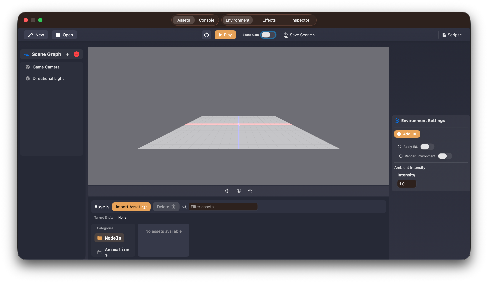
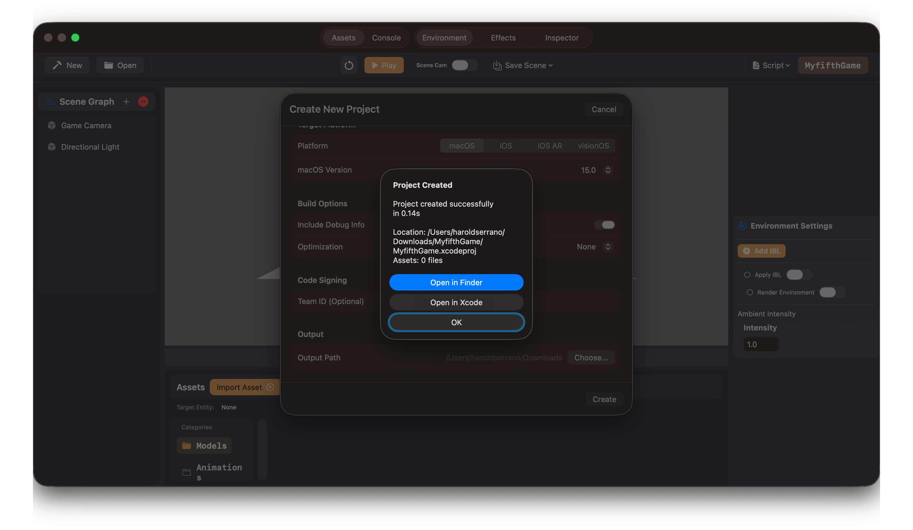
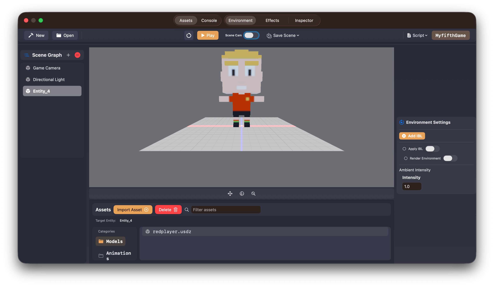

# Getting Started with Untold Engine Studio

This guide will walk you through the basics of getting up and running with **Untold Engine Studio**, from installation to loading your first model.

---

## Downloading Untold Engine Studio

To start developing with the Untold Engine, download the latest version of **Untold Engine Studio** from the official GitHub releases page:

👉 https://github.com/untoldengine/UntoldEditor/releases

Once downloaded:

1. Drag **Untold Engine Studio** into your **Applications** folder  
2. Double-click the app to launch it

---

## Creating a New Project

When the editor launches, you will be presented with the main startup screen.



At this point, create a new project:

1. Click **New**
2. A new window will appear asking for:
   - **Project name**
   - **Target platform**
   - **Project location**
3. Fill in the details and click **Create**

Once completed, the engine will generate a fully configured **Xcode game project** for you.

You will then be prompted to open the project in Xcode. I recommend doing so.



---

## Exploring the Generated Project

After opening the project in Xcode, take a moment to explore the file structure. This will help you navigate the project later.

### Project Structure

```
MyGame/                          # Your working directory
└── MyGame/                      # Generated project
    ├── MyGame.xcodeproj         # Open this in Xcode
    ├── project.yml              # XcodeGen configuration
    └── Sources/
        └── MyGame/
            ├── GameData/        # ← Put your assets here
            │   ├── Models/      # 3D models
            │   ├── Scenes/      # Scene files
            │   ├── Scripts/     # USC scripts
            │   ├── Textures/    # Images
            │   └── ...
            ├── GameScene.swift          # Your game logic
            ├── GameViewController.swift # View controller
            └── AppDelegate.swift        # App entry point
```

The most important file to look for is:

```GameScene.swift```

This is where you will do most of your coding.  
It contains the core lifecycle functions, including:

- `init()` – scene setup  
- `update()` – per-frame logic  

You’ll be spending most of your time here when writing game logic.

---

## Back to the Editor

Return to **Untold Engine Studio**.

If you look at the editor toolbar, you’ll notice the name of your newly created project displayed on the right side of the window.

At this point, you can already start adding content to your scene.

---

## Adding Entities to the Scene

You can quickly add a primitive by clicking the **“+”** button in the **Scenegraph View** and selecting a cube or other built-in shapes.

However, it’s more fun to load real models.

---

## Downloading Sample Models

I’ve provided a small set of [sample models](https://haroldserrano.gumroad.com/l/iqjlac) you can use to get started:

- A soccer player  
- A soccer ball  
- A stadium  
- Idle and running animations

All assets are provided as **`.usdz`** files.

> **Note**  
> Untold Engine currently accepts **USDZ** files only.

Download the sample assets from the provided link.

---

## Importing Models into Your Project

Once the models are downloaded, it’s time to import them into your project.

1. Open the **Asset Browser**
2. Select the **Model** category
3. Click **Import**
4. Navigate to the folder containing your downloaded `.usdz` file
5. Select a model and confirm

After importing, the engine will display a feedback message confirming the import.  
You will also see the `.usdz` file listed under the **Model** category.

---

## Loading a Model into the Scene

Now for the fun part.

- **Double-click** the imported `.usdz` file in the Asset Browser

The model will immediately appear in the editor viewport.



Behind the scenes, two things just happened:

1. An **entity** was created  
2. The `.usdz` asset was linked to that entity  

---

## Importing and Linking Animations

The same workflow applies to animations.

1. Select the **Animation** category in the Asset Browser
2. Click **Import**
3. Locate and import an animation `.usdz` file
4. Double-click the animation asset

The animation will automatically be linked to the currently selected entity.

If you open the **Inspector** tab, you’ll see the animation listed as part of the entity’s components.

---

## What’s Next?

Now that you have a basic understanding of the editor, asset workflow, and project structure, you’re ready to start coding with the Untold Engine.

👉 Continue with the **Hello World** tutorial to write your first gameplay logic.


