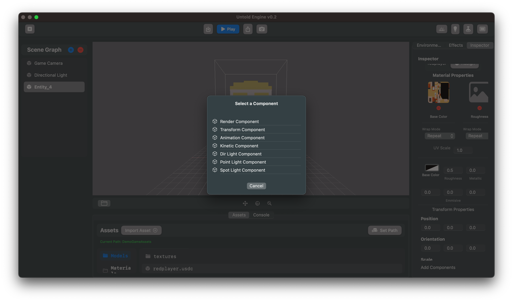
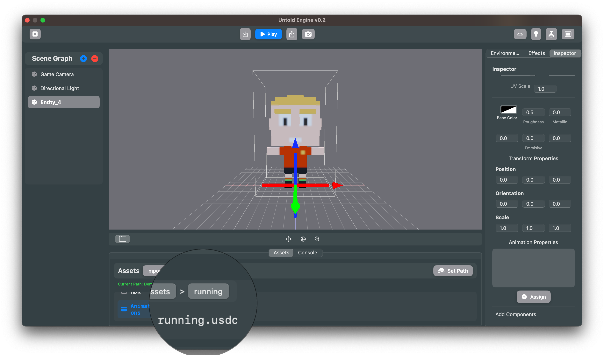
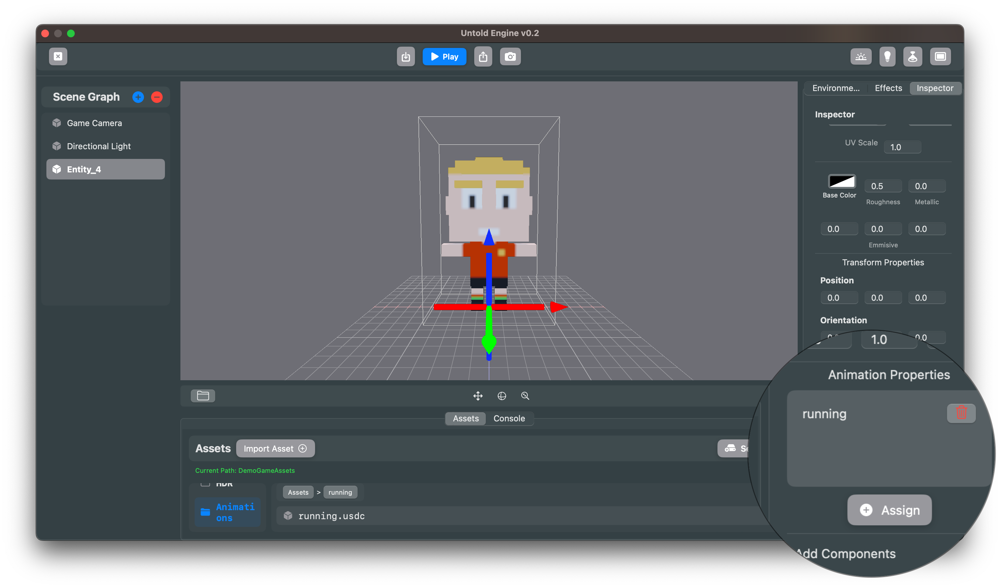

## How-To: Add Animations Using the Editor

Follow these steps to add an animation to an entity. If you prefer, is a step-by-step [video](https://vimeo.com/1117004242?share=copy#t=0).

1. **Select the Entity**  
   In the **Inspector**, make sure the entity you want to animate is selected.  

2. **Add the Animation Component**  
   - Click on **Add Components** in the Inspector.  
   - Choose **Animation Component**.  

3. **Open the Asset Browser**  
   - In the Asset Browser, click on **Animations**.  
   - Browse to the `.usdc` animation file you want to use.  

4. **Select the Animation File**  
   - Click on the animation file in the Asset Browser.  

5. **Assign the Animation**  
   - In the Inspector, under the **Animation Component**, click on **Assign**.  
   - The animation’s name should now appear in the component field.  

🎬 Your entity is now linked to the animation!

