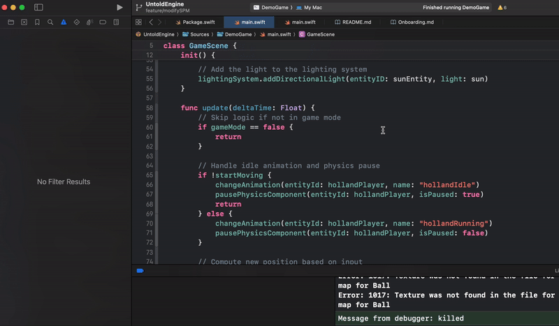

# Starter Game – Experiment and Learn

If you want to tinker and get hands-on, the **Starter Game** is your playground. It’s a minimal setup that gives you just enough to start experimenting, importing assets, and building your own mechanics.

**What’s Included**
- A blank canvas with the basic engine hooks you need to begin.  

**How to Run**
1. Select the **StarterGame** scheme.  
2. Set **My Mac** as the target device and hit **Run**.  

---

### Preloaded Assets to Kickstart Development

To save time, the Untold Engine includes preloaded assets you can use right away:

- **Models**: Soccer stadium, player, ball, and more.  
- **Animations**: Prebuilt running, idle, and other character motions.  

You can download them [Demo Game Assets v1.0](https://github.com/untoldengine/UntoldEngine-Assets/releases/tag/v1).

