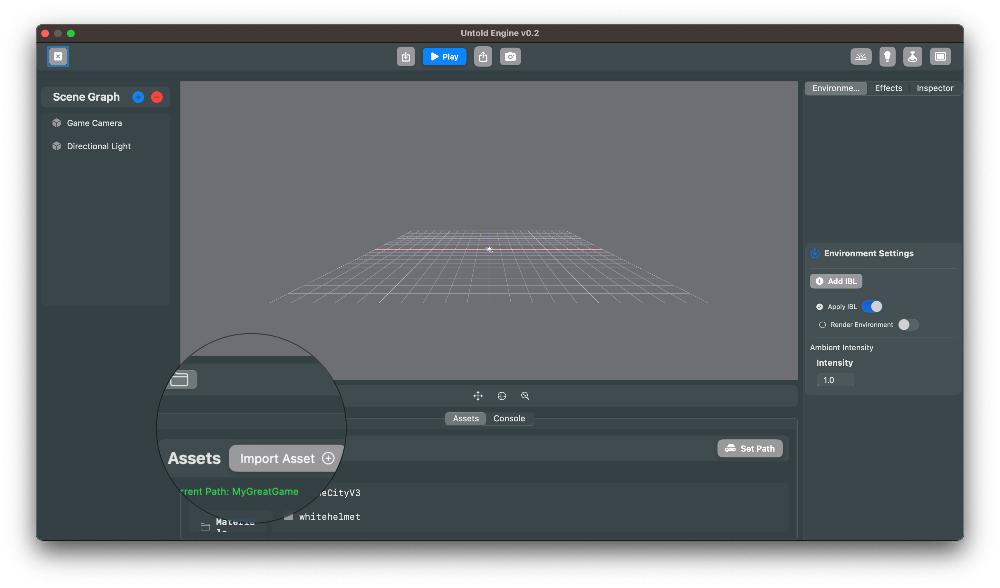

# Importing Assets

> **Audience:** Engine contributors **and** game developers building their own Xcode projects.

This guide shows how to organize assets so they load the same way whether you’re using an **external asset folder** during development or shipping your game with assets inside your app’s **Resources** (main bundle). The engine applies the **same folder structure** to both locations, so you don’t have to think differently for each case.

---

## External Folder vs. Resources (Main Bundle)

- **External asset folder (development)**
  - **Pros:** Import models/animations/materials at runtime via the **Asset Browser** (no rebuilds).
  - **Cons:** Before you ship, you **must** copy these files into your app’s **Resources** so they are bundled.

- **Resources (main bundle)**
  - **Pros:** No extra deployment step; assets ship with the app.
  - **Cons:** You can’t import new files to the bundle at runtime.

> **Recommendation:** If possible, keep everything under **Resources** from day one using the structure below. If you prefer faster iteration, mirror the same structure in an external folder during development and copy it into **Resources** before release.

---

## 1) Setting the Asset Path (for external folders)

1. Create a folder on your computer where you’ll store your game’s assets.  
   *Example: `MyGreatGameAssets/`*  
2. In the **Asset Browser**, click **Set Path**.  
   
3. Pick your external asset folder.

> ⚠️ The engine cannot add files to your app bundle at runtime. The **external** folder is what enables hot-import while the editor is running.

---

## 2) Using Resources in your Xcode project (game developers)

If you’re building a game in your own Xcode project:

- Add your assets to your app target’s **Resources** using the **same folder layout** shown below (e.g., `Resources/Assets/...`).
- If you used an external folder while developing, **copy** its content into **Resources** before you archive/release.
- Keep the folder names and structure identical so lookups work without code changes.

---

### 3) Importing 3D Models (External folder only)

- Supported format: **USDC**.
- **Best practice:** Create a **dedicated folder per model** that contains:
  - `<model>.usdc`
  - `textures/` subfolder with all texture maps

**Steps:**  
1. In the **Asset Browser**, click **Models**.  
2. Click **Import Asset**.  
   
3. Select the model’s `.usdc` file inside its dedicated folder (with `textures/`).  
4. The engine links textures automatically when following this structure.

---

### 4) Importing Animations (External folder only)

- Animations are **`.usdc`** files.
1. In the **Asset Browser**, click **Animations**.  
2. Click **Import Asset** and select the animation `.usdc`.

---

### 5) Importing Materials (External folder only)

- Import a folder with your texture maps (BaseColor, Roughness, Metallic, Normal, etc.).
1. In the **Asset Browser**, click **Materials**.  
2. Click **Import Asset** and select the material’s folder.  
3. Assign materials to entities in the **Inspector**.

---

## Canonical Asset Folder Structure

Use this **same structure** under your **external asset folder** *or* under your app’s **Resources**:

```text
Assets/
├── Animations/                 # .usdc animations (one folder per clip is ideal)
│   ├── walk/
│   │   └── walk.usdc
│   └── jump/
│       └── jump.usdc
│
├── HDR/                        # Environment lighting maps (.hdr)
│   ├── studio.hdr
│   ├── desert.hdr
│   └── forest.hdr
│
├── Materials/                  # One folder per material with all maps
│   └── Wood-Material/
│       ├── Wood_BaseColor.png
│       ├── Wood_Normal.png
│       ├── Wood_Roughness.png
│       └── Wood_Metalness.png
│
└── Models/                     # **One folder per model** with .usdc + textures/
    ├── tree/
    │   ├── tree.usdc
    │   └── textures/
    │       ├── Tree_BaseColor.png
    │       ├── Tree_Normal.png
    │       └── Tree_Roughness.png
    └── character/
        ├── character.usdc
        └── textures/
            ├── Character_BaseColor.png
            ├── Character_Normal.png
            └── Character_Roughness.png
```

**Why a dedicated folder per model?**

It keeps the .usdc and its textures/ together, making references predictable and reducing broken links during import/export.

### Key Points

- Animations: Place each animation .usdc in its own folder for clarity.
- HDR: Keep environment maps together for easy IBL (Image-Based Lighting) setup.
- Materials: Each material gets its own folder with all required textures.
- Models: Each model gets its own folder with a .usdc file and a textures/ subfolder containing its textures.

For reference, download the [Demo Game Assets v1.0](https://github.com/untoldengine/UntoldEngine-Assets/releases/tag/v1)

⚠️ Tip: The engine expects this structure. Keeping a clean hierarchy will make asset importing smoother in the Editor.
