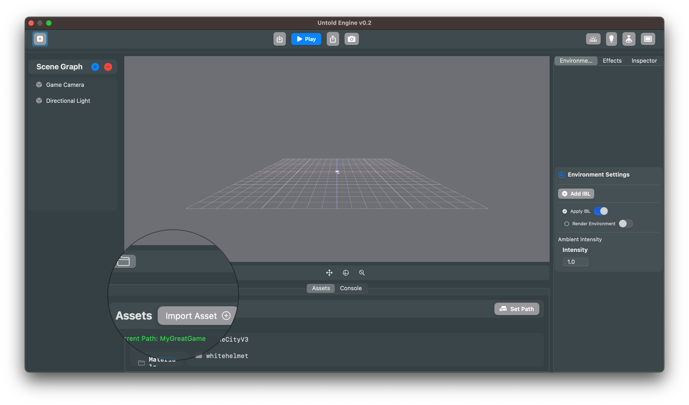

# Importing Assets

> **Audience:** Engine contributors **and** game developers building their own Xcode projects.

The Untold Engine requires a **specific folder structure** to locate and load your game assets. This guide explains the required structure and shows you how to organize assets for development and deployment.

---

## ⚠️ Required Folder Structure

**The engine will NOT find your assets unless they follow this exact structure:**

```text
Assets/
├── Animations/                 # .usdz animation files
│   ├── walk/
│   │   └── walk.usdz
│   └── jump/
│       └── jump.usdz
│
├── Gaussians/                  # Gaussian splat point cloud files
│   │   
│   └── scene1.ply
│
├── HDR/                        # Environment lighting maps (.hdr)
│   ├── studio.hdr
│   ├── desert.hdr
│   └── forest.hdr
│
├── Materials/                  # One folder per material with all texture maps
│   └── Wood-Material/
│       ├── Wood_BaseColor.png
│       ├── Wood_Normal.png
│       ├── Wood_Roughness.png
│       └── Wood_Metalness.png
│
└── Models/                     # One folder per model
    ├── tree/
    │   └── tree.usdz
    └── character/
        └── character.usdz
```

### Structure Requirements

| Asset Type | Location | Folder Structure | File Format |
|-----------|----------|------------------|-------------|
| **Models** | `Assets/Models/` | One subfolder per model | `.usdz` |
| **Animations** | `Assets/Animations/` | One subfolder per animation | `.usdz` |
| **Gaussians** | `Assets/Gaussians/` | One subfolder per Gaussian splat | `.ply` |
| **Materials** | `Assets/Materials/` | One subfolder per material (contains all texture maps) | `.png`, `.jpg` |
| **HDR Maps** | `Assets/HDR/` | Flat (no subfolders needed) | `.hdr` |

> 💡 **Why subfolders?** Organizing each model and animation in its own folder keeps assets modular and makes it easier to manage multiple files (e.g., LODs, variants) for a single asset in the future.

---

## Where to Store Your Assets

You have two options for storing assets, and **both must use the exact same folder structure** shown above:

### Option 1: External Folder (Development)

**Best for:** Rapid iteration during development.

- Store assets in any folder on your computer (e.g., `~/MyGameAssets/`)
- The engine reads assets from this external location at runtime
- You can import new assets via the **Asset Browser** without rebuilding your app
- **Before shipping:** You must copy this folder into your app's **Resources**

**Setup:**
1. Create a folder anywhere on your computer (e.g., `MyGreatGameAssets/`)
2. Inside it, create the `Assets/` folder with the required subfolders
3. In the **Asset Browser**, click **Set Path**  
   
4. Select your external asset folder

### Option 2: Resources (Main Bundle)

**Best for:** Final deployment or if you prefer a production-ready setup from the start.

- Add the `Assets/` folder directly to your Xcode project's **Resources**
- Assets are bundled with your app (no external folder needed)
- You **cannot** import new files at runtime
- No extra deployment step required

**Setup:**
1. In your Xcode project, add the `Assets/` folder to your app target's **Resources**
2. Ensure it uses the same structure: `Resources/Assets/Models/`, `Resources/Assets/Materials/`, etc.
3. The engine will automatically detect and load assets from the bundle

> **Recommendation:** Use an external folder during development for faster iteration, then copy everything into **Resources** before release. Just make sure the folder structure remains identical.

---

## Importing Assets (External Folder Only)

When using an external asset folder, you can import assets through the **Asset Browser**:

### Importing 3D Models

- **Format:** `.usdz`
- **Structure:** Each model must be in its own subfolder under `Assets/Models/`

**Steps:**
1. Click **Models** in the **Asset Browser**
2. Click **Import Asset**  
   
3. Select your `.usdz` file
4. The engine will automatically place it in `Assets/Models/<model-name>/`

### Importing Animations

- **Format:** `.usdz`
- **Structure:** Each animation in its own subfolder under `Assets/Animations/`

**Steps:**
1. Click **Animations** in the **Asset Browser**
2. Click **Import Asset**
3. Select your animation `.usdz` file
4. The engine places it in `Assets/Animations/<animation-name>/`

### Importing Materials

- **Format:** Folder containing texture maps (`.png`, `.jpg`)
- **Supported maps:** BaseColor, Normal, Roughness, Metallic/Metalness, AO
- **Structure:** Each material in its own subfolder under `Assets/Materials/`

**Steps:**
1. Click **Materials** in the **Asset Browser**
2. Click **Import Asset**
3. Select the folder containing your texture maps
4. The engine organizes it under `Assets/Materials/<material-name>/`
5. Assign materials to entities via the **Inspector**

### Importing Gaussians

- **Format:** `.ply` (Gaussian splat point cloud)
- **Structure:** Each Gaussian splat in its own subfolder under `Assets/Gaussians/`

**Steps:**
1. Click **Gaussians** in the **Asset Browser**
2. Click **Import Asset**
3. Select your `.ply` file
4. The engine places it in `Assets/Gaussians/<gaussian-name>/`

### Adding HDR Maps

- **Format:** `.hdr`
- **Structure:** Place directly in `Assets/HDR/` (no subfolders)

**Steps:**
1. Copy your `.hdr` files directly into `Assets/HDR/`
2. These are used for environment lighting (IBL) in your scenes

---

## Troubleshooting

### Assets not loading?

✅ **Check these common issues:**

1. **Wrong folder structure**  
   - Verify you have `Assets/Models/`, `Assets/Animations/`, etc.
   - Each model/animation must be in its own subfolder

2. **Case sensitivity**  
   - Folder names are case-sensitive: use `Assets`, not `assets`

3. **Missing parent folder**  
   - Don't skip the `Assets/` parent folder

4. **External path not set**  
   - If using an external folder, make sure you've set the path in the **Asset Browser**

5. **Resources not in bundle**  
   - If using Resources, verify the folder is added to your Xcode target's **Copy Bundle Resources** phase

---

## Example: Complete Asset Setup

Here's what a properly structured asset folder looks like:

```text
MyGameAssets/              # Your root folder (external or Resources)
└── Assets/                # REQUIRED parent folder
    ├── Animations/
    │   ├── walk/
    │   │   └── walk.usdz
    │   ├── run/
    │   │   └── run.usdz
    │   └── jump/
    │       └── jump.usdz
    │
    ├── Gaussians/
    │   ├── garden/
    │   │   └── garden.ply
    │   └── room/
    │       └── room.ply
    │
    ├── HDR/
    │   ├── studio.hdr
    │   └── forest.hdr
    │
    ├── Materials/
    │   ├── Wood/
    │   │   ├── Wood_BaseColor.png
    │   │   ├── Wood_Normal.png
    │   │   ├── Wood_Roughness.png
    │   │   └── Wood_Metalness.png
    │   └── Metal/
    │       ├── Metal_BaseColor.png
    │       ├── Metal_Normal.png
    │       └── Metal_Roughness.png
    │
    └── Models/
        ├── tree/
        │   └── tree.usdz
        ├── rock/
        │   └── rock.usdz
        └── character/
            └── character.usdz
```

For a complete working example, download the [Demo Game Assets v1.0](https://github.com/untoldengine/UntoldEngine-Assets/releases/tag/v1).

---

## Summary

- **The engine requires the `Assets/` folder structure** with specific subfolders: `Models/`, `Animations/`, `Gaussians/`, `Materials/`, and `HDR/`
- **Each model, animation, and Gaussian splat must be in its own subfolder**
- **Use the same structure** whether storing assets externally (development) or in Resources (deployment)
- **External folders** allow runtime imports; **Resources** bundles assets with your app
- **Before shipping**, copy your external folder into your app's Resources
